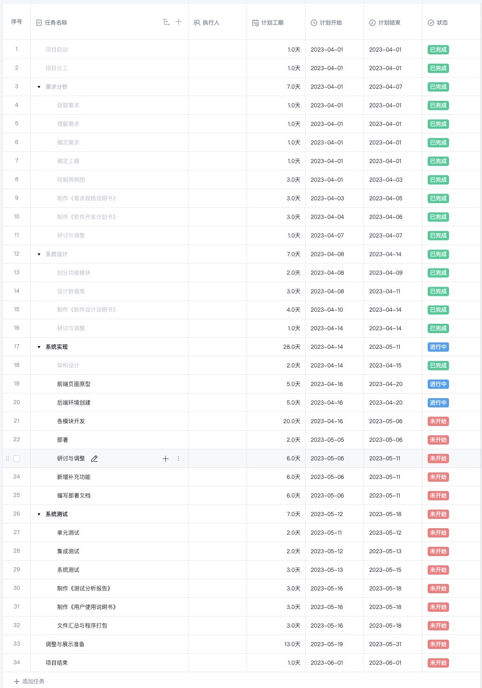
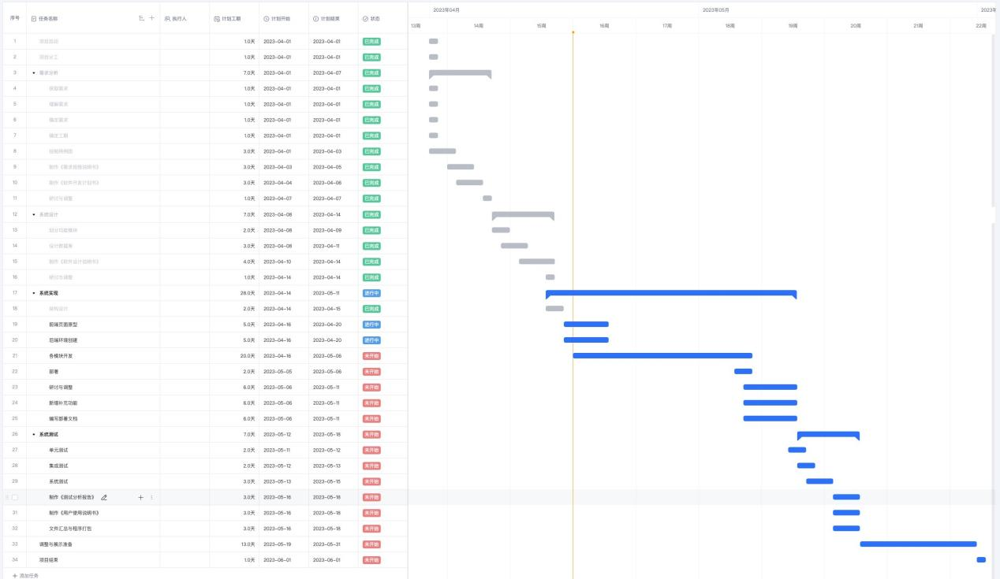

# CareCompass软件开发计划书

| 成员&#xA; | 刘芊祺&#xA; |
| ------- | -------- |
| 成员&#xA; | 翁晨皓&#xA; |
| 成员&#xA; | 武钰川&#xA; |
| 成员&#xA; | 冯伟伦&#xA; |
| 成员&#xA; | 刘洪宇&#xA; |

## 引言

### 背景

随着互联网技术的飞速发展，传统的医疗行业也已经逐渐迎来了数字化的浪潮，医院门诊预约系统也成为了现代医院不可或缺的重要组成部分。传统的预约方式不仅效率低下，还存在排队、等待等问题，给患者带来了很多不便和烦扰。而现代化的门诊预约系统，可以通过互联网技术为患者提供便捷的在线预约服务，让患者可以随时随地进行预约，减少等待时间和排队时间，提高了患者的就医体验。这样现代化的预约系统，不仅可以提高医院的服务水平，还可以为患者提供更便捷的就医方式，缓解医疗资源短缺和分配不均等问题。因此，越来越多的医院与时俱进，选择为自己搭建一套好用的门诊预约系统。

在这样的背景和需求下，我们开发了我们的医院门诊预约系统“CareCompass”。主要面向广大有就医需求的患者和提供就医服务的医院医生们，搭建了一个一体化提供患者、医生、预约挂号以及消息推送等的多功能平台。在无需线下挂号的情况下，尽可能方便的为患者以及医生提供相应的服务，充分满足线上挂号“安全稳定”、“信息透明”、“方便快捷”的重大需求。

### 编写目的

为了保证项目开发团队能够高质量并按时的完成项目目标，并且让所有开发人员更清楚的了解项目情况，使得各个项目开发工作井然有序的开展，很有必要以书面形式来详细描述项目生命周期内的所有工作任务范围、任务分解、项目团队组织结构、各团队成员的工作责任、团队内外沟通协作方式、开发进度、经费预算、项目内外环境条件、风险对策等内容。以此来作为项目团队成员和项目干系人之间的共识和约定，以及所有项目活动的行动基础，为项目团队开展和检查项目工作提供依据。

这份计划书不仅让项目开发人员了解项目的具体进展情况，而且明确团队成员的职责，有助于保证团队之间的协作有条不紊，项目工作的各个过程得以合理有序进行。同时，这份计划书也在团队内外的沟通中起着指导作用，对团队之间的工作范围、开发模块之间的关系，以及对开发进度、经费预算、分配人力物力、风险等因素进行了概括描述。

本项目开发计划书的编写旨在为“医院门诊预约系统”的开发提供主要规划和整合，面向用户、项目监督人员和项目开发人员。

### 参考资料

\[1] 吕云翔. 软件工程实用教程\[M]. 北京：清华大学出版社, 2015.

### 相关文档

\[1] 《需求规格说明书》

\[2] 《软件设计说明书》

\[3] 《部署文档》

\[4] 《测试报告》

\[5] 《用户使用说明书》 

### 涉及名词

| **术语**     | **定义**                                        |
| ---------- | --------------------------------------------- |
| 本平台&#xA;   | 又称本系统、本项目、本网站、CareCompass,，代表此项目最终的成品。&#xA;   |
| 未注册用户&#xA; | 任何访问网页浏览挂号信息的人。&#xA;                          |
| 已注册用户&#xA; | 在网站进行身份认证、获得账号、完成注册的用户。可以是医生或者患者。&#xA;        |
| 客服&#xA;    | 审核患者尤其是医生注册，审核挂号信息有效性，同时具有管理所有平台资料的权利的人。&#xA; |

## 项目概述

### 项目目标

以满足所有基本需求为基础，提高用户体验为拓展，我们制定了以下目标：

+ 满足平台基础功能的正常运行。
+ 保证平台信息的私密性和安全性。
+ 保证平台操作的便利性和流畅性。
+ 适当拓展额外功能与特性，以给用户提供更全面、更个性化的服务。

### 项目范围

本节主要依照《需求规格说明书》的相关章节来说明“医院门诊预约系统”的涉及范围。

功能模块列表：

| **编号** | **名称**        | **模块功能描述**                                                                                           |
| ------ | ------------- | ---------------------------------------------------------------------------------------------------- |
| 1&#xA; | 患者信息管理模块&#xA; | 患者可以在该模块进行注册或登录；登录后可以管理自己的信息，包括修改密码等操作。&#xA;                                                         |
| 2&#xA; | 患者就诊管理模块&#xA; | 患者在该模块可以浏览各科室医生情况、对应医生介绍以及医生可预约的号源数；已注册患者可以进入预约挂号申请页面，通过后即完成挂号；患者可在该模块浏览所有就诊记录以及就诊详情并支付相关的就诊费用。&#xA; |
| 3&#xA; | 医生模块&#xA;     | 医生可在该模块登录，登录后可修改自己的个人信息及账号密码及后续操作；医生可在该模块查看该日等待就诊患者信息并查看患者的历史记录；医生可在该模块为就诊患者开具病例及处方。&#xA;            |
| 4&#xA; | 管理员模块&#xA;    | 管理员在该模块管理所有医生的账号信息以及医院开设的科室信息；管理员管理医生开诊的所有信息并管理医院可提供的检查信息及处方信息；管理员在该模块处理无效预约及医生的请假等操作。&#xA;          |
| 5&#xA; | 消息推送模块&#xA;   | 该模块负责向医生以及患者推送有关消息。&#xA;                                                                             |

性能需求列表：

| **编号** | **性能需求来源名称** | **使用者**   | **功能描述**                   | **响应要求**  | **结果**          |
| ------ | ------------ | --------- | -------------------------- | --------- | --------------- |
| 1&#xA; | 检测账号合法性&#xA; | 所有用户&#xA; | 在登录页面填写登录信息后，检验登录是否合法&#xA; | 0.5秒&#xA; | 登录成功或显示未注册&#xA; |
| 2&#xA; | 加载页面信息&#xA;  | 所有用户&#xA; | 加载医院门诊预约系统页面&#xA;          | 0.5秒&#xA; | 显示页面信息&#xA;     |
| 3&#xA; | 搜索&#xA;      | 患者&#xA;   | 对科室或医生进行搜索&#xA;            | 1秒&#xA;   | 显示搜索结果&#xA;     |

### 项目使用对象

本平台最终用户是有意愿浏览和使用本网站的用户，所需要的硬件设施为可以连接网络有浏览器的计算机。

系统维护人员为项目开发团队，对于此系统的相关部分比较熟悉，团队内部具有对数据库、计算机、网络较为熟悉的人员。

管理员为开发团队指定的人选，需要有一定的信息管理经验。

### 需要交付的成果

#### 需要交付的软件

基于React和Django设计的"小型网站书店系统"，其中包括由React框架编写的前端页面、后台MySQL数据库系统、可直接在Linux服务器部署的后台逻辑代码（包括使用的用于渲染和与用户交互的前端页面代码）。 

#### 需要交付的文档

1.《软件开发计划书》

2.《需求规格说明书》

3.《软件设计说明书》

4.《源代码》

5.《用户使用说明书》

6.《部署文档》

7.《测试报告》

### 项目开发

本网站采用PC机进行开发，开发环境如下：

操作系统：Windows10 家庭中文版

数据库系统：MySQL-8.0.30

IDE：JetBrains PyCharm 2023.1/Visual Studio Code 1.77.3

测试工具：django.test测试工具

浏览器：Chrome

## 组织安排

### 组织结构

由五名沈元学院的学生组成，各成员基本信息如下表所示：

| **姓名**    | **班级**    | **学号**      |
| ----------- | ----------- | ------------- |
| 刘芊琪&#xA; | 202317&#xA; | 20231183&#xA; |
| 翁晨皓&#xA; | 202311&#xA; | 20231017&#xA; |
| 武钰川&#xA; | 202316&#xA; | 20231171&#xA; |
| 冯伟伦&#xA; | 202316&#xA; | 20231161&#xA; |
| 刘洪宇&#xA; | 202316&#xA; | 20231165&#xA; |

### 成员分工

成员分工如下表所示：

| **成员**    | **主要任务**                                                |
| ----------- | ----------------------------------------------------------- |
| 刘芊琪&#xA; | 项目经理、页面设计、前端开发、前后端交互实现&#xA;           |
| 翁晨皓&#xA; | 页面设计、前端开发、前后端交互实现&#xA;                     |
| 武钰川&#xA; | 页面设计、前端开发、前后端交互实现&#xA;                     |
| 冯伟伦&#xA; | 业务逻辑架构设计、测试与优化、前后端交互实现、后端开发&#xA; |
| 刘洪宇&#xA; | 数据库组织设计、检索算法设计、后端开发&#xA;                 |

### 协作与沟通

#### 协作沟通对象

为了更好地完成该项目，需要与小组成员、项目需求方以及老师保持良好的沟通。

在本项目中，需要沟通的对象包括：分系统开发人员（小组内）、软件工程课程助教（甲方）和软件工程课程任课老师杨溢龙老师。

#### 沟通方式

为保证开发过程中成员间的良好沟通，团队沟通方案计划如下：

1.每周进行一次总体会议，会议讨论内容包括关于项目做出的新的变动或调整，上一阶段任务完成情况的统计以及总结，下一个阶段任务的详细安排和准备，并作相应的会议记录。会议为线下开会或者使用腾讯会议等软件以便利地归档。

2.每周通过线上工具进行项目进度跟进与文档存档。此部分将使用wolai笔记，Github等团队协作线上工具。

3.遇到问题或者与甲方沟通时，及时通过聊天通讯软件进行沟通。如果项目会做出较大的调整、项目进度达到一定程度或者项目出现问题时，也需要与老师及助教及时联系，汇报项目进展情况，并且及时提交相应的文档和源码，提交任务安排等。沟通将会使用微信、QQ等软件。 

#### 协作模式

在团队内部，协作模式主要是团队内部协调、沟通为主。针对组员或者项目经理提出的建议或问题，组织团队成员进行开会讨论，并参考老师以及助教的建议，统一意见，做出决定。 

## 实施计划

### 风险评估

考虑到团队初次协作需要磨合,且项目需要一个完备的平台系统，因此考虑到以下的几个点：

1.前端页面设计，做到美观、人性化。

2.前端和数据库的交互，做好接口文档。

3.交流实时性的实现，在技术和服务器上都要做到适配。

4.推荐和搜索的性能优化，这部分属于额外需求，视工期优化完成。

由于团队成员缺乏团队开发经验，对于相关技术的了解不多，因此存在技术风险和进度风险，而且是技术风险导致进度风险的可能性比较大，基于以上四个部分在项目中的重要性和其实现难度，为了避免进度拖延导致项目无法完成，在设计计划时我们在较难的部分留出了足够的时间。

### 工作流程及任务分解

项目开发时间：（2023/4/1——2023/6/1）

需求分析：包括获取需求、确定需求和编写《软件开发计划书》和《需求规格说明书》（2023/4/1——2023/4/7）

项目系统设计：包括前后端功能模块设计，项目设计对接整合和编写《软件设计说明书》。（2023/4/8——2023/4/14）

项目开发：包括前端静态页面、组件、交互效果开发，后端数据库、接口开发以及前后端交互式配合。（2023/4/14——2023/5/11）

项目功能测试与改进：包括前后端及数据库的单元测试、集成测试，各个模块改进，交互部分改进（2023/5/12——2023/5/18）

项目汇总：包括项目代码汇总、文档汇总及修改和最终展示的准备。（2023/5/19——2023/6/1）

### 进度安排

项目进度安排使用“WPS小团队”设计，项目进度安排如下所示：

### 项目控制计划

根据风险评估中提到的技术风险和进度风险，为了切实保证项目能够如期完成各阶段任务，考虑各种可能耽误项目进度的因素，我们制定如下计划项目进行项目风险控制。

#### 技术风险控制

为了预防由于团队成员对本项目开发要使用的语言和框架不熟悉，或技术难点不易突破而导致的进度拖延，我们采用两个计划控制技术风险：

1. 在项目开展前期进行积极有效的技术学习。在项目启动前期，我们将会安排一周的时间进行集中式的技术学习，学习到网站架设方面的基本内容。同时，在项目实际开展过程中，在完成相应任务的同时，继续学习需要的技术。

2. 与教师、助教保持良好、及时的沟通。在技术方面出现问题时，及时与老师助教进行沟通，听取建议，尽量少走弯路，规避可能存在的技术风险。

#### 进度风险控制

1. 为了确保团队能够按照项目计划，及时完成相应的任务，我们打算按照以下三种方案来规避可能的进度风险。
2. 项目经理和团队成员之间做好相应的监督工作，当各成员对应阶段的工作完成时向大家进行展示，当有成员进度落下时各成员进行提醒，以此减少进度风险。
3. 保持每周一次的例会，会议上通过总结上一阶段的任务和安排下一阶段的任务，保持整个项目的进度。
4. 与教师保持良好的沟通，及时向教师提交任务安排，通过老师的监督来确保进度。 

## 支持条件

### 计算机系统支持

#### 开发时需要的支持条件

硬件：

前期使用个人PC开发。

个人PC的具体配置：

处理器：Intel® Core™ i9-9880H CPU @2.30GHz

内存：16GB

硬盘容量：1TB

输入输出设备：鼠标、键盘、显示屏

网络设备：宽带

软件：

操作系统为Windows 10，使用集成开发环境Microsoft Visual Studio Code，数据库采用MySQL，前端采用React，后端采用Django，项目运行环境为Python 3.8。

其他开发工具包括：PyCharm，Postman

#### 运行时需要的支持条件

1.服务器的要求：

a.服务器的中央处理器部件（CPU）建议使用配置更高的处理器芯片。

b.服务器内存必须使用服务器专用ECC内存。

c.为了保证数据存储的绝对可靠，硬盘应使用磁盘冗余阵列（RAID 01）。

2.服务器上应该配备的软件

a.操作系统：Ubuntu 18.04

b.运行环境：Python 3.8

c.数据库：MySQL 5.0

d.前端框架：React

e.后端框架：Django

### 用户支持

建议使用Google Chrome等基于webkit内核的浏览器浏览本网站。

## 预算预估

### 人员成本

由于本项目不是商业运行的项目，而是首次团队项目的实践，同时也是软件工程的课程大作业，所以不需要考虑人员的费用，本项目的团队设立项目经理1名，页面设计、需求分析、设计编码、测试人员4名。直接人力成本5人。

### 设备成本

在前期的网站开发过程中，数据库的设计与运行测试，代码的编写，文档的撰写，美化工作的完成，均在小组成员的个人开发设备上完成，故无额外成本。

后期在网站正式投入运营后，设备成本主要来自租用服务器的费用。

### 其他经费预算

在可能涉及经费支出的方面，我们都尽量节约成本，例如：在项目初期学习的过程中，我们充分利用了学校图书馆的丰富资源来获取学习资料；同时也得到了老师的指点；租用服务器时，可以考虑提供新用户免费试用的云提供商的服务器。这使得项目的成本大幅度降低。

## 关键问题分析

### 用户体验

在满足最基本需求和在平台没有漏洞的基础上，我们还做出了如下计划去优化用户与本网站交互的体验方面。

#### &#x20;提高用户体验

为了提高用户的体验，满足用户挂号的需求，本系统应做到如下要求。首先，用户界面应当简单明了，易于理解和操作。通过减少视觉噪音和提供清晰的导航路径，可以让用户更轻松地完成任务并找到他们需要的信息。其次，应当提供友好的导航和搜索功能，方便用户进行快速查找。另外，还应提供详细的服务介绍，让用户更好了解服务内容。最后，应当简化预约流程，使用户的操作更简单。

#### 提高网页交互

为了提高用户的访问网页体验，本系统应当做到如下要求。首先，使用响应式设计，增强对不同设备的兼容性。其次，增强用户反馈机制，让用户及时了解每一步操作的结果。另外，应当适当提供动态效果和动画，让用户感受到网页的生命性。最后，应当提供多种交互方式，满足不同用户的偏好和需求。

#### 提高客户留存性

为了保障平台用户的规模数量和留存性，我们提供了个性化、便捷化的医疗服务，新增了健康管理服务，加强医患互动，能够提升用户对于网站的粘性和依赖程度。

## 专题计划要点

### 项目成员培训计划

鉴于团队相关成员对服务器网站的开发框架和流程不熟悉，我们考虑在4月1日至4月14日期间进行Python、React、JS、CSS的学习，以提高团队开发效率，降低技术风险。

### 项目测试计划

预计在2023年4月14日至2023年5月11日的开发过程中，对本系统进行相关测试，同时进行相关的改进工作。在5月12日至5月31日对整合后的平台进行系统的功能测试与改进。

### 质量保证计划

严格遵循项目开发过程中的各项步骤，按照项目立项、可行性研究报告、需求分析报告、项目开发计划等的顺序逐步实施。

同时在项目开发的每个阶段都定期进行项目备份，防止由于后续开发中版本不稳定导致项目质量下降。 

### 安全保密计划

在从项目开发阶段到软件正式发布的期间，为了做好项目的保密工作，团队成员需对项目的所有开发计划以及相关文档做好保密工作并通过Github项目托管网站对代码进行网上托管保证代码的存储安全。
