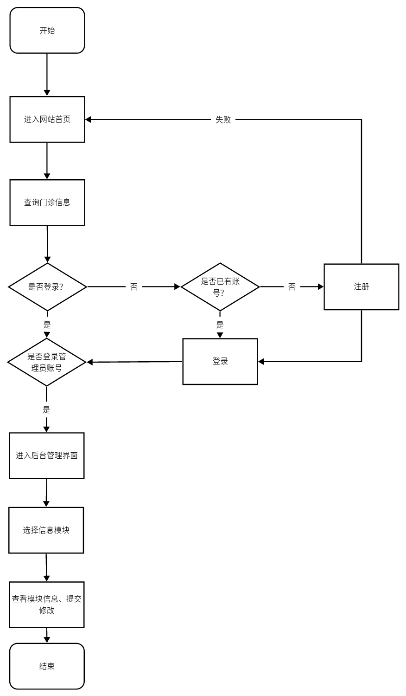

# CareCompass需求规格说明书

| 成员&#xA; | 刘芊琪&#xA; |
| ------- | -------- |
| 成员&#xA; | 翁晨皓&#xA; |
| 成员&#xA; | 冯伟伦&#xA; |
| 成员&#xA; | 武钰川&#xA; |
| 成员&#xA; | 刘洪宇      |

[TOC]

## 概述

### 用户简介

"医院门诊预约系统"最终用户是有意愿浏览和使用本网站的用户，使用者主要有管理者和用户群两种，其中用户群又分为游客、就诊患者和医护人员。

#### 游客

在实际操作中，没有在本站进行实名认证的用户。游客拥有浏览本站信息的权限，但无法进行预约等操作，无法调用数据库相关借口，可以通过注册及实名认证转化为就诊患者。

#### 就诊患者

在实际操作中，在本站实名认证过的用户。就诊患者可使用本人身份证对应的帐号进行登录，拥有游客拥有的所有权限，可以使用查询各科室医生出诊情况、查看出诊医生的介绍信息、查看各出诊医生剩余号源数、预约门诊挂号、查询门诊挂号预约、取消门诊挂号预约、支付医疗费用、查看历史诊疗信息等相关功能。 

#### 医生

在实际操作中，经过本站认证过的本院在职医生。医生可使用本人帐号进行登录，可以使用账号信息管理、浏览当日等候就诊患者信息、查看患者历史诊疗信息、开具患者检查、开具患者病历、开具患者处方单、确认患者就诊完成等相关功能。 

#### 管理员

在实际操作中，拥有本站管理者账号的用户。管理员可以通过管理员账号登录，可以进行管理医生账号、管理科室信息、管理医生排班及放号数量、管理医院可提供的检查、处理患者失约、处理医生请假等相关功能。

### 项目的目的与目标

#### 目的

随着社会的发展和医疗行业的进步，人们越来越重视自己的健康问题。然而，由于人口众多、资源有限，传统的医疗门诊预约方式已经不能满足现代社会的需求。在这种背景下，线上医疗门诊预约系统应运而生。利用互联网技术，提供一个方便、高效的医疗服务预约平台，使患者可以在线预约挂号、咨询医生、了解相关的医疗信息等。

本“医疗门诊预约系统”旨在改善传统的预约流程，优化患者就诊体验，提高医疗服务的效率，节省患者和医生的时间，从而促进医疗行业的健康发展。

#### 目标 

1.  医疗门诊预约系统功能完善，包括在线预约挂号、在线咨询、查看医生信息、查看就诊记录等功能；
2.  系统稳定运行，保证患者和医生的数据安全，避免系统故障影响预约服务；
3.  为患者提供便捷的预约方式，用户可以根据自己的需求随时进行预约，缩短排队时间，提高就诊效率；
4.  患者可以通过系统查询医生信息、医院信息、科室信息等，方便选择合适的医疗服务；
5.  付款渠道畅通。

### 术语定义

\[1] 管理员：本系统的后台管理者，可以对医院信息与用户信息进行管理。

\[2] 游客：没有注册的网站用户，只能浏览网站信息，注册并实名认证后可成为就诊患者。

\[3] 就诊患者：已实名认证的网站用户，具有游客除了注册之外的所有功能，可以查询相关信息并预约门诊挂号。 

\[4] 医生：本院在职医生，可以进行患者信息查询、处方开具等操作。

\[5] 第三方支付系统：譬如微信或支付宝这样的第三方支付系统，用来支付相关费用。

### 参考资料

\[1] 吕云翔. 软件工程实用教程\[M]. 北京：清华大学出版社, 2015.

\[2] Pressman R S. 软件工程: 实践者的研究方法 (英文精编版)\[M]. 机械工业出版社, 2008. 

\[3] Ian Sommerille. 软件工程(原书第8版)\[M]. 机械工业出版社, 2007.

### 相关文档

\[1] 《软件开发计划书》

\[2] 《软件设计说明书》

\[3] 《部署文档》

\[4] 《测试报告》

\[5] 《用户使用说明书》

 

## 目标系统描述

### 角色定义

医院门诊预约系统的角色定义如下表所示：

| **编号**  | **角色**    | **职责**    | **相关的业务**        |
| ------- | --------- | --------- | ---------------- |
| 01&#xA; | 游客&#xA;   | 无&#xA;    | 浏览网站信息&#xA;      |
| 02&#xA; | 就诊患者&#xA; | 无&#xA;    | 使用网站查询、预约功能&#xA; |
| 03&#xA; | 医生&#xA;   | 诊断&#xA;   | 出具诊断信息&#xA;      |
| 04&#xA; | 管理员&#xA;  | 管理平台&#xA; | 管理网站相关业务&#xA;    |

### 业务流程

#### 网站总体工作图

网站总体工作如下图所示：

#### 用户角度总体工作图

用户总体工作流程如下图所示：

用户（包括患者和医生）在未登录情况下可以浏览网站首页，其余部分需在实名注册登录后才能使用。

#### 管理员角度总体工作图

管理员角度总体工作如下图所示：

管理员需要用后台提供的管理员账号登录，然后进行相关操作维护。

#### 患者预约流程图

这里将本平台患者角度最重要的预约门诊模块拿出来进行分析，其余功能模块基本可由用户角度的总体工作流程图概括。预约门诊流程如下图所示：

用户在进入网站首页后，可以点击预约门诊，未登录用户会自动跳转登录。进入预约系统后可以选择科室，查看出诊医生及其号源，选择医生后可选择预约就诊时间段，点击“确认预约”进入付款界面，成功付款后完成预约。过程中用户可随时返回上一界面。

#### 医生诊断流程图

这里将本平台医生角度最重要的诊断模块拿出来进行分析，其余功能模块基本可由用户角度的总体工作流程图概括。诊断流程如下图所示：

医生使用医生账号进入医生系统，可以查询当日所属本人的就诊患者列表，患者前来就诊时，可选择当前就诊患者，查看患者详细信息及相关检查结果，就诊结束后医生可开具诊断结果、检查、处方、病历等，点击“确认诊断”按钮提交诊断结果，诊断完成。

#### 管理员管理信息

这里将本平台管理员角度最重要的管理信息模块拿出来进行分析，其余模块基本可由管理员角度总体工作流程图概括。管理员管理信息流程如下图所示：

管理员利用管理员账号登录后进入后台管理页面，选择要管理的条目后进入相应的管理页面进行相应操作。

## 总体功能需求

### 总体功能

“医院门诊预约系统”的功能概述如下图所示：

### 用户故事

#### 患者用户故事

1.  作为一名患者，我希望能在线注册，以便在预约挂号和查询病历时使用。
2.  作为一名患者，我希望能查看并编辑我的个人资料和联系方式，以便医院能够与我保持联系。
3.  作为一名患者，我希望能在线预约和取消预约，以便节省时间和精力。
4.  作为一名患者，我希望能查看我的病历和检查结果，以便了解我的健康状况。
5.  作为一名患者，我希望能查看和支付我的账单，以便了解我的医疗费用。
6.  作为一名患者，我希望能在线申请处方续签和查看我的用药记录，以便管理我的药物治疗。
7.  作为一名患者，我希望能与我的医生和护士进行在线沟通，以便及时解决我的疑问和问题。

#### 医生用户故事

1.  作为一名医生，我希望能查看并编辑我的个人资料和职业信息，以便患者能了解我的专业背景。
2.  作为一名医生，我希望能查看我的预约日程和患者排队情况，以便更好地管理我的时间。
3.  作为一名医生，我希望能访问患者的病历、检查结果和诊断历史，以便为患者提供适当的医疗建议。
4.  作为一名医生，我希望能在线开处方和管理患者的用药记录，以便确保患者正确使用药物。
5.  作为一名医生，我希望能与患者和其他医护人员进行在线沟通，以便协同工作和解决问题。

#### 管理员用户故事

1.  作为一名管理员，我希望能管理患者、医生和其他员工的用户账户，以便确保系统中的信息准确和更新。
2.  作为一名管理员，我希望能查看和调整预约日程，以便更好地安排医生和护士的工作时间。
3.  作为一名管理员，我希望能管理患者的账单和付款信息，以便确保财务记录的准确性。
4.  作为一名管理员，我希望能查看医院绩效和患者满意度报告，以便评估医院的服务质量并进行改进。
5.  作为一名管理员，我希望能管理药物和医疗用品的库存，以便确保医院有足够的资源为患者提供服务。

### 用例图形式分析

#### 患者系统

患者信息管理系统的用例图如下所示：

患者信息管理系统的顺序图如下所示：

“患者账号注册”用例如下表所示。

| 编号&#xA;     | 101&#xA;                                                     | 用例名称&#xA; | 患者账号注册&#xA;       |
| ------------- | ------------------------------------------------------------ | ------------- | ----------------------- |
| 使用人员&#xA; | 游客&#xA;                                                    | 扩展点&#xA;   | 无&#xA;                 |
| 输入&#xA;     | 患者个人信息，包括姓名、性别、出生日期、联系电话、电子邮箱等登录密码确认密码 | 后置条件&#xA; | 患者账号已成功注册&#xA; |
| 系统响应&#xA; | 保存患者个人信息和密码创建患者账号                           |               |                         |
| 输出&#xA;     | 注册成功提示信息&#xA;                                        |               |                         |
| 前置条件&#xA; | 无&#xA;                                                      |               |                         |
| 活动步骤&#xA; | 患者访问注册页面。患者输入个人信息，包括姓名、性别、出生日期、联系电话、电子邮箱等。患者输入登录密码。患者确认密码。系统验证密码是否一致，如果一致则保存患者个人信息和密码，创建患者账号，跳转到登录页面并显示注册成功提示信息，本次活动完成。 |               |                         |
| 异常处理&#xA; | 如果密码不一致，则系统返回错误信息“密码不一致，请重新输入”。如果患者账号注册失败，则系统返回错误信息“账号注册失败，请稍后再试”。 |               |                         |

“患者账号登录”用例如下表所示：

| 编号&#xA;   | 102&#xA;                                                                      | 用例名称&#xA; | 患者账号登录&#xA;    |
| --------- | ----------------------------------------------------------------------------- | --------- | -------------- |
| 使用人员&#xA; | 游客&#xA;                                                                       | 扩展点&#xA;  | 无&#xA;         |
| 输入&#xA;   | 患者账号登录密码                                                                      | 后置条件&#xA; | 用户登录身份为患者&#xA; |
| 系统响应&#xA; | 进入患者模式主页面，保存登录状态&#xA;                                                         |           |                |
| 输出&#xA;   | 显示患者权限内的页面&#xA;                                                               |           |                |
| 前置条件&#xA; | 无&#xA;                                                                        |           |                |
| 活动步骤&#xA; | 用户选择“登录”按钮。用户输入患者账号。用户输入登录密码。系统验证账号密码，如果验证成功，则跳转到登录后的患者主页面，显示患者权限内的页面，本次活动完成。 |           |                |
| 异常处理&#xA; | 如果登录失败，则系统返回错误信息“账号或密码错误”。&#xA;                                               |           |                |

“患者个人信息查询”用例如下表所示：

| 编号&#xA;   | 103&#xA;                                                | 用例名称&#xA; | 患者个人信息查询&#xA; |
| --------- | ------------------------------------------------------- | --------- | ------------- |
| 使用人员&#xA; | 患者&#xA;                                                 | 扩展点&#xA;  | 无&#xA;        |
| 输入&#xA;   | 系统自动转换，不需要输入&#xA;                                       | 后置条件&#xA; | 无&#xA;        |
| 系统响应&#xA; | 获取患者个人信息数据&#xA;                                         |           |               |
| 输出&#xA;   | 患者个人信息数据&#xA;                                           |           |               |
| 前置条件&#xA; | 用户以患者身份登录&#xA;                                          |           |               |
| 活动步骤&#xA; | 患者进入个人信息查询页面。患者输入患者账号。系统获取患者个人信息数据，显示在个人信息查询页面上，本次活动完成。 |           |               |
| 异常处理&#xA; | 如果患者个人信息获取失败，则系统返回错误信息“信息获取失败，请稍后再试”。&#xA;              |           |               |

“患者个人信息修改”用例说明如下表所示：

| 编号&#xA;   | 104&#xA;                                                                                        | 用例名称&#xA; | 患者个人信息修改&#xA;    |
| --------- | ----------------------------------------------------------------------------------------------- | --------- | ---------------- |
| 使用人员&#xA; | 患者&#xA;                                                                                         | 扩展点&#xA;  | 无&#xA;           |
| 输入&#xA;   | 需要修改的患者个人信息&#xA;                                                                                | 后置条件&#xA; | 患者个人信息已成功修改&#xA; |
| 系统响应&#xA; | 保存新修改的患者个人信息数据&#xA;                                                                             |           |                  |
| 输出&#xA;   | 修改成功提示信息&#xA;                                                                                   |           |                  |
| 前置条件&#xA; | 用户以患者身份登录&#xA;                                                                                  |           |                  |
| 活动步骤&#xA; | 患者进入个人信息修改页面。患者修改个人信息。患者确认修改。系统验证患者信息是否完整并符合格式要求，如果一致则保存患者个人信息数据，跳转到个人信息查询页面并显示修改成功提示信息，本次活动完成。 |           |                  |
| 异常处理&#xA; | 如果患者个人信息修改失败，则系统返回错误信息“信息修改失败，请稍后再试”。&#xA;                                                      |           |                  |

“患者账号安全信息修改”用例说明如下表所示：

| 编号          | 105                                                          | 用例名称      | 患者账号安全信息修改            |
| ------------- | ------------------------------------------------------------ | ------------- | ------------------------------- |
| 使用人员      | 患者                                                         | 扩展点&#xA;   | 无&#xA;                         |
| 输入&#xA;     | 新登录密码&#xA;确认新登录密码&#xA;                           | 后置条件&#xA; | 患者账号安全信息已成功修改&#xA; |
| 系统响应&#xA; | 验证原登录密码是否正确;保存新登录密码&#xA;                   |               |                                 |
| 输出&#xA;     | 修改成功提示信息&#xA;                                        |               |                                 |
| 前置条件&#xA; | 用户以患者身份登录&#xA;                                      |               |                                 |
| 活动步骤&#xA; | 患者进入账号安全信息修改页面。患者输入新登录密码。患者确认新登录密码。系统验证新登录密码和确认新登录密码是否一致，如果验证通过，则保存新登录密码，修改患者账号安全信息数据，跳转到个人信息查询页面并显示修改成功提示信息，本次活动完成。 |               |                                 |
| 异常处理&#xA; | 如果新登录密码和确认新登录密码不一致，则系统返回错误信息“新登录密码和确认新登录密码不一致，请重新输入”。&#xA;如果患者账号安全信息修改失败，则系统返回错误信息“账号安全信息修改失败，请稍后再试”。&#xA; |               |                                 |

患者就诊管理系统的用例图如下所示：

“查询医生出诊情况”用例说明如下表所示：

| 编号&#xA;   | 201&#xA;                                                                              | 用例名称&#xA; | 查询医生出诊情况&#xA; |
| --------- | ------------------------------------------------------------------------------------- | --------- | ------------- |
| 使用人员&#xA; | 患者&#xA;                                                                               | 扩展点&#xA;  | 无&#xA;        |
| 输入&#xA;   | 医生姓名与查询日期&#xA;                                                                        | 后置条件&#xA; | 无&#xA;        |
| 系统响应&#xA; | 根据医生姓名和查询日期，获取医生出诊情况数据（号源数、价格等）&#xA;                                                  |           |               |
| 输出&#xA;   | 显示医生出诊情况数据&#xA;                                                                       |           |               |
| 前置条件&#xA; | 已登录为患者&#xA;                                                                           |           |               |
| 活动步骤&#xA; | 用户进入查询医生出诊情况页面。用户输入医生姓名。用户输入查询日期。点击“查询”按钮。系统根据医生姓名或编号和查询日期，获取医生出诊情况数据，并显示在页面上，本次活动完成。 |           |               |
| 异常处理&#xA; | 如果没有找到医生的出诊情况数据，则系统返回错误信息“未找到该医生的出诊情况数据”。&#xA;                                        |           |               |

“查询出诊医生介绍”用例说明如下表所示：

| 编号&#xA;   | 202&#xA;                                                              | 用例名称&#xA; | 查询出诊医生介绍&#xA; |
| --------- | --------------------------------------------------------------------- | --------- | ------------- |
| 使用人员&#xA; | 患者&#xA;                                                               | 扩展点&#xA;  | 无&#xA;        |
| 输入&#xA;   | 出诊医生姓名&#xA;                                                           | 后置条件&#xA; | 无&#xA;        |
| 系统响应&#xA; | 根据医生姓名，获取医生介绍信息&#xA;                                                  |           |               |
| 输出&#xA;   | 显示医生介绍信息&#xA;                                                         |           |               |
| 前置条件&#xA; | 用户已登录为患者&#xA;                                                         |           |               |
| 活动步骤&#xA; | 用户进入查询出诊医生介绍页面。用户输入医生姓名。点击“查询”按钮。系统根据医生姓名或编号，获取医生介绍信息，并显示在页面上，本次活动完成。 |           |               |
| 异常处理&#xA; | 如果没有找到医生的介绍信息，则系统返回错误信息“未找到该医生的介绍信息”。&#xA;                            |           |               |

“预约门诊挂号”用例说明如下表所示：

| 编号&#xA;   | 203&#xA;                                                                                                                                | 用例名称&#xA; | 预约门诊挂号&#xA;                |
| --------- | --------------------------------------------------------------------------------------------------------------------------------------- | --------- | -------------------------- |
| 使用人员&#xA; | 患者&#xA;                                                                                                                                 | 扩展点&#xA;  | 无&#xA;                     |
| 输入&#xA;   | 医生姓名；预约时间段&#xA;                                                                                                                         | 后置条件&#xA; | 患者已成功预约挂号，并可以在预约的时间就诊&#xA; |
| 系统响应&#xA; | 根据预约时间段和医生姓名，验证医生的当日号源剩余&#xA;                                                                                                           |           |                            |
| 输出&#xA;   | 预约挂号成功信息&#xA;                                                                                                                           |           |                            |
| 前置条件&#xA; | 用户已登录为患者&#xA;                                                                                                                           |           |                            |
| 活动步骤&#xA; | 患者进入预约挂号页面。患者输入预约日期和医生姓名，或是根据欲就诊科室查询到医生。点击“查询医生出诊情况”按钮，系统根据医生姓名和预约日期，获取医生的出诊情况数据。患者选择预约时间段。点击“提交预约”按钮，系统验证患者个人信息并将预约信息保存，预约挂号成功，本次活动完成。 |           |                            |
| 异常处理&#xA; | 如果预约日期和时间已被预约完，则系统返回错误信息“该时间段已被预约完，请选择其他时间段”。&#xA;                                                                                      |           |                            |

“查询挂号预约”用例说明如下表所示：

| 编号&#xA;   | 204&#xA;                                                                    | 用例名称&#xA; | 查询挂号预约&#xA; |
| --------- | --------------------------------------------------------------------------- | --------- | ----------- |
| 使用人员&#xA; | 患者&#xA;                                                                     | 扩展点&#xA;  | 无&#xA;      |
| 输入&#xA;   | 无需输入，系统自动获取当前登录患者的信息&#xA;                                                   | 后置条件&#xA; | 无&#xA;      |
| 系统响应&#xA; | 根据当前登录患者的信息，获取该患者当前的挂号预约信息&#xA;                                             |           |             |
| 输出&#xA;   | 显示当前患者的挂号预约信息&#xA;                                                          |           |             |
| 前置条件&#xA; | 用户已登录为患者&#xA;                                                               |           |             |
| 活动步骤&#xA; | 患者进入查询当前挂号预约页面。系统自动获取当前登录患者的信息。系统根据当前登录患者的信息，获取该患者当前的挂号预约信息，并显示在页面上，本次活动完成。 |           |             |
| 异常处理&#xA; | 如果当前患者没有任何挂号预约信息，则系统返回错误信息“当前患者没有任何挂号预约信息”。&#xA;                            |           |             |

“取消挂号预约”用例说明如下表所示：

| 编号&#xA;   | 205&#xA;                                                                                                                                     | 用例名称&#xA; | 取消挂号预约&#xA;                    |
| --------- | -------------------------------------------------------------------------------------------------------------------------------------------- | --------- | ------------------------------ |
| 使用人员&#xA; | 患者&#xA;                                                                                                                                      | 扩展点&#xA;  | 无&#xA;                         |
| 输入&#xA;   | 需要取消的挂号预约记录&#xA;                                                                                                                             | 后置条件&#xA; | 成功取消预约，对应预约时段和医生增加一个可预约号源&#xA; |
| 系统响应&#xA; | 根据患者提供的挂号预约记录，获取对应的挂号预约信息&#xA;                                                                                                               |           |                                |
| 输出&#xA;   | 显示取消挂号预约成功信息&#xA;                                                                                                                            |           |                                |
| 前置条件&#xA; | 患者已登录，并已经预约了挂号&#xA;                                                                                                                          |           |                                |
| 活动步骤&#xA; | 患者进入取消挂号预约页面。患者输入个人信息。患者输入挂号预约号码。点击“确认取消预约”按钮，系统验证患者个人信息并获取对应的挂号预约信息。系统确认患者是否确定取消挂号预约。如果患者确认取消挂号预约，则系统将该预约信息从预约挂号列表中删除，并显示取消挂号预约成功信息，本次活动完成。 |           |                                |
| 异常处理&#xA; | 如果由于某些网络加载原因，挂号预约记录无效，则系统返回错误信息“无效的挂号预约”。&#xA;如果患者确认取消挂号预约失败，则系统返回错误信息“取消挂号预约失败”。&#xA;                                                       |           |                                |

“支付诊疗费用”用例说明如下表所示：

| 编号&#xA;   | 206&#xA;                                                                                                  | 用例名称&#xA; | 支付诊疗费用&#xA;             |
| --------- | --------------------------------------------------------------------------------------------------------- | --------- | ----------------------- |
| 使用人员&#xA; | 患者&#xA;                                                                                                   | 扩展点&#xA;  | 无&#xA;                  |
| 输入&#xA;   | 需要支付的诊疗单号&#xA;                                                                                            | 后置条件&#xA; | 患者已成功支付诊疗费用，支付状态更新&#xA; |
| 系统响应&#xA; | 跳转至第三方支付系统进行支付；更新诊疗支付状态和患者费用记录&#xA;                                                                       |           |                         |
| 输出&#xA;   | 显示支付成功信息&#xA;                                                                                             |           |                         |
| 前置条件&#xA; | 患者已经进行了诊疗&#xA;                                                                                            |           |                         |
| 活动步骤&#xA; | 患者进入某项诊疗的支付费用页面。系统显示当前的诊疗费用。患者选择支付方式，并点击“确认支付”按钮。系统跳转至第三方支付系统进行支付。支付成功后，系统更新诊疗支付状态和费用记录，并显示支付成功信息，本次活动完成。 |           |                         |
| 异常处理&#xA; | 如果第三方支付失败，则系统返回错误信息“支付失败”。&#xA;                                                                           |           |                         |

“查看历史诊疗信息”用例说明如下表所示：

| 编号&#xA;   | 207&#xA;                                               | 用例名称&#xA; | 查看历史诊疗信息&#xA; |
| --------- | ------------------------------------------------------ | --------- | ------------- |
| 使用人员&#xA; | 患者&#xA;                                                | 扩展点&#xA;  | 无&#xA;        |
| 输入&#xA;   | 系统自动处理，不需要输入&#xA;                                      | 后置条件&#xA; | 无&#xA;        |
| 系统响应&#xA; | 获取患者历史诊疗信息数据&#xA;                                      |           |               |
| 输出&#xA;   | 显示当前患者历史诊疗数据&#xA;                                      |           |               |
| 前置条件&#xA; | 用户已登录为患者&#xA;                                          |           |               |
| 活动步骤&#xA; | 患者进入查看历史诊疗信息页面。系统获取当前患者历史诊疗信息数据。系统显示当前患者历史诊疗数据，本次活动完成。 |           |               |
| 异常处理&#xA; | 如果历史诊疗信息数据获取失败，则系统返回错误信息“历史诊疗信息获取失败”。&#xA;             |           |               |

#### 医生系统

医生系统用例图如下所示：

医生系统顺序图如下所示：

“账号登录”用例说明如下表所示：

| 编号&#xA;   | 301&#xA;                                   | 用例名称&#xA; | 账号登录&#xA;      |
| --------- | ------------------------------------------ | --------- | -------------- |
| 使用人员&#xA; | 医生&#xA;                                    | 扩展点&#xA;  | 无&#xA;         |
| 输入&#xA;   | 个人账户与密码&#xA;                               | 后置条件&#xA; | 用户登录身份为医生&#xA; |
| 系统响应&#xA; | 进入医生模式主页面，保存登录状态&#xA;                      |           |                |
| 输出&#xA;   | 显示与医生权限内的页面&#xA;                           |           |                |
| 前置条件&#xA; | 无&#xA;                                     |           |                |
| 活动步骤&#xA; | 用户选择“登录”按钮用户输入账号。用户输入密码。系统跳转到登陆后主界面，本次活动完成 |           |                |
| 异常处理&#xA; | 若登录失败，返回“账号或密码错误”&#xA;                     |           |                |

 

“密码修改”用例说明如下表所示：

| 编号&#xA;   | 302&#xA;                                                            | 用例名称&#xA; | 密码修改&#xA; |
| --------- | ------------------------------------------------------------------- | --------- | --------- |
| 使用人员&#xA; | 医生&#xA;                                                             | 扩展点&#xA;  | 无&#xA;    |
| 输入&#xA;   | 旧密码与新密码（二次确认）/手机号验证码加新密码&#xA;                                       | 后置条件&#xA; | 无&#xA;    |
| 系统响应&#xA; | 提示密码修改进程，并向后端进行数据反馈&#xA;                                            |           |           |
| 输出&#xA;   | 密码修改成功/失败&#xA;                                                      |           |           |
| 前置条件&#xA; | 无&#xA;                                                              |           |           |
| 活动步骤&#xA; | 用户选择修改密码（旧密码修改或手机验证修改）。用户输入旧密码/手机验证码。用户输入新密码（二次确认）。显示密码修改成功系统返回历史页面 |           |           |
| 异常处理&#xA; | 若旧密码或验证码错误，提示相应问题&#xA;                                              |           |           |

“浏览当日候诊患者信息”用例说明如下表所示：

| 编号&#xA;   | 303&#xA;               | 用例名称&#xA; | 浏览当日候诊患者信息&#xA; |
| --------- | ---------------------- | --------- | --------------- |
| 使用人员&#xA; | 医生&#xA;                | 扩展点&#xA;  | 无&#xA;          |
| 输入&#xA;   | 系统自动转换，不需要输入&#xA;      | 后置条件&#xA; | 无&#xA;          |
| 系统响应&#xA; | 展示患者信息列表&#xA;          |           |                 |
| 输出&#xA;   | 显示当体候诊患者信息数据&#xA;      |           |                 |
| 前置条件&#xA; | 用户以医生身份登录&#xA;         |           |                 |
| 活动步骤&#xA; | 用户点击当日患者信息菜单展示当日候诊患者信息 |           |                 |
| 异常处理&#xA; | 若当日暂无候诊患者，则会进行提示&#xA;  |           |                 |

“开具患者检查”用例说明如下表所示：

| 编号&#xA;   | 304&#xA;                                                           | 用例名称&#xA; | 开具患者检查&#xA; |
| --------- | ------------------------------------------------------------------ | --------- | ----------- |
| 使用人员&#xA; | 医生&#xA;                                                            | 扩展点&#xA;  | 无&#xA;      |
| 输入&#xA;   | 患者所需检查项目&#xA;                                                      | 后置条件&#xA; | 无&#xA;      |
| 系统响应&#xA; | 展示患者信息列表&#xA;                                                      |           |             |
| 输出&#xA;   | 显示当前候诊患者信息数据&#xA;                                                  |           |             |
| 前置条件&#xA; | 用户以医生身份登录&#xA;                                                     |           |             |
| 活动步骤&#xA; | 进入当前患者就诊页面点击“开具检查”选项选择其中的若干项检查点击“确认”按钮系统更新患者就诊信息，患者可以从个人信息中看到待检查项目 |           |             |
| 异常处理&#xA; | 若检查设置出现异常，提示医生“检查设置失败”&#xA;                                        |           |             |

“查看患者历史诊疗信息”用例说明如下表所示：

| 编号&#xA;   | 305&#xA;                                       | 用例名称&#xA; | 查看患者历史诊疗信息&#xA; |
| --------- | ---------------------------------------------- | --------- | --------------- |
| 使用人员&#xA; | 医生&#xA;                                        | 扩展点&#xA;  | 无&#xA;          |
| 输入&#xA;   | 系统自动转换，不需要输入&#xA;                              | 后置条件&#xA; | 无&#xA;          |
| 系统响应&#xA; | 获取患者历史诊疗信息数据&#xA;                              |           |                 |
| 输出&#xA;   | 显示当前候诊患者历史诊疗数据&#xA;                            |           |                 |
| 前置条件&#xA; | 用户以医生身份登录&#xA;                                 |           |                 |
| 活动步骤&#xA; | 医生选择患者进行就诊点击“查看历史诊疗信息”选项查看就诊患者的历史诊疗信息，用以辅佐当前诊断 |           |                 |
| 异常处理&#xA; | 若患者历史信息获取失败，则提示“信息获取失败，请稍后再试”&#xA;             |           |                 |

“开具患者病历”用例说明如下表所示：

| 编号&#xA;   | 306&#xA;                                           | 用例名称&#xA; | 开具患者病历&#xA; |
| --------- | -------------------------------------------------- | --------- | ----------- |
| 使用人员&#xA; | 医生&#xA;                                            | 扩展点&#xA;  | 无&#xA;      |
| 输入&#xA;   | 患者本次就诊病历信息&#xA;                                    | 后置条件&#xA; | 无&#xA;      |
| 系统响应&#xA; | 获取患者就诊信息&#xA;                                      |           |             |
| 输出&#xA;   | 显示当前患者就诊信息&#xA;                                    |           |             |
| 前置条件&#xA; | 用户以医生身份登录&#xA;                                     |           |             |
| 活动步骤&#xA; | 医生选择患者进行就诊对患者进行诊断在病历信息文本区填写本次就诊病历数据点击“确认”保存病历，活动结束 |           |             |
| 异常处理&#xA; | 若提交时系统出错，则界面提示“病历保存失败”&#xA;                        |           |             |

“开具患者处方单”用例说明如下表所示：

| 编号&#xA;   | 307&#xA;                                                          | 用例名称&#xA; | 开具患者处方单&#xA; |
| --------- | ----------------------------------------------------------------- | --------- | ------------ |
| 使用人员&#xA; | 医生&#xA;                                                           | 扩展点&#xA;  | 无&#xA;       |
| 输入&#xA;   | 患者本次处方单&#xA;                                                      | 后置条件&#xA; | 无&#xA;       |
| 系统响应&#xA; | 获取患者就诊信息&#xA;                                                     |           |              |
| 输出&#xA;   | 显示当前患者就诊信息&#xA;                                                   |           |              |
| 前置条件&#xA; | 用户以医生身份登录&#xA;                                                    |           |              |
| 活动步骤&#xA; | 医生选择患者进行就诊对患者进行诊断并查看患者病历信息点击“开具处方药”选项，为患者开具本次所需处方药点击“确认”，处方单开具完成。 |           |              |
| 异常处理&#xA; | 若提交时系统出错，则界面提示“处方单开具失败”&#xA;                                      |           |              |

“确认患者就诊完成”用例说明如下表所示：

| 编号&#xA;   | 308&#xA;                                                                      | 用例名称&#xA; | 确认患者就诊完成&#xA; |
| --------- | ----------------------------------------------------------------------------- | --------- | ------------- |
| 使用人员&#xA; | 医生&#xA;                                                                       | 扩展点&#xA;  | 无&#xA;        |
| 输入&#xA;   | 系统自动转换，不需要输入&#xA;                                                             | 后置条件&#xA; | 患者结束就诊状态&#xA; |
| 系统响应&#xA; | 将本次就诊信息传输到后台&#xA;                                                             |           |               |
| 输出&#xA;   | 显示就诊确认进度&#xA;                                                                 |           |               |
| 前置条件&#xA; | 用户以医生身份登录，当前有患者在就诊状态&#xA;                                                     |           |               |
| 活动步骤&#xA; | 医生对就诊患者进行就诊可选择为患者开具检查开具患者病历可选择为患者开具处方单以上流程结束，可选择“完成本次就诊”选项系统将本次就诊信息提交至后台，活动结束 |           |               |
| 异常处理&#xA; | 若提交时系统出错，则界面提示“确认就诊失败，请稍后再试”&#xA;                                             |           |               |

#### 管理员系统

医院管理员系统用例图如下所示：

管理员系统顺序图如下所示：

“管理医生账号”用例说明如下表所示：

| 编号&#xA;   | 401&#xA;                                                      | 用例名称&#xA; | 管理医生账号&#xA; |
| --------- | ------------------------------------------------------------- | --------- | ----------- |
| 使用人员&#xA; | 医院管理员&#xA;                                                    | 扩展点&#xA;  | 无&#xA;      |
| 输入&#xA;   | 系统自动转换，不需要输入&#xA;                                             | 后置条件&#xA; | 无&#xA;      |
| 系统响应&#xA; | 显示医生信息数据，并对后端发送数据修改请求&#xA;                                    |           |             |
| 输出&#xA;   | 显示医生账号信息数据&#xA;                                               |           |             |
| 前置条件&#xA; | 用户以医院管理员身份登录&#xA;                                             |           |             |
| 活动步骤&#xA; | 选择“管理医生账号”模块选择想要修改的医生账号跳转到详情修改界面，进行修改修改完成，点击保存系统提示保存成功，完成本次活动 |           |             |
| 异常处理&#xA; | 若后端信息修改失败，平台将进行报错，管理员可联系维护人员进行处理&#xA;                         |           |             |

“管理科室信息”用例说明如下表所示：

| 编号&#xA;   | 402&#xA;                                                                               | 用例名称&#xA; | 管理科室信息&#xA; |
| --------- | -------------------------------------------------------------------------------------- | --------- | ----------- |
| 使用人员&#xA; | 医院管理员&#xA;                                                                             | 扩展点&#xA;  | 无&#xA;      |
| 输入&#xA;   | 系统自动转换，不需要输入&#xA;                                                                      | 后置条件&#xA; | 无&#xA;      |
| 系统响应&#xA; | 显示当前所有科室相关数据&#xA;                                                                      |           |             |
| 输出&#xA;   | 显示科室及其介绍，以及科室下的医生信息和介绍&#xA;                                                            |           |             |
| 前置条件&#xA; | 用户以医院管理员身份登录&#xA;                                                                      |           |             |
| 活动步骤&#xA; | 点击“科室信息修改”选项可选择修改每科室的科室简介可选择调整每科室下的具体医生可选择修改科室内医生的介绍信息点击“确认修改”按钮系统将修改信息发送到后端，页面跳转到上级页面 |           |             |
| 异常处理&#xA; | 若后端信息修改失败，平台将进行报错，管理员可联系维护人员进行处理&#xA;                                                  |           |             |

“管理医生排班放号数量”用例说明如下表所示：

| 编号&#xA;   | 403&#xA;                                                     | 用例名称&#xA; | 管理医生排班放号数量&#xA; |
| --------- | ------------------------------------------------------------ | --------- | --------------- |
| 使用人员&#xA; | 医院管理员&#xA;                                                   | 扩展点&#xA;  | 无&#xA;          |
| 输入&#xA;   | 系统自动转换，不需要输入&#xA;                                            | 后置条件&#xA; | 无&#xA;          |
| 系统响应&#xA; | 获取当前医生的排班信息数据&#xA;                                           |           |                 |
| 输出&#xA;   | 显示每个科室下医生当前的排班时间和放号数量&#xA;                                   |           |                 |
| 前置条件&#xA; | 用户以医院管理员身份登录&#xA;                                            |           |                 |
| 活动步骤&#xA; | 点击“医生排班”选项可选择设置医生的排班时间可选择设置医生排班时间的放号数量点击“确认”进行数据提交系统将修改提交至后端 |           |                 |
| 异常处理&#xA; | 若后端信息修改失败，平台将进行报错，管理员可联系维护人员进行处理&#xA;                        |           |                 |

“管理医院可提供检查”用例说明如下表所示：

| 编号&#xA;   | 404&#xA;                                                    | 用例名称&#xA; | 管理医院可提供检查&#xA; |
| --------- | ----------------------------------------------------------- | --------- | -------------- |
| 使用人员&#xA; | 医院管理员&#xA;                                                  | 扩展点&#xA;  | 无&#xA;         |
| 输入&#xA;   | 系统自动转换，不需要输入&#xA;                                           | 后置条件&#xA; | 无&#xA;         |
| 系统响应&#xA; | 获取当前的检查项目信息&#xA;                                            |           |                |
| 输出&#xA;   | 显示当前医院可进行的检查信息&#xA;                                         |           |                |
| 前置条件&#xA; | 用户以医院管理员身份登录&#xA;                                           |           |                |
| 活动步骤&#xA; | 点击“设置检查项目”选项可选择对医院当前检查项目进行增删改查点击“确定”提交修改后的数据系统将数据提交至后端，完成设置 |           |                |
| 异常处理&#xA; | 若后端信息修改失败，平台将进行报错，管理员可联系维护人员进行处理&#xA;                       |           |                |

“处理患者失约”用例说明如下表所示：

| 编号&#xA;   | 405&#xA;                                                                          | 用例名称&#xA; | 处理患者失约&#xA; |
| --------- | --------------------------------------------------------------------------------- | --------- | ----------- |
| 使用人员&#xA; | 医院管理员&#xA;                                                                        | 扩展点&#xA;  | 无&#xA;      |
| 输入&#xA;   | 系统自动转换，不需要输入&#xA;                                                                 | 后置条件&#xA; | 无&#xA;      |
| 系统响应&#xA; | 获取当前的失约患者信息&#xA;                                                                  |           |             |
| 输出&#xA;   | 显示当前失约患者列表&#xA;                                                                   |           |             |
| 前置条件&#xA; | 用户以医院管理员身份登录&#xA;                                                                 |           |             |
| 活动步骤&#xA; | 点击“失约患者处理”选项可选择帮失约患者重新调整预约时间可选择通过消息系统向失约患者发送提示信息，让患者重新选择预约时间处理完任意名失约患者后均可选择结束本次活动 |           |             |
| 异常处理&#xA; | 若当前不存在失约患者，则系统进行提示&#xA;                                                           |           |             |

“处理医生请假”用例说明如下表所示：

| 编号&#xA;   | 406&#xA;                                                                                                           | 用例名称&#xA; | 处理医生请假&#xA; |
| --------- | ------------------------------------------------------------------------------------------------------------------ | --------- | ----------- |
| 使用人员&#xA; | 医院管理员&#xA;                                                                                                         | 扩展点&#xA;  | 无&#xA;      |
| 输入&#xA;   | 系统自动转换，不需要输入&#xA;                                                                                                  | 后置条件&#xA; | 无&#xA;      |
| 系统响应&#xA; | 获取当前的请假医生信息&#xA;                                                                                                   |           |             |
| 输出&#xA;   | 显示当前请假医生列表&#xA;                                                                                                    |           |             |
| 前置条件&#xA; | 用户以医院管理员身份登录&#xA;                                                                                                  |           |             |
| 活动步骤&#xA; | 点击“处理医生请假”选项对请假医生的请假详情进行审核批准修改请假医生的排班信息通过消息系统向已预约该医生请假时间段的患者发送通知，并帮其安排最近的可就诊时间名额处理完一名或多名医生请假信息后可点击确认，系统将上述修改进行数据处理 |           |             |
| 异常处理&#xA; | 若当前不存在请假医生，则系统进行提示&#xA;                                                                                            |           |             |

#### 消息系统

消息系统的用例图如下所示：

“向医生推送消息”用例说明如下表所示：

| 编号&#xA;   | 501&#xA;                                            | 用例名称&#xA; | 向医生推送消息&#xA;                   |
| --------- | --------------------------------------------------- | --------- | ------------------------------ |
| 使用人员&#xA; | 消息系统&#xA;                                           | 扩展点&#xA;  | 无&#xA;                         |
| 输入&#xA;   | 有需要向医生推送消息的功能被调用&#xA;                               | 后置条件&#xA; | 消息成功送达或在等候推送队列中，等待医生登录后收取&#xA; |
| 系统响应&#xA; | 生成消息并加入等候推送队列&#xA;                                  |           |                                |
| 输出&#xA;   | 无显式输出&#xA;                                          |           |                                |
| 前置条件&#xA; | 无&#xA;                                              |           |                                |
| 活动步骤&#xA; | 生成消息内容若医生已登录，则直接向医生推送消息若医生未登录，则将消息加入等候队列中，等待医生上线后推送 |           |                                |
| 异常处理&#xA; | 若消息推送失败，则系统记录错误到日志中&#xA;                            |           |                                |

“向患者推送消息”用例说明如下表所示：

| 编号&#xA;   | 502&#xA;                                            | 用例名称&#xA; | 向患者推送消息&#xA;                   |
| --------- | --------------------------------------------------- | --------- | ------------------------------ |
| 使用人员&#xA; | 消息系统&#xA;                                           | 扩展点&#xA;  | 无&#xA;                         |
| 输入&#xA;   | 有需要向患者推送消息的功能被调用&#xA;                               | 后置条件&#xA; | 消息成功送达或在等候推送队列中，等待患者登录后收取&#xA; |
| 系统响应&#xA; | 生成消息并加入等候推送队列&#xA;                                  |           |                                |
| 输出&#xA;   | 无显式输出&#xA;                                          |           |                                |
| 前置条件&#xA; | 无&#xA;                                              |           |                                |
| 活动步骤&#xA; | 生成消息内容若患者已登录，则直接向患者推送消息若患者未登录，则将消息加入等候队列中，等待患者上线后推送 |           |                                |
| 异常处理&#xA; | 若消息推送失败，则系统记录错误到日志中&#xA;                            |           |                                |

## 系统数据需求

存储于内部的文章管理数据库中的数据的逻辑结构如下图所示。

这些数据条目中每一个条目的数据描述如下：

**（1）患者实体**

| 数据项&#xA;             | 类型&#xA;           | 描述&#xA;        | 备注&#xA;      |
| -------------------- | ----------------- | -------------- | ------------ |
| UserID&#xA;          | Int&#xA;          | 用户的唯一身份标码&#xA; | 用户实体的主键&#xA; |
| UserName&#xA;        | Varchar (50)&#xA; | 用户姓名&#xA;      |              |
| UserPassword&#xA;    | Varchar (50)&#xA; | 用户密码&#xA;      |              |
| UserEmail&#xA;       | Varchar (50)&#xA; | 用户电子邮箱&#xA;    |              |
| UserPhoneNumber&#xA; | Varchar (50)&#xA; | 用户电话号&#xA;     |              |
| UserOfficialID&#xA;  | Varchar(50)&#xA;  | 用户身份证号&#xA;    |              |

**（2）管理员实体**

| 数据项&#xA;             | 类型&#xA;           | 描述&#xA;    | 备注&#xA;       |
| -------------------- | ----------------- | ---------- | ------------- |
| ManagerID&#xA;       | Int&#xA;          | ID&#xA;    | 管理员实体的主键&#xA; |
| ManagerName&#xA;     | Varchar (50)&#xA; | 管理员名称&#xA; |               |
| ManagerPassword&#xA; | Varchar (50)&#xA; | 管理员密码&#xA; |               |

**（3）医生实体**

| 数据项&#xA;              | 类型&#xA;           | 描述&#xA;      | 备注&#xA;             |
| --------------------- | ----------------- | ------------ | ------------------- |
| DoctorID&#xA;         | Int&#xA;          | 医生ID&#xA;    | 医生实体的主键&#xA;        |
| DoctorName&#xA;       | Varchar (50)&#xA; | 医生名称&#xA;    |                     |
| DoctorPassword&#xA;   | Varchar (50)&#xA; | 医生密码&#xA;    |                     |
| DoctorDepartment&#xA; | Int&#xA;          | 医生所属科室&#xA;  | 指向科室实体下科室ID的外键&#xA; |
| DoctorTitle&#xA;      | Varchar(50)&#xA;  | 医生职称&#xA;    |                     |
| DoctorCount&#xA;      | Int&#xA;          | 医生累计挂号量&#xA; |                     |

**（4）门诊挂号表单实体**

| 数据项&#xA;          | 类型&#xA;            | 描述&#xA;       | 备注&#xA;             |
| ----------------- | ------------------ | ------------- | ------------------- |
| DoctorID&#xA;     | Int&#xA;           | 医生ID&#xA;     | 指向医生实体下医生ID的外键&#xA; |
| DepartmentID&#xA; | Varchar (50)&#xA;  | 就诊科室ID&#xA;   | 指向科室实体下科室ID的外键&#xA; |
| Amount&#xA;       | Decimal(10,2)&#xA; | 挂号费&#xA;      |                     |
| CommitTime&#xA;   | DateTime&#xA;      | 挂号时间&#xA;     |                     |
| AppointTime&#xA;  | DateTime&#xA;      | 预约就诊时间&#xA;   |                     |
| UserID&#xA;       | Int&#xA;           | 患者ID&#xA;     | 指向患者实体下用户ID的外键&#xA; |
| OrderID&#xA;      | Int&#xA;           | 门诊挂号表单ID&#xA; | 门诊挂号表单实体的主键&#xA;    |

**（5）病历实体**

| 数据项&#xA;      | 类型&#xA;           | 描述&#xA;   | 备注&#xA;             |
| ------------- | ----------------- | --------- | ------------------- |
| RecordID&#xA; | Int&#xA;          | 病历ID&#xA; | 病历实体的主键&#xA;        |
| UserID&#xA;   | Int&#xA;          | 患者ID&#xA; | 指向患者实体下用户ID的外键&#xA; |
| DoctorID&#xA; | Int&#xA;          | 医生ID&#xA; | 指向医生实体下医生ID的外键&#xA; |
| Detail&#xA;   | Varchar(255)&#xA; | 详细信息&#xA; |                     |

**（6）处方单列表**

| 数据项&#xA;         | 类型&#xA;            | 描述&#xA;       | 备注&#xA;             |
| ---------------- | ------------------ | ------------- | ------------------- |
| PrescribeID&#xA; | Int&#xA;           | 病历ID&#xA;     | 病历实体的主键&#xA;        |
| UserID&#xA;      | Int&#xA;           | 患者ID&#xA;     | 指向患者实体下用户ID的外键&#xA; |
| DoctorID&#xA;    | Int&#xA;           | 医生ID&#xA;     | 指向医生实体下医生ID的外键&#xA; |
| Detail&#xA;      | Varchar(4095)&#xA; | 处方数量项目字典&#xA; |                     |

**（7）处方消费项目实体**

| 数据项&#xA;       | 类型&#xA;            | 描述&#xA;     | 备注&#xA;        |
| -------------- | ------------------ | ----------- | -------------- |
| ItemID&#xA;    | Int&#xA;           | 消费项目ID&#xA; | 消费项目实体的主键&#xA; |
| ItemName&#xA;  | Varchar (50)&#xA;  | 消费项目名称&#xA; |                |
| ItemPrice&#xA; | Decimal(10,2)&#xA; | 消费项目金额&#xA; |                |

**（8）医生排班实体**

| 数据项&#xA;       | 类型&#xA;       | 描述&#xA;     | 备注&#xA;               |
| -------------- | ------------- | ----------- | --------------------- |
| ManagerID&#xA; | Int&#xA;      | 管理员ID&#xA;  | 指向管理员实体下管理员ID的外键&#xA; |
| StartTime&#xA; | DateTime&#xA; | 排班开始时间&#xA; |                       |
| EndTime&#xA;   | DateTime&#xA; | 排班结束时间&#xA; |                       |
| ShiftID&#xA;   | Int&#xA;      | 排班实体ID&#xA; | 医生排班实体的主键&#xA;        |
| DoctorID&#xA;  | Int&#xA;      | 医生ID&#xA;   | 指向医生实体下医生ID的外键&#xA;   |

**（9）科室实体**

| 数据项&#xA;            | 类型&#xA;            | 描述&#xA;   | 备注&#xA;      |
| ------------------- | ------------------ | --------- | ------------ |
| DepartmentID&#xA;   | Int&#xA;           | 科室ID&#xA; | 科室实体的主键&#xA; |
| DepartmentName&#xA; | Varchar(50)&#xA;   | 科室名称&#xA; |              |
| DepartmentInfo&#xA; | Varchar(4095)&#xA; | 科室介绍&#xA; |              |

**（10）检查实体**

| 数据项&#xA;          | 类型&#xA;            | 描述&#xA;     | 备注&#xA;      |
| ----------------- | ------------------ | ----------- | ------------ |
| ExamineID&#xA;    | Int&#xA;           | 检查项目ID&#xA; | 检查实体的主键&#xA; |
| ExamineName&#xA;  | Int&#xA;           | 检查名称&#xA;   |              |
| ExaminePrice&#xA; | Decimal(10,2)&#xA; | 检查单价&#xA;   |              |

**（11）检查单实体**

| 数据项&#xA;           | 类型&#xA;       | 描述&#xA;          | 备注&#xA;             |
| ------------------ | ------------- | ---------------- | ------------------- |
| ChecklistID&#xA;   | Int&#xA;      | 检查单ID&#xA;       | 检查单实体的主键&#xA;       |
| RecordID&#xA;      | Int&#xA;      | 病历ID&#xA;        | 指向病历实体下医生ID的外键&#xA; |
| ExamineID&#xA;     | Int&#xA;      | 检查ID&#xA;        | 只想检查实体下检查ID的外键&#xA; |
| ChecklistTime&#xA; | Datetime&#xA; | 检查时间检查单创建时间&#xA; |                     |

## 系统性能需求

具体性能需求点如下表所示：

| **编号** | **性能需求来源名称**     | **使用者**           | **功能描述**                | **输入**           | **响应要求**    | **结果**          |
| ------ | ---------------- | ----------------- | ----------------------- | ---------------- | ----------- | --------------- |
| 1&#xA; | 加载网站页面&#xA;      | 游客，患者，医生，管理员&#xA; | 加载平台的页面&#xA;            | 无&#xA;           | 0.5秒&#xA;   | 显示平台的页面&#xA;    |
| 2&#xA; | 预约门诊页面&#xA;      | 患者&#xA;           | 在数据库中查找出诊信息&#xA;        | 科室信息、选择医生&#xA;   | 2秒以内&#xA;   | 输出符合要求的记录&#xA;  |
| 3&#xA; | 患者信息页面&#xA;      | 医生&#xA;           | 在数据库中查找相应患者信息&#xA;      | 选择患者&#xA;        | 2秒以内&#xA;   | 输出符合要求的记录&#xA;  |
| 4&#xA; | 信息的录入，修改，删除&#xA; | 患者，医生，管理员&#xA;    | 在数据库中录入、修改、删除相应的信息&#xA; | 录入、修改、删除的信息&#xA; | 0.5秒以内&#xA; | 输出提示信息&#xA;     |
| 5&#xA; | 检查信息的规范性&#xA;    | 患者，医生，管理员&#xA;    | 检查录入、修 改、删除的信息的正确性&#xA; | 输入各种信息&#xA;      | 0.1秒以内&#xA; | 输出信息是否符合规范&#xA; |

 

## 目标系统界面与接口需求

### 界面需求

输入设备：键盘、鼠标

输出设备：显示器

显示风格：material design风格

显示方式：适配浏览器的长宽

输出格式：以网页的方式输出

### 页面设计

这一部分仅为暂时的页面设计，即初稿，后期可能会做出相应的调整，最终的页面情况请参考软件设计说明书。

#### 登陆页面

该页面应实现如下功能：提供给已注册患者、医生、管理员登录账户。页面中包含了填写账号、密码、验证码表单和登录按钮；当用户登录失败时，页面中会弹出相应的失败提示，方便用户修改登录信息。若登录成功，用户将直接跳到主页面。

#### 注册页面

该页面应实现如下功能：用户注册。页面中包含了填写手机号或邮箱、密码、验证码表单、实名认证模块和注册按钮；当用户注册失败时，页面中会弹出相应的失败提示，方便用户修改信息重新注册。若注册成功，页面会提供填写个人详细信息的表单，以及确认按钮，用户可以选择填写或直接点击确定按钮完成注册。注册成功后将直接登录并跳转到主页面。

#### 主页面

该页面应实现如下功能：用户注册、用户登录、医院详情、就医指南及公告栏。用户点击医院详情、就医指南、公告栏后可以跳转到相应文章界面，点击头像会跳转到个人空间页面，点击登录和注册按钮会跳转到登录页或者注册页。

#### 预约门诊页面

该页面应实现如下功能：查询各科室医生出诊情况、查看出诊医生的介绍信息、查看各出诊医生剩余号源数、预约门诊挂号。页面中主要含有根据科室、时间进行就诊预约模块。点击医生简介会跳转到相应的医生信息页面。

#### 诊断页面

该页面应实现如下功能：查看患者信息、开具患者诊断结果。页面中主要含有就诊患者条目，医生可选择患者进行查看相应患者信息并开具诊断结果。

#### 管理信息页面

该页面应实现如下功能：管理医生账号、管理科室信息、管理医生排班及放号数量、管理医院可提供的检查和处方、处理患者失约、处理医生请假等。点击侧边栏对应条目进行对应的信息管理。

#### 个人空间页面

该页面应实现如下功能：查看个人信息、修改个人信息。用户点击修改按钮后页面将会提供表单给用户修改个人信息，修改成功后会刷新页面，修改失败则会弹出相应的错误提示信息。

### 接口需求

暂无。

## 系统的其他需求

### 安全性

本项目应尽量提高数据传输的安全性，确保用户的隐私和资料万无一失。使用安全链接加强保密性，通过防火墙防止木马和病毒的入侵。本地数据存储采用键值对的方式存放在数据库中，关键信息完全由后台进行配置。本系统应该能够记录系统运行时发生的所有错误和引发该错误的操作。

本系统严格采用编码规范进行开发，使用B/S体系架构。通过一系列的测试手段来完善系统，保证系统的可靠性。

### 可靠性

本项目应该保证网站管理人员、就诊患者、医生以及游客都能正常访问和进行相应操作，在项目开发过程中，需要记录每一次发生的错误并进行改正，保证维护人员在之后的开发中能够追踪、定位到错误的来源。

### 灵活性

本项目预留多个接口，提供高可扩展性，支持后续更新。
