# 软件设计说明书

| 成员&#xA; | 刘芊琪&#xA; |
| --------- | ----------- |
| 成员&#xA; | 翁晨皓&#xA; |
| 成员&#xA; | 冯伟伦&#xA; |
| 成员&#xA; | 武钰川&#xA; |
| 成员&#xA; | 刘洪宇      |

[TOC]

## 1 引言

### 1.1 编写目的

在完成了医院门诊预约系统系统需求分析的基础上，依据《需求规格说明书》对本项目进行了宏观设计，同时使开发过程文档化。

### 1.2 术语定义

本系统：本“医院门诊预约系统”项目，包括文档和源代码。

### 1.3 参考资料

\[1] 吕云翔.软件工程实用教程\[M].北京：清华大学出版社，2015.

### 1.4 相关文档

\[1] 《需求规格说明书》

\[2] 《软件开发计划书》

\[3] 《部署文档》

\[4] 《测试报告》

\[5] 《用户使用说明书》

## 2 总体设计

### 2.1 硬件运行环境

处理器：Intel® Core™ i9-9880H CPU @2.30GHz

内存：16GB

硬盘容量：1TB

输入输出设备：鼠标、键盘、显示屏

网络设备：宽带

### 2.2 软件运行环境

操作系统：Windows 10

连接的后端数据库：MySQL 5.0

项目运行环境：Python 3.8

浏览器：Google Chrome

### 2.3 子系统清单

本项目的包图如下：

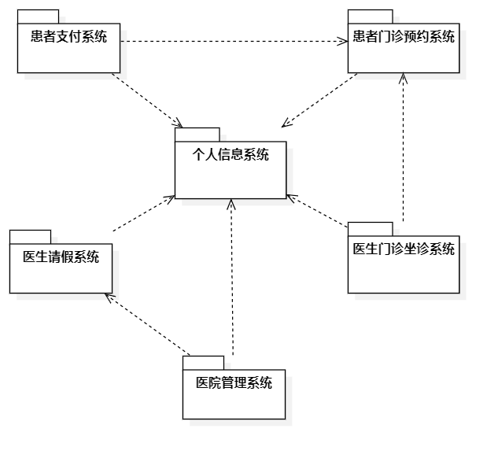

本项目的子系统设置如下表所示：

| **编号** | **名称**   | **子系统功能描述**                                                                      |
| ------ | -------- | -------------------------------------------------------------------------------- |
| 1      | 个人信息管理系统 | 1) 用户登录系统时，对其身份进行检验&#xA;2\) 未注册用户可以进行注册。&#xA;3\) 已注册用户可以修改个人信息、修改密码、注销等。         |
| 2      | 患者门诊预约系统 | 1) 患者根据科室、日期等查看医生排班信息。&#xA;2\) 患者选择医生进行挂号预约。                                     |
| 3      | 患者支付子系统  | 1) 患者支付挂号费。&#xA;2\) 患者支付检查、处方等项目费用。&#xA;3\) 患者查看历史付费项目记录。                        |
| 4      | 医生门诊坐诊系统 | 1) 医生预先排班、自动排班。&#xA;2\) 医生查看特定日期患者列表、工作内容。&#xA;3\) 医生开具检查、处方，完善病例等。              |
| 5      | 医生请假子系统  | 1) 医生申请请假。&#xA;2\) 医生对未被同意的请假申请进行申诉或补充说明。&#xA;3\) 医生取消已通过或生效的请假。&#xA;4\) 医生紧急请假。 |
| 6      | 医院管理系统   | 1) 管理员审核医生请假信息。&#xA;2\) 管理员管理科室、检查项目、药品目录等信息。&#xA;3\) 管理员管理挂号、病例等记录信息。           |

### 2.4 功能模块清单

本项目的功能模块清单如下表所示：

| **编号** | **名称**     | **模块功能描述**             |
| ------ | ---------- | ---------------------- |
| 101    | 注册账号       | 用户从游客注册为患者             |
| 102    | 登录系统       | 已注册用户登录系统              |
| 103    | 找回密码       | 用户丢失密码后，通过审核重新获取       |
| 104    | 查看个人信息     | 用户查看个人信息               |
| 105    | 修改个人信息     | 用户登录后对资料进行管理           |
| 106    | 用户注销       | 用户离开系统时，进行注销           |
| 201    | 浏览科室信息     | 患者或游客浏览科室列表            |
| 202    | 查看科室详细信息   | 患者或游客查看科室详细信息          |
| 203    | 查找医生       | 患者或游客检索医生              |
| 204    | 查看排班信息     | 患者或游客查看排班信息            |
| 301    | 账号登录       | 用户登录身份为医生              |
| 302    | 密码修改       | 医生修改自己密码               |
| 303    | 浏览当日候诊患者信息 | 医生点击当日患者信息菜单展示当日候诊患者信息 |
| 304    | 开具患者检查     | 医生为患者开具检查              |
| 305    | 查看患者历史诊疗信息 | 医生点击查看患者历史诊疗信息         |
| 306    | 开具患者病历     | 医生开具患者病历               |
| 307    | 开具患者处方单    | 医生开具患者处方单              |
| 308    | 确认患者就诊完成   | 医生确认患者就诊完成             |
| 401    | 浏览当日候诊患者信息 | 医生点击当日患者信息菜单展示当日候诊患者信息 |
| 402    | 查看患者历史诊疗信息 | 医生点击查看患者历史诊疗信息         |
| 403    | 开具患者病历     | 医生开具患者病历               |
| 404    | 开具患者处方单    | 医生开具患者处方单              |
| 405    | 开具患者检查     | 医生开具患者检查               |
| 406    | 确认患者就诊完成   | 医生确认患者就诊完成             |
| 501    | 申请请假       | 医生发起请假申请               |
| 502    | 二次申请       | 医生对已驳回的请假进行二次申请        |
| 503    | 查看请假记录     | 医生查看自己过去的请假信息          |
| 601    | 管理医生账号     | 管理员进行医生账号的管理           |
| 602    | 管理科室信息     | 管理员进行医院科室信息的管理         |
| 603    | 管理医生排班     | 管理员进行医生排班放号数量的管理       |
| 604    | 管理检查/药品    | 管理员进行医院可提供检查和药品信息的管理   |
| 605    | 审批医生请假     | 管理员进行医生请假申请的审批         |

## 3 数据库设计

### 3.1 数据库中表名列表

数据库中表名列表格式如下表所示：

| **编号** | **表名**                | **表功能说明** |
| ------ | --------------------- | --------- |
| 1      | User                  | 用户信息      |
| 2      | Patient               | 患者        |
| 3      | Doctor                | 医生        |
| 4      | Administrator         | 管理员       |
| 5      | Prescription          | 处方项       |
| 6      | PrescriptionForm      | 处方清单      |
| 7      | MedicalRecord         | 病例        |
| 8      | RegistrationForm      | 挂号单       |
| 9      | SchedulingInformation | 排班信息      |
| 10     | Department            | 科室信息      |
| 11     | InspectForm           | 检查清单      |
| 12     | Inspect               | 检查        |

### 3.2 数据库表之间的关系

数据库表之间的关系如图所示。

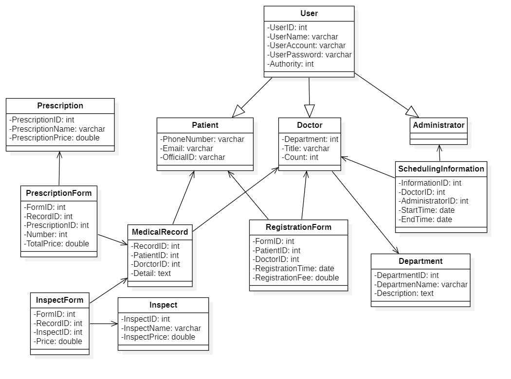

### 3.3 数据库各表具体字段

本数据库符合3NF范式，在符合2NF的基础上消除了非主属性对于候选码的传递函数依赖。

数据库中User表的具体字段如下表所示：

| **数据项**      | **类型**       | **描述**    | **备注**  |
| ------------ | ------------ | --------- | ------- |
| UserID       | Int          | 用户的唯一身份标码 | 用户实体的主键 |
| UserName     | Varchar (50) | 用户姓名      |         |
| UserPassword | Varchar (50) | 用户密码      |         |
| UserAccount  | Varchar (50) | 用户显示名称    |         |
| Authority    | Varchar (50) | 用户身份      |         |

Patient表：

| **数据项**         | **类型**       | **描述** | **备注** |
| --------------- | ------------ | ------ | ------ |
| UserEmail       | Varchar (50) | 用户电子邮箱 |        |
| UserPhoneNumber | Varchar (50) | 用户电话号  |        |
| UserOfficialID  | Varchar(50)  | 用户身份证号 |        |

Doctor表：

| **数据项**          | **类型**      | **描述**  | **备注**         |
| ---------------- | ----------- | ------- | -------------- |
| DoctorDepartment | Int         | 医生所属科室  | 指向科室实体下科室ID的外键 |
| DoctorTitle      | Varchar(50) | 医生职称    |                |
| DoctorCount      | Int         | 医生累计挂号量 |                |

RegisterForm表：

| **数据项**      | **类型**        | **描述**   | **备注**         |
| ------------ | ------------- | -------- | -------------- |
| 数据项          | 类型            | 描述       | 备注             |
| DoctorID     | Int           | 医生ID     | 指向医生实体下医生ID的外键 |
| DepartmentID | Varchar (50)  | 就诊科室ID   | 指向科室实体下科室ID的外键 |
| Amount       | Decimal(10,2) | 挂号费      |                |
| CommitTime   | DateTime      | 挂号时间     |                |
| AppointTime  | DateTime      | 预约就诊时间   |                |
| UserID       | Int           | 患者ID     | 指向患者实体下用户ID的外键 |
| OrderID      | Int           | 门诊挂号表单ID | 门诊挂号表单实体的主键    |

MedicalRecord表：

| **数据项**  | **类型**       | **描述** | **备注**         |
| -------- | ------------ | ------ | -------------- |
| RecordID | Int          | 病历ID   | 病历实体的主键        |
| UserID   | Int          | 患者ID   | 指向患者实体下用户ID的外键 |
| DoctorID | Int          | 医生ID   | 指向医生实体下医生ID的外键 |
| Detail   | Varchar(255) | 详细信息   |                |

PrescriptionForm表：

| **数据项**     | **类型**        | **描述**   | **备注**         |
| ----------- | ------------- | -------- | -------------- |
| PrescribeID | Int           | 病历ID     | 病历实体的主键        |
| UserID      | Int           | 患者ID     | 指向患者实体下用户ID的外键 |
| DoctorID    | Int           | 医生ID     | 指向医生实体下医生ID的外键 |
| Detail      | Varchar(4095) | 处方数量项目字典 |                |

Prescription表：

| **数据项**   | **类型**        | **描述** | **备注**    |
| --------- | ------------- | ------ | --------- |
| ItemID    | Int           | 消费项目ID | 消费项目实体的主键 |
| ItemName  | Varchar (50)  | 消费项目名称 |           |
| ItemPrice | Decimal(10,2) | 消费项目金额 |           |

SchedulingInformation表：

| **数据项**   | **类型**   | **描述** | **备注**           |
| --------- | -------- | ------ | ---------------- |
| ManagerID | Int      | 管理员ID  | 指向管理员实体下管理员ID的外键 |
| StartTime | DateTime | 排班开始时间 |                  |
| EndTime   | DateTime | 排班结束时间 |                  |
| ShiftID   | Int      | 排班实体ID | 医生排班实体的主键        |
| DoctorID  | Int      | 医生ID   | 指向医生实体下医生ID的外键   |

DepartmentForm表：

| **数据项**        | **类型**        | **描述** | **备注**  |
| -------------- | ------------- | ------ | ------- |
| DepartmentID   | Int           | 科室ID   | 科室实体的主键 |
| DepartmentName | Varchar(50)   | 科室名称   |         |
| DepartmentInfo | Varchar(4095) | 科室介绍   |         |

Inspection表：

| **数据项**      | **类型**        | **描述** | **备注**  |
| ------------ | ------------- | ------ | ------- |
| ExamineID    | Int           | 检查项目ID | 检查实体的主键 |
| ExamineName  | Int           | 检查名称   |         |
| ExaminePrice | Decimal(10,2) | 检查单价   |         |

InspectionForm表：

| **数据项**       | **类型**   | **描述**      | **备注**         |
| ------------- | -------- | ----------- | -------------- |
| ChecklistID   | Int      | 检查单ID       | 检查单实体的主键       |
| RecordID      | Int      | 病历ID        | 指向病历实体下医生ID的外键 |
| ExamineID     | Int      | 检查ID        | 只想检查实体下检查ID的外键 |
| ChecklistTime | Datetime | 检查时间检查单创建时间 |                |

## 4 典型功能子系统设计

### 4.1 个人信息管理系统设计

这里给出了个人信息管理系统的类图以及该系统中最典型的操作——注册和登录的活动图和顺序图。

#### 4.1.1 类图设计

个人信息管理系统的类图如下图所示：

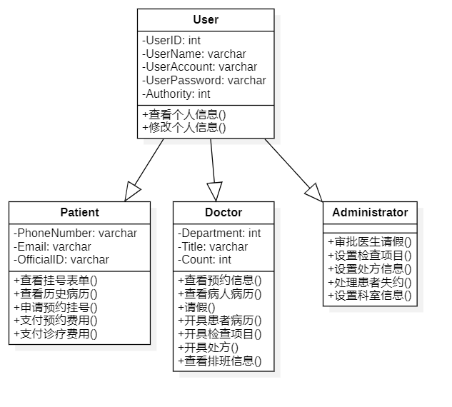

#### 4.1.2 活动图设计

注册的活动图设计如下图所示：

登录的活动图设计如下图所示：

#### 4.1.3 顺序图设计

注册的顺序图设计如下图所示：

登录的顺序图设计如下图所示：

### 4.2 患者门诊预约系统设计

这里给出了患者门诊预约系统的类图以及该系统中最典型的操作——预约挂号和取消预约挂号的活动图和顺序图。

#### 4.2.1 类图设计

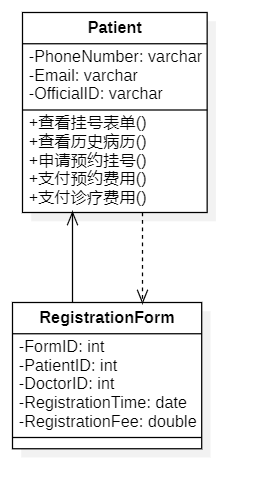

#### 4.2.2 顺序图设计

患者预约挂号的顺序图设计如下图所示：

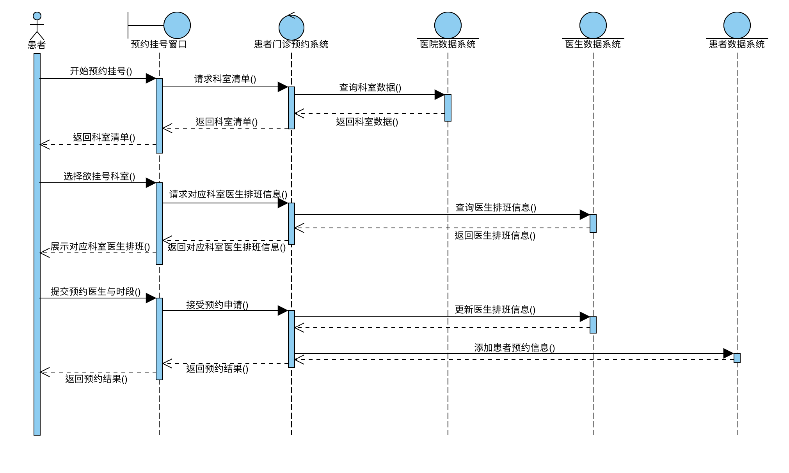

患者取消预约挂号的顺序图设计如下图所示：

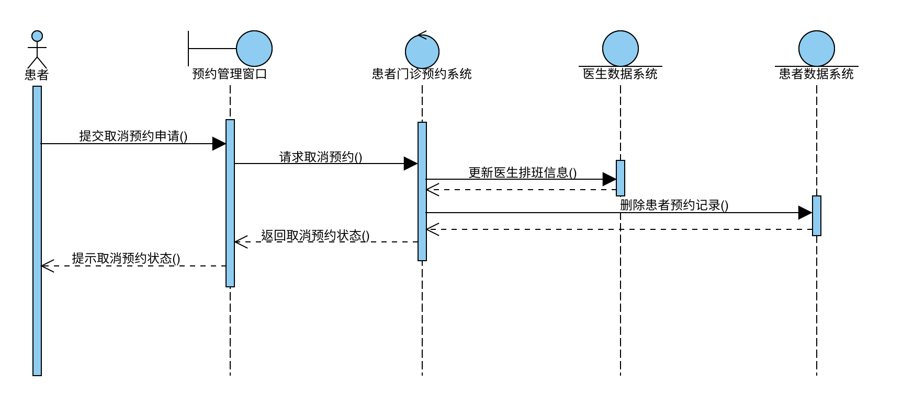

#### 4.2.3 活动图设计

患者预约挂号的活动图设计如下图所示：

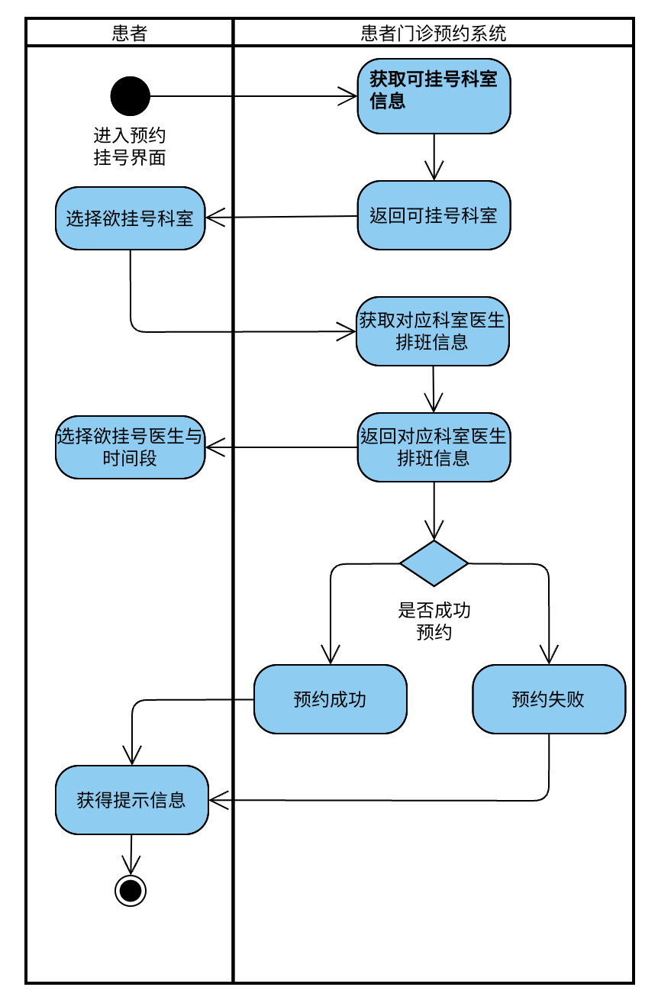

患者取消挂号的活动图设计如下图所示：

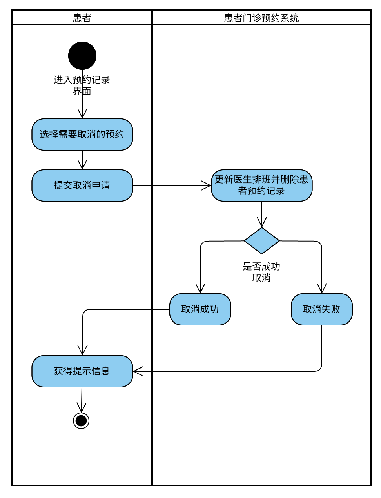

### 4.3  患者支付子系统设计

这里给出了患者支付系统的类图以及该系统中最典型的操作——患者支付的活动图和顺序图。

#### 4.3.1 类图设计

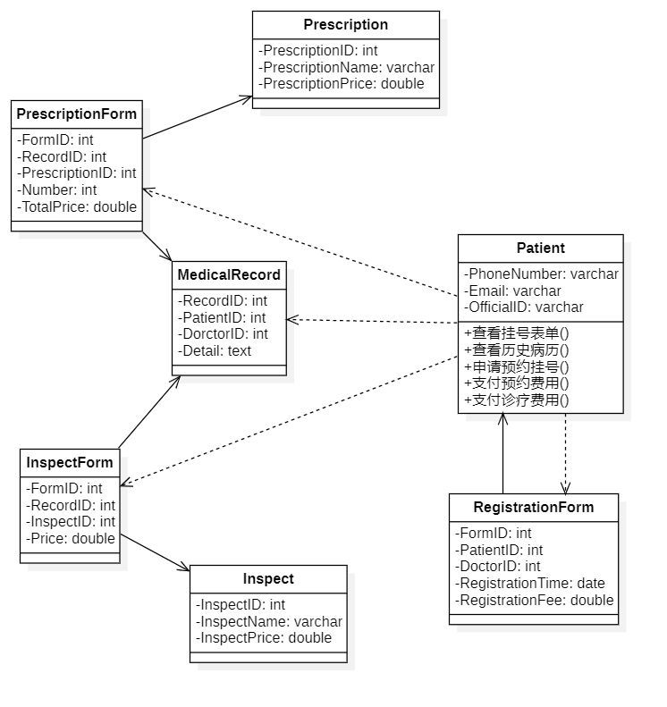

#### 4.3.2 顺序图设计

患者支付的顺序图设计如下图所示：

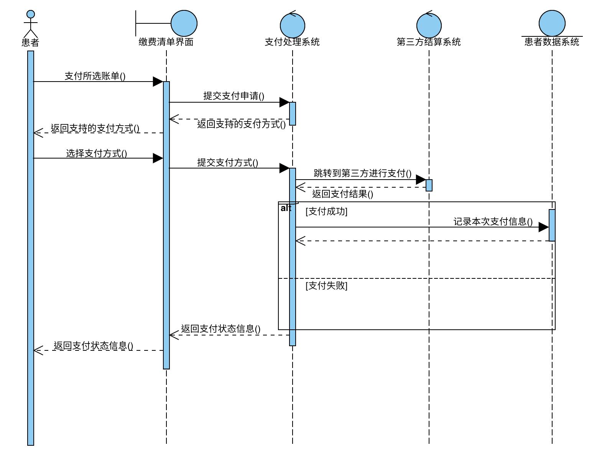

#### 4.3.3 活动图设计

患者支付的活动图设计如下图所示：

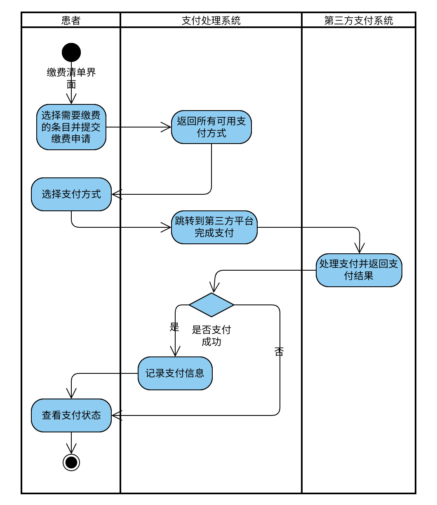

### 4.4 医生门诊坐诊系统设计

这里给出了医生门诊坐诊系统的类图以及该系统中最典型的操作——查看预约患者信息和患者诊断的活动图和顺序图。

#### 4.4.1  类图设计

医生门诊坐诊系统的类图如下图所示：

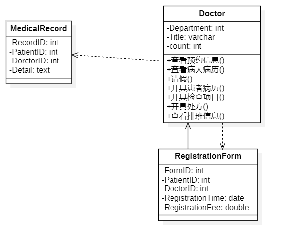

#### 4.4.2 活动图设计

查看预约患者信息的活动图设计如下图所示：

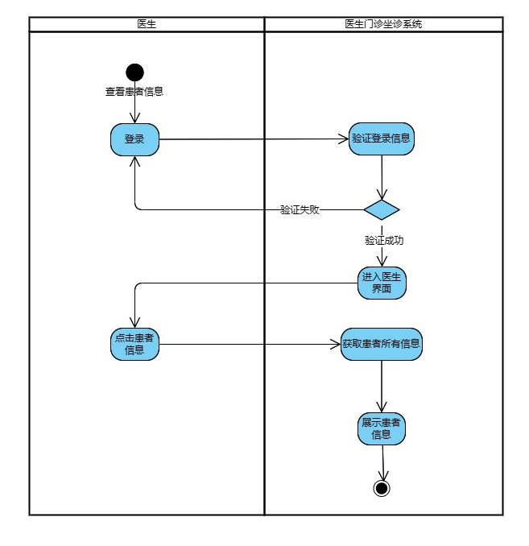

患者诊断的活动图设计如下图所示：

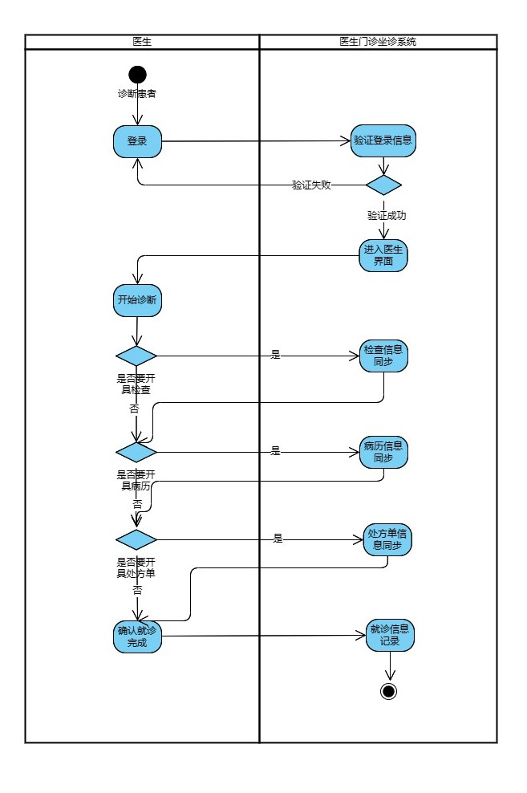

#### 4.4.3 顺序图设计

查看预约患者信息的顺序图设计如下图所示：

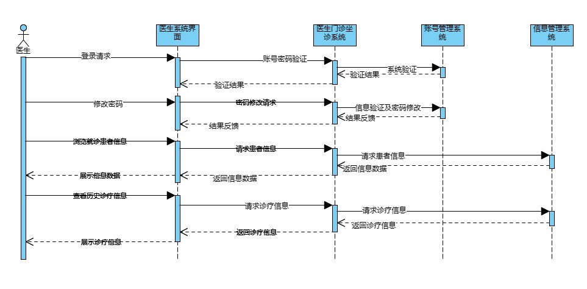

患者诊断的顺序图设计如下图所示：、

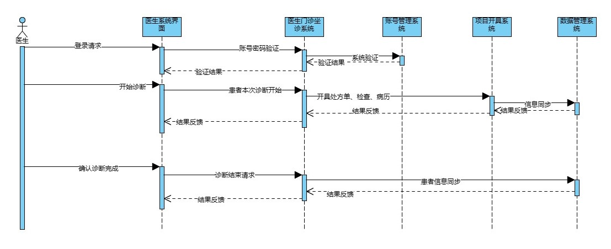

### 4.5 医生请假子系统设计

这里给出了医生请假子系统的类图以及该系统中最典型的操作——医生请假和查看请假记录的活动图和顺序图。

#### 4.5.1  类图设计

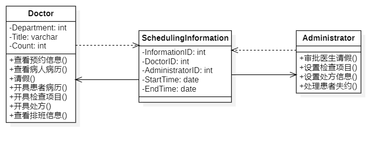

#### 4.5.2 活动图设计

医生请假的活动图设计如下图所示：

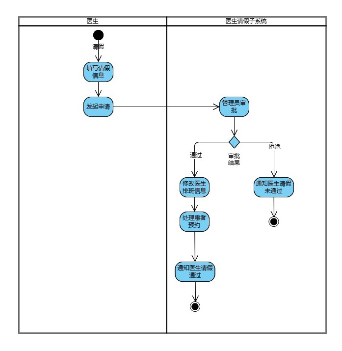

查看请假记录的活动图设计如下图所示：

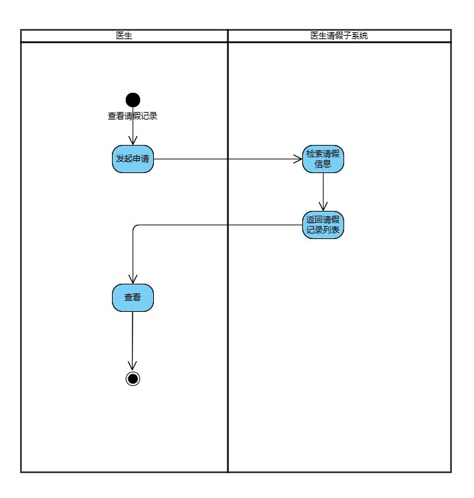

#### 4.5.3 顺序图设计

医生请假的顺序图设计如下图所示：

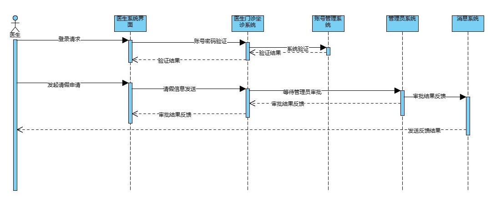

查看请假记录的顺序图设计如下图所示：

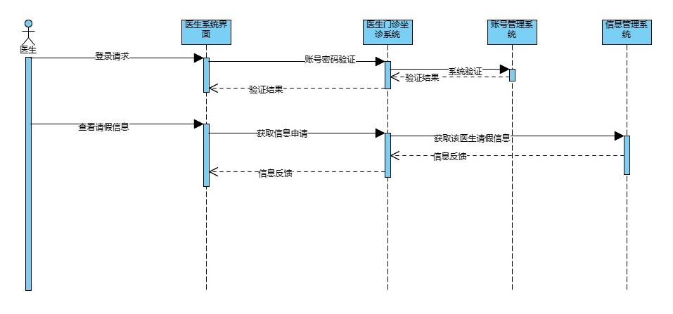

### 4.6 医院管理系统设计

这里给出了医院管理系统的类图以及该系统中典型操作的活动图和顺序图，包括：处理医生请假、管理科室信息。

#### 4.6.1 类图设计

医院管理系统的类图如下图所示：

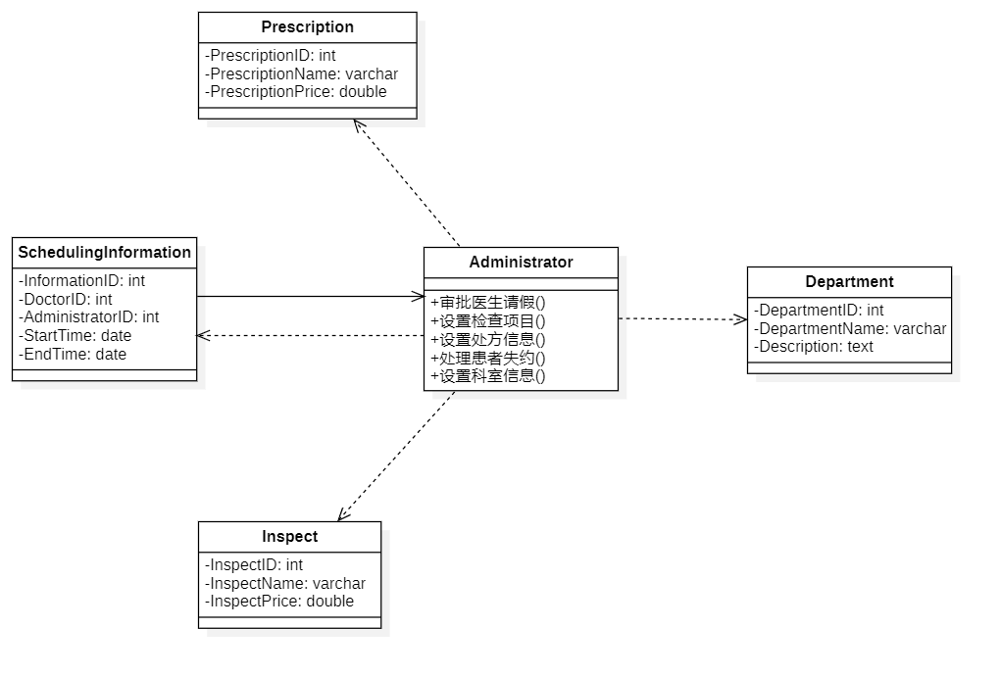

#### 4.6.2 活动图设计

处理医生请假的活动图如下图所示：

管理科室信息的活动图如下图所示：

#### 4.6.3 顺序图设计

处理医生请假的顺序图如下图所示：

管理科室信息的顺序图如下图所示：

## 5 功能模块设计

本系统的六个功能模块，在本章中由七大主要界面来实现，这七个部分的详细内容设计在下方一一说明。

### 5.1 主页面

**包含功能模块**

患者门诊预约模块，个人信息管理模块。

**页面参数**

1.  用户ID，它是存储用户信息的主键。凭借这一个主键，页面能向服务器请求到用户相关信息，并加载到页面上。该参数只在用户登录之后产生，能使得用户在点击个人中心、预约系统时显示正确的信息。

**调用背景**

当用户进入网站时，首先就会进入主页。

**页面组成**

1.  上方导航栏：从左到右包含有网站图标、提示用户登录信息、个人中心。
2.  主内容区：包含有门诊预约入口、医院重要公告、医疗科普文章等。

**页面制作示意图**

主页面的页面制作示意图如下图所示：

**页面使用简介**

当用户进入页面的时候，系统会给用户加载各类的信息。 用户可以通过该页面导航至其他页面。

用户可由门诊预约入口进入门诊预约系统。

用户可在公告栏浏览医院重要公告及相关医疗科普。

### 5.2 登录 / 注册

**包含功能模块**

个人信息管理模块。

**页面参数**

1.  用户ID，它是存储用户信息的主键，用于获取用户的基本信息。该用户信息用于验证登录时消息的合法性。

**调用背景**

当游客想要获取本站账号，或者未登录用户想要登录时，点击“登录”按钮可以跳转到该页面。

当游客或未登录用户需要访问个人主页或门诊预约系统等专属于实名患者的功能的时候，会自动跳转至该页面。

**页面组成**

1.  网站logo图标。
2.  注册登录信息收集表单。

**页面制作示意图**

登录/注册的页面制作示意图如下图所示：

**页面使用简介**

当游客点击页面上实名患者才能使用的按钮时，会跳转到该页面，提醒游客进行注册或者登录。或在未登录状态直接点击主页中的头部导航条登录按钮跳转到该页面。

游客若想执行登录操作，直接在相应的输入框中输入正确的帐号和密码，点击“登录”即可登录成功。

若游客想执行注册操作，点击“注册”可跳转到注册页面，输入真实姓名、身份证号、密码、手机号、验证码，点击“注册”按钮，验证通过后即注册成功。

### 5.3 门诊预约

**包含功能模块**

患者门诊预约模块，患者诊疗信息模块

**页面参数**

1.  用户ID，它是存储用户信息的主键，用于获取用户的基本信息。需要此ID以提交门诊预约申请。

**调用背景**

1.  顶部导航栏，患者可从能访问到的各个页面的顶部导航栏中快捷进入门诊预约界面。
2.  侧边导航栏，患者登录后能从侧边栏访问门诊预约界面

**页面组成**

1.  网站logo图标及header。
2.  左侧导航栏。
3.  门诊预约挂号主体页面。

页面制作示意图

具体来说，患者进行预约挂号时，将访问到以下三个页面。首先，患者需要选择科室：

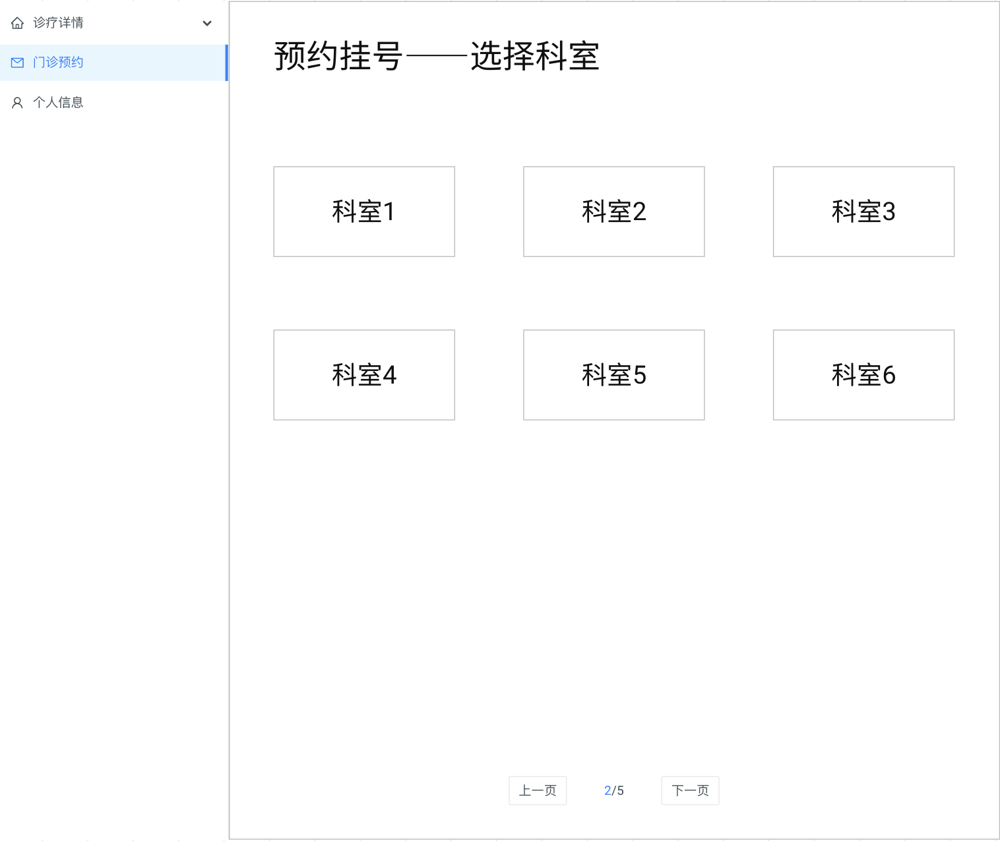

其次，患者需要根据对应科室的医生排班，选择预约医生和时间：

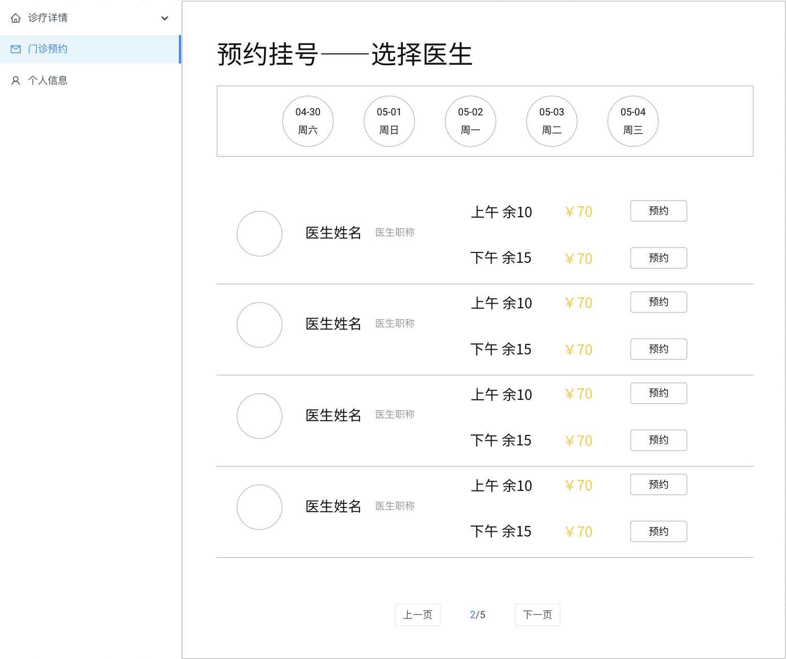

最后，患者需要确认预约挂号信息并缴费：

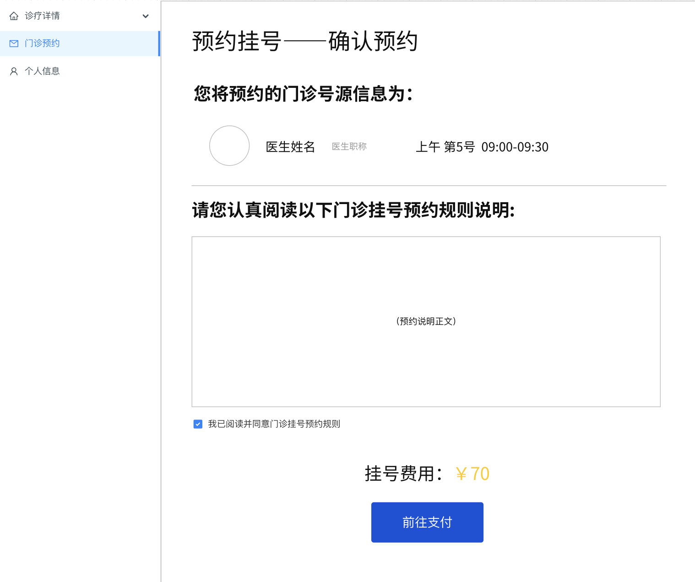

此外，患者可通过专门的页面浏览历次预约和诊疗信息：

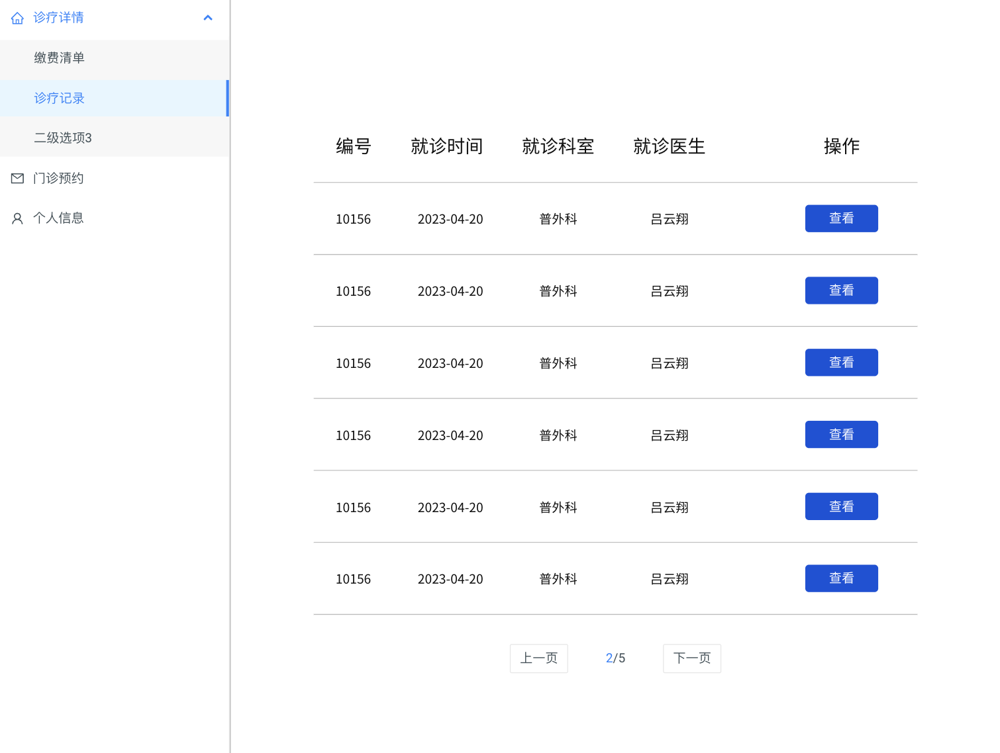

**页面使用简介**

如前所述，患者进入门诊预约界面后，首先选择自己需要预约的科室，再按照选定科室的医生排班选择需要预约的医生及时段，最后确认信息并支付挂号费用。

在“诊疗记录”页面，患者还可以查看历史诊疗详情。

### 5.4 支付清单

**包含功能模块**

患者缴费模块

**页面参数**

1.  用户ID，它是存储用户信息的主键，用于获取用户的基本信息。需要此ID以查询用户的所有缴费清单并提交支付申请。

**调用背景**

1.  侧边导航栏，用户通过侧边导航栏的二级导航项进入支付清单界面。

**页面组成**

1.  网站logo和header。
2.  侧边导航栏。
3.  缴费清单主界面。

**页面制作示意图**

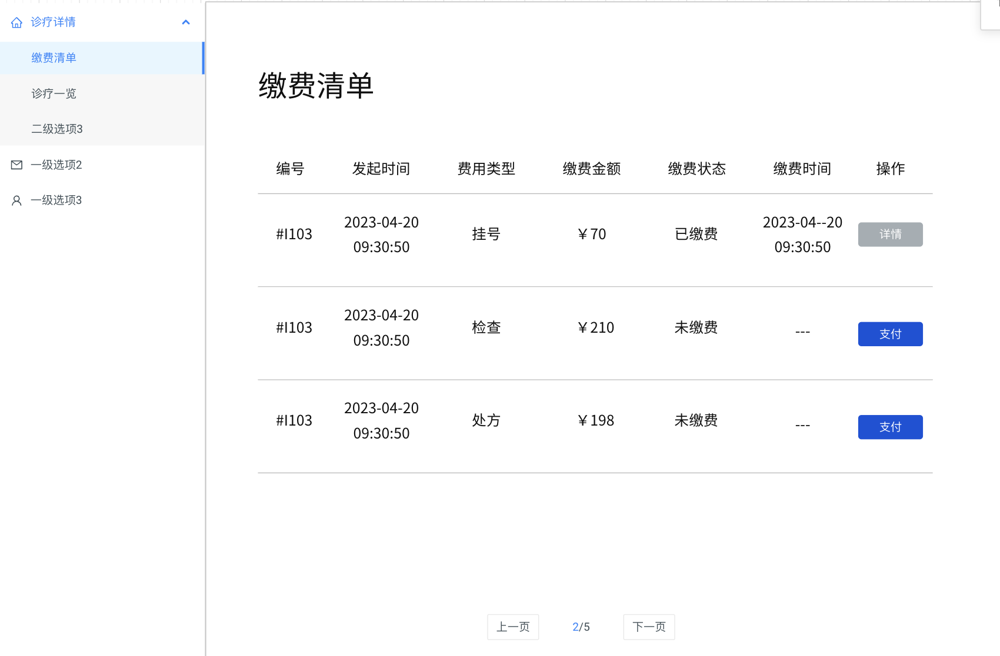

**页面使用简介**

缴费清单主界面中，有列出当前用户所有已缴费、为缴费的费用。

若用户想查看某次缴费对应的诊疗的详细情况，则可点击“详情”按钮查看按钮所在行的缴费对应诊疗。

若用户想结清某笔未支付的费用，则可点击“支付”按钮，跳转到支付界面进行支付。

### 5.5 医生坐诊

**包含功能模块**。

医生就诊模块。

**页面参数**

1.  用户ID，它是存储用户信息的主键，用于获取用户的基本信息。需要此ID以获取对应医生的坐诊信息。

**调用背景**

医生登录医生账号，开始坐诊，接待患者。

**页面组成**

1.  顶部导航栏，包括网站logo、个人中心等。
2.  侧边导航栏，包括预约患者、排班查看、医生请假等。
3.  主内容区为对应模块的详情信息。

**页面制作示意图**

医生坐诊流程如下所示，首先医生要选择对应患者开始诊断：

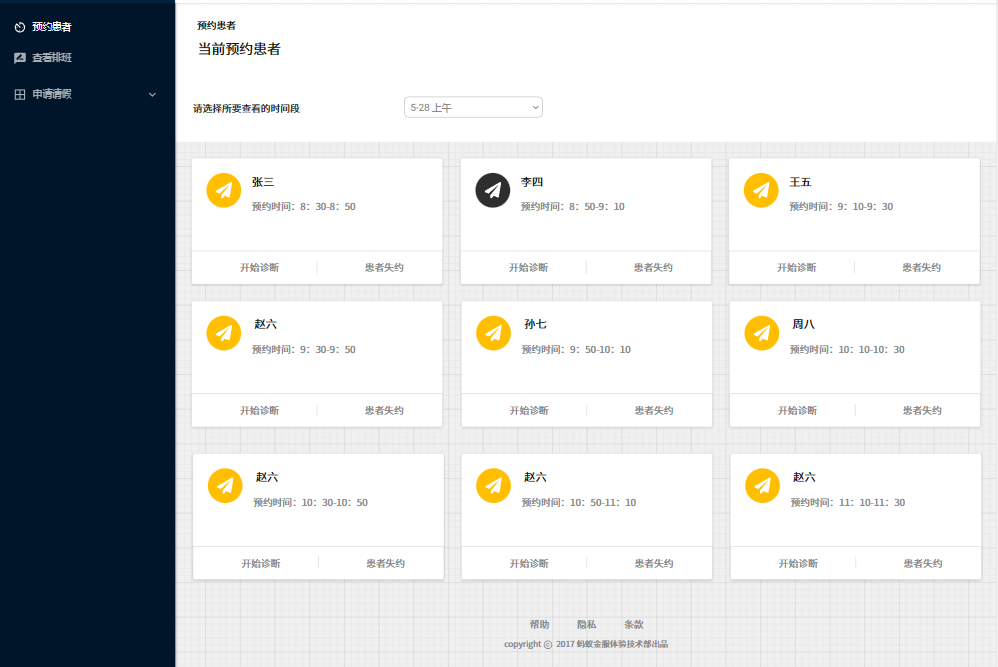

开始诊断后，进入到患者就诊页，为患者开启相关的检查、处方单等，最终开具病历单，完成就诊：

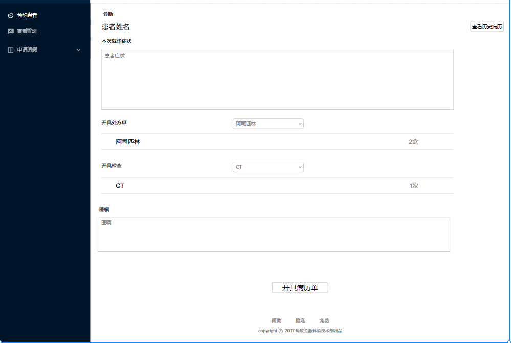

### 5.6 医生日程表

**包含功能模块**

医生排班查看模块、医生请假模块。

**页面参数**

1.  用户ID，它是存储用户信息的主键，用于获取用户的基本信息。该用户信息用于验证登录时消息的合法性。

**调用背景**

医生想要查看自己近期的排班，或者想申请请假时，应用此模块。

**页面组成**

1.  顶部导航栏，包括网站logo、个人中心等。
2.  侧边导航栏，包括可管理的医院信息，如科室信息、医生排班、医生请假等。
3.  主内容区为正在管理的医院信息。

**页面制作示意图**

点击医生排班，在主内容去查看最近的排班时间以及每个时间所对应的排版人数：

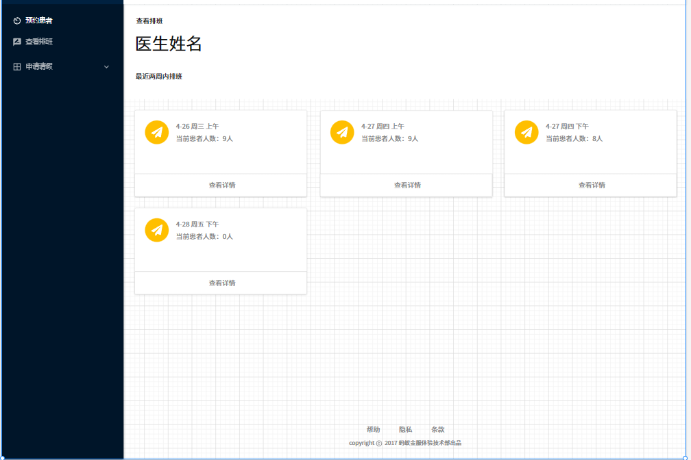

若想请假，则点击申请请假，提交请假时间、请假理由以及相关图片证明，进行申请：

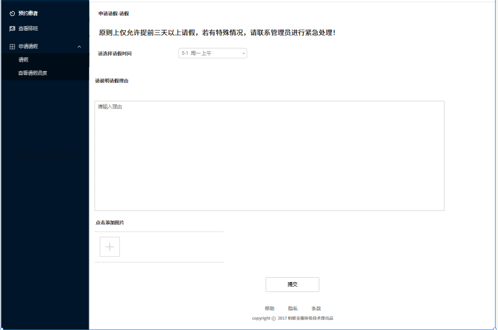

### 5.7 医院管理

**包含功能模块**

医院管理模块。

**页面参数**

1.  用户ID，它是存储用户信息的主键，用于获取用户的基本信息。该用户信息用于验证登录时消息的合法性。

**调用背景**

医院管理员登录管理员账号，进行医院相关信息的管理。

**页面组成**

1.  顶部导航栏，包括网站logo、个人中心等。
2.  侧边导航栏，包括可管理的医院信息，如科室信息、医生排班、医生请假等。
3.  主内容区为正在管理的医院信息。

**页面制作示意图**

医院管理界面的页面制作示意图如下图所示：

**页面使用简介**

当医院管理员想要进行医院信息管理时，登录管理员账号，直接跳转至该页面。

管理员可直接在左侧导航栏选择想要进行管理的信息，如科室信息、医生排班、医生请假等，主内容区将呈现待管理内容。

## 6 接口设计

### 6.1 用户接口

为实现简约、美观、易用的用户界面，我们选用了React框架搭建前端，并配合Ant design、Chakra UI等组件，精心进行页面设计与绘制，以尽可能地提升用户的使用体验。

### 6.2 外部接口

在数据方面，本网站涉及较多的数据存储及数据处理。考虑到与部分搜索和推荐的开源框架衔接（均为Python实现）的兼容性以及前后端交互的便利性，我们选用了Django 框架搭建后端架构，与MySQL 5.0进行外部数据接口交互。

### 6.3 内部接口

为了实现B/S架构的前后端框架内部交互，我们通过Ajax技术设计了异步的动态交互接口，并合理沟通筑构了接口规范。通过这样的内部接口我们能够实现高效的、松耦合的、高可扩展性的接口交互。

## 7 角色授权设计

本项目的使用角色有4类：游客、患者、医生、管理员。他们的角色授权如表所示。

角色授权设计表

|           |        |    |    |         |
| --------- | ------ | -- | -- | ------- |
| **子系统名称** | **游客** | 患者 | 医生 | **管理员** |
| 个人信息管理系统  | ○      | ●  | ●  | ●       |
| 患者门诊预约系统  | ○      | ●  |    | ●       |
| 患者支付系统    |        | ●  |    | ●       |
| 医生门诊坐诊系统  |        |    | ●  | ●       |
| 医生请假系统    |        |    | ●  | ●       |
| 医院管理系统    |        |    |    | ●       |

●表示有全部权限，○表示享有部分权限，空则表示无权限。

管理员可以从通用登录界面进行登录，也可以从管理员登录界面进行登录，所以管理员拥有该系统的所有权限。个人信息管理系统中，游客仅有注册登录的权限；患者门诊预约系统中，游客不能进行挂号相关操作。

## 8 系统错误处理

### 8.1 出错信息管理

1.  为确保数据的有效性和安全性，需要对前端输入或导入的内容或文件进行检查，以降低错误发生的风险，并避免注入攻击的可能性。
2.  在程序运行期间，应该对可能出现的异常情况进行捕获，并收集相关的错误信息。这些错误信息将被存储在专门的数据库中，方便后续根据日志进行调试、维护和升级。
3.  当用户试图访问其权限范围之外的信息或页面不存在时，应将其重定向到一个出错提示页面，以避免因为未授权的访问而产生安全风险。在提示页面中，还应提供自动返回上一页的功能，以便用户快速回到之前的操作。

### 8.2 故障预防与补救

为了提高网站的安全性，可以采用统一的权限控制机制，对访问网站的用户进行身份验证，并根据其权限设置相应的访问权限。此外，对程序中使用的数据进行加密处理，可以有效降低黑客攻击的风险。

另外，定期对数据库中的数据进行备份，也是防范黑客攻击的重要措施。这样可以在遭受攻击或数据丢失的情况下，及时恢复数据，保证网站正常运行。

### 8.3 系统维护设计

#### 8.3.1 编码规范化

在编写代码时，可以采用模块化和分层的设计思想，将系统按照功能划分为不同的模块和层次，以提高模块内部的内聚性和降低模块间的耦合度。这样可以使系统的逻辑结构更加清晰，方便后续的扩展和维护。

同时，在编码过程中，也需要注意标识符命名的意义，为变量、函数、类等标识符取有意义的名称，以方便阅读和维护代码。此外，还需要按照规格约定撰写注释和开发文档，对代码进行充分的解释和说明，便于其他人理解和使用代码。这样可以提高代码的可读性和可维护性。

#### 8.3.2 编码模块化

在进行页面开发时，可以将页面的可重复部分抽象为可复用模块，避免冗余的代码。这样可以在新增模块时，使用div组件来实现灵活的布局和样式，并充分利用框架提供的特性来提高页面的灵活性和可重用性。

同时，为了更好地进行系统设计和开发，可以将面向过程和面向对象的思想相结合，对模块进行划分，符合面向对象的设计原则。这样可以使系统的架构更加清晰和可扩展，提高系统的可维护性和可重用性。

#### 8.3.3 收集用户反馈

为了持续改进系统并确保其良好的发展，我们将为用户提供一个方便的渠道，让他们能够向我们反馈使用本系统的体验。我们将认真收集和分析这些反馈信息，并将其作为重要参考，对用户提出的问题进行改进和回应。通过不断更新和完善系统，我们将保持其活力和优越性，以更好地服务于我们的用户。

## 9 项目测试计划

测试计划作为本项目的测试指导，将由项目成员按计划和规定进行测试。本系统的测试将从单元测试、集成测试、系统测试 3个方面来设计。

测试计划如下表所示：

| **测试计划序号** | **测试计划类型** | **对应部分**      | **测试计划内容**                     | **测试开始时间** |
| ---------- | ---------- | ------------- | ------------------------------ | ---------- |
| 1          | 单元测试       | 注册登录模块        | 测试注册登录功能                       | 2023.5.11  |
| 2          | 单元测试       | 患者门诊预约模块      | 测试能否正常浏览医院科室和排班信息              | 2023.5.11  |
| 3          | 单元测试       | 患者门诊预约模块      | 测试挂号流程能否正常运作                   | 2023.5.11  |
| 4          | 单元测试       | 患者支付模块        | 测试能否正确管理支付项目                   | 2023.5.11  |
| 5          | 单元测试       | 医生坐诊模块        | 测试能否正确坐诊，包括开具检查和处方等            | 2023.5.11  |
| 6          | 单元测试       | 医生请假模块        | 测试能否正确请假，受影响的患者是否能正确接收通知       | 2023.5.11  |
| 7          | 单元测试       | 医院管理模块        | 测试能否正确管理检查项目、药品名录等医院各种信息       | 2023.5.11  |
| 8          | 集成测试       | 个人信息管理系统      | 测试个人信息能否正确管理                   | 2023.5.15  |
| 9          | 集成测试       | 排班、挂号、坐诊、支付系统 | 测试一个完整的患者诊疗流程能否正确实现            | 2023.5.15  |
| 10         | 集成测试       | 医生请假和患者通知模块   | 测试医生请假、通知患者、患者更改就诊计划的流程是否能正确实现 | 2023.5.15  |
| 11         | 集成测试       | 医院管理系统        | 测试能否全平台同步更改的医院信息               | 2023.5.15  |
| 12         | 系统测试       | 医院门诊预约系统全系统   | 测试整个平台的运行是否正常                  | 2023.5.17  |
