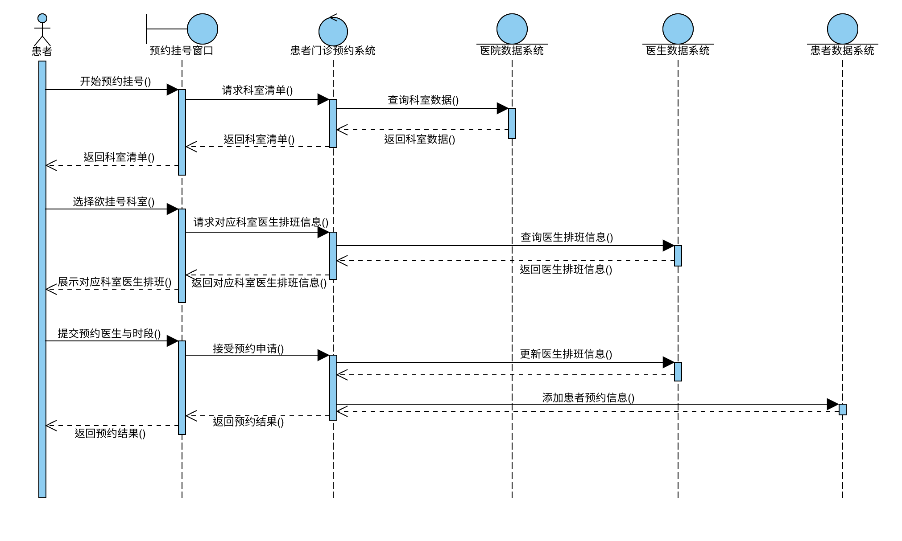
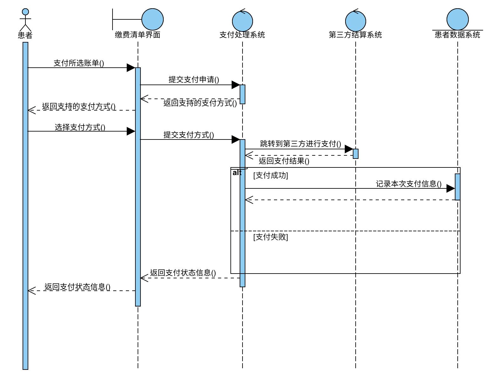
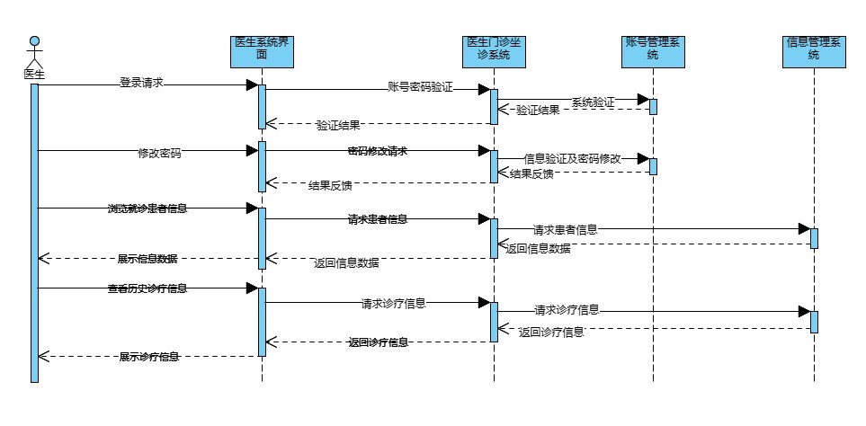
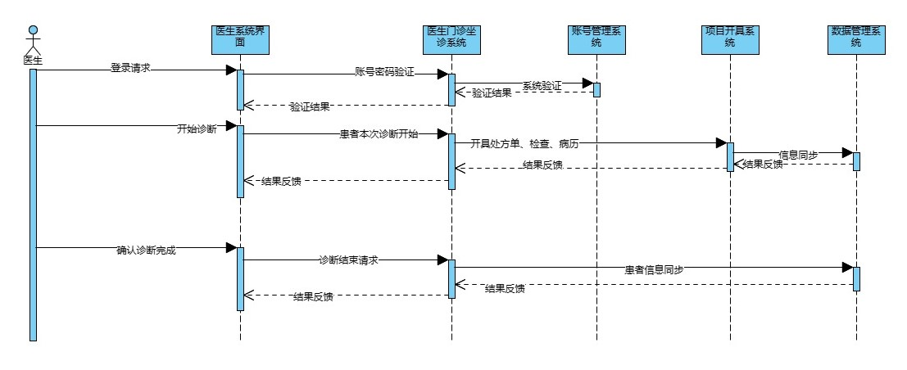
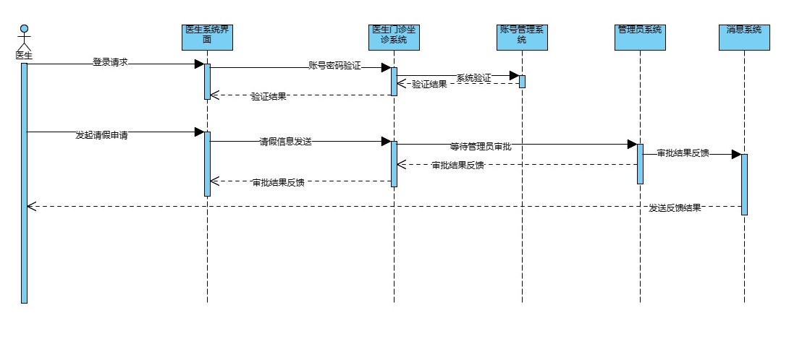

# 软件实现说明书

| 成员&#xA; | 刘芊琪&#xA; |
| --------- | ----------- |
| 成员&#xA; | 翁晨皓&#xA; |
| 成员&#xA; | 冯伟伦&#xA; |
| 成员&#xA; | 武钰川&#xA; |
| 成员&#xA; | 刘洪宇      |

[TOC]

## 1 技术选型说明

### 1.1 前端技术选型

对于前端的技术选型，我们选择了React。相比于其他前端框架，比如Angular和Vue，React有一些显著的优势。首先，React是一个基于JavaScript的库，由Facebook开发和维护，专为构建用户界面而生，特别适合开发大型，复杂的单页应用。

相较于Angular，React更加灵活和轻量级。Angular是一个完整的前端开发框架，包含了大量的功能和工具，这虽然在一定程度上带来了便利，但也使得Angular变得相对臃肿。此外，Angular的生态不够丰富，使用Angular也会带来生态缺乏的相关问题。

相较于Vue，虽然Vue在易用性和学习曲线上有优势，但React的社区和生态系统更加强大和成熟，同时React的文档和教程资源丰富，对于解决开发中遇到的问题非常有帮助。更重要的是，Vue2与Vue3不能完全兼容，互相迁移比较繁琐，一些在Vue2上维护成熟的项目可能在Vue3上还有不完善之处，甚至没有适配Vue3，为开发带来麻烦。

**值得注意的是，特别是在敏捷开发等需要快速迭代的场景下，若确实需要使用形如Vue的大版本之间有较多不可兼容差异（与React 18不同）的技术框架，则一定要选择较稳定的老版本，否则不可预知的报错会极大压缩本就不充裕的开发时间，这也是笔者的实战教训。**

React的核心优势在于其虚拟DOM技术和组件化设计。React使用虚拟DOM来优化性能，它可以比较两个虚拟DOM树的差异，然后只更新实际DOM中需要改变的部分，这一设计大大提高了页面的渲染效率。而React的组件化设计使得我们可以构建复用性高的组件，降低了开发难度，提高了开发效率。特别需要提及的是，React有众多样式丰富、自定义程度高、生态完备的组件库，如Chakra UI、Ant Design等，Github上甚至有专门收录基于Chakra UI开发的组件和项目的仓库，这极大方便了我们小组的开发进程。

### 1.2 后端技术选型

在后端的技术选型上，我们选择了Django。与Java的Spring框架相比，Django有以下几个优势。首先，Django是一个Python Web框架，由于Python的简洁和易读性，使得我们的开发工作更加便捷。而Spring是基于Java的，虽然Java的健壮性和稳定性都非常好，但其复杂的语法和冗长的代码对于我们这个项目来说可能显得过于繁重。

其次，Django框架遵循MVC设计模式，自带一个功能强大的ORM（对象关系映射），使得我们可以使用Python代码而不是SQL语句来操作数据库，大大提升了开发效率。而Spring需要配合其他ORM工具如Hibernate使用，配置相对复杂。

## 2 软件实现基本思路

### 2.1 工程角度的软件实现

在前端开发中，我们采用了React的组件化设计理念。我们将界面划分为一系列的组件，每个组件都有其自己的状态和逻辑，可以独立地进行渲染和更新。我们将需要大量复用的元素，例如号源展示卡片等，均抽象为单独的组件，这不仅提高了代码的可维护性，也让用户界面更加统一和协调。

在后端开发中，我们使用Django框架的MVC设计模式，将应用划分为模型、视图和控制器三个部分，这使得我们的代码结构清晰，易于理解和维护。我们构建了患者、医生、预约记录、诊疗记录、处方单、检查单、处方、检查等模型，这些模型反映了我们系统的核心业务对象。我们利用Django的ORM进行数据库操作，使我们的代码更加简洁，易于阅读和编写。

在开发过程中，我们坚持严格的代码规范。我们的代码规范不仅包括语法规范，还包括命名规范、注释规范等。通过坚持代码规范，我们保证了代码的可读性和一致性，同时也方便了代码的维护和管理。

### 2.2 团队管理角度的软件实现

在我们的医院门诊预约系统的开发过程中，我们采用灵活的开发模式，结合了敏捷开发和严格的代码规范，以实现高效、稳定的软件开发和部署。我们将整个项目划分为一系列小规模、可管理的任务，每个任务在一个短的开发周期，也就是一个迭代中完成。这种方式使得我们能够快速地适应需求的变化。

虽然本项目没有非常严苛的开发速度要求，但我们仍然坚持以敏捷开发的风格进行团队进度管理。医院门诊预约系统的总体思路不复杂，对象模型比较清晰，但是需求实现细节较多，并且需求不可能在开发初期就完全确定。与甲方（在本课程中，是助教、老师等课程组成员）交流或组内成员沟通讨论后，功能具体实现可能随时更改，此时需要小组进行快速开发，以尽可能快地评估不同需求细节的最终效果。

## 3 设计模型到前后端代码映射

由于患者门诊预约系统的大多数用例并不十分复杂，设计模型到前后端代码映射有较多共性，同时项目总体用例较多，因此我们选择了一些具有设计模式代表性的患者系统、医生系统和管理员系统的设计模型，展示项目如何实现设计模型到前后端的代码映射。

### 3.1 患者系统

#### 3.1.1 预约挂号

患者预约挂号的顺序图设计如下图所示：

在代码实践中，可以将患者预约挂号的过程描述为以下几个步骤：

1.  **获取科室信息**：这一步骤涉及到用户界面和服务器之间的交互。设计模型中可以包含一个用户界面模型，描述用户如何获取科室信息，以及一个服务器模型，描述服务器如何处理这个请求。
2.  **选择科室并获取号源信息**：这一步骤同样涉及到用户界面和服务器的交互。设计模型需要描述用户如何在界面上选择科室，并向服务器请求号源信息，以及服务器如何处理这个请求。
3.  **选择号源并提交预约申请**：这一步骤涉及到用户界面、服务器、以及数据库的交互。设计模型需要描述用户如何在界面上选择号源并提交预约申请，服务器如何处理这个请求并向数据库添加新的预约记录和账单。

映射到前后端代码时，有如下的对应关系：

1.  **获取科室信息**：在预约挂号界面的主React组件中，当state为1（选择科室步骤）时，展示\<SelectDepartment>组件。这个组件将向服务器发起请求，获取所有可供挂号的科室信息。在后端，Django服务器接收到这个请求后，从数据库中查询科室信息，并将结果返回给前端。
2.  **选择科室并获取号源信息**：在React组件中，当用户选择了一个科室，将state设置为2（选择号源步骤），同时展示\<SelectDepartment>和\<SelectDoctor>组件。这个组件将向服务器发起请求，获取对应科室未来三天的医生排班、号源信息。在后端，Django服务器接收到这个请求后，从数据库中查询号源信息，并将结果返回给前端。
3.  **选择号源并提交预约申请**：在React组件中，当用户选择了一个号源并确认了预约信息，会向后端发送两个请求： /patient/appointment/create/ 和 /patient/bill/create/ ，分别表示新增挂号记录和新增账单。在后端，Django服务器接收到这两个请求后，会在数据库中创建新的预约记录和账单。

#### 3.1.2 查看诊疗记录

在代码实践中，可以将患者查看所有诊疗记录的过程描述为以下几个步骤：

1.  **选择查看诊疗记录**：在这一步骤中，患者在个人信息一览界面的下方Tab栏中，选中“诊疗记录”。
2.  **获取并展示诊疗记录简况**：点击“操作”一栏的“查看详情”按钮后，会跳出一个右侧抽屉，内含该次诊疗记录的所有信息。

将设计模型映射到实际的前后端代码，可以看到以下的对应关系：

1.  **选择查看诊疗记录**：在React组件中，当用户点击\<Tab>组件的“诊疗记录”选项时，触发这个动作。
2.  **获取并展示诊疗记录简况**：在React组件中，点击“诊疗记录”一栏后，会向后端服务器发送请求 /patient/consultation/list/ ，以获取历史所有诊疗记录的简况。简况内容包括诊疗编号、科室名称、就诊医生、就诊时间、操作等。在后端，Django服务器接收到这个请求后，从数据库中查询诊疗记录简况，并将结果返回给前端。前端收到数据后，使用Ant Design的\<Table>组件显示所有的诊疗记录简况。我们使用符合Ant Design标准的list和箭头函数预先定义了\<Table>组件内每一列的渲染方式。
3.  **查看诊疗详情**：在React组件中，当点击某条诊疗记录对应的“查看详情”时，前端会向后端服务器发送 /patient/consultation/get/ 请求，以获取该次诊疗的所有详细信息。在后端，Django服务器接收到这个请求后，从数据库中查询详细的诊疗记录，并将结果返回给前端。前端收到数据后，以右侧抽屉的形式弹出诊疗详情，内容包括患者主诉、开具处方列表、开具检查列表和医生诊断等。

#### 3.1.3 支付指定账单

患者支付的顺序图设计如下图所示：

在代码实践中，可以将支付指定账单的过程描述为以下几个步骤：

1.  **显示待支付金额**：在这一步骤中，系统会在页面上显示待支付的金额。
2.  **选择支付方式并前往付款**：患者选择他们偏好的支付方式，然后点击“前往付款”按钮。系统会弹出含有付款二维码的抽屉供患者扫码支付。
3.  **确认支付完成**：患者支付完成后，点击“已完成支付”按钮。系统会进行核实，如果支付成功，系统会更改账单支付状态。

将设计模型映射到实际的前后端代码，可以看到以下的对应关系：

1.  **显示待支付金额**：在React组件中，使用简单的Ant Design Typograpy与Layout排版展示待支付的金额。
2.  **选择支付方式并前往付款**：在React组件中，患者可以通过选择支付方式然后点击“前往付款”按钮来开始支付流程。点击后，系统会在右侧弹出含有付款二维码的抽屉。
3.  **确认支付完成**：在React组件中，当患者点击“已完成支付”按钮后，前端会向后端发送 /patient/bill/pay/ 请求，更改当前账单状态为已支付。**因为这是一个演示项目，所以没有实际的支付接入，系统会默认核实通过支付状态。** 在后端，Django服务器接收到这个请求后，会在数据库中更新账单的支付状态。支付完成后，前端使用react-router-v6的useNavigate()跳转到患者个人信息页面。

### 3.2 医生系统

#### 3.2.1 诊断患者

诊断患者功能比较复杂，使用一个顺序图无法准确描述所有功能。

查看预约患者信息的顺序图设计如下图所示：

患者诊断的顺序图设计如下图所示：

可以将诊断患者的过程描述为以下几个步骤：

1.  **查看当日就诊患者**：医生可以在预约患者页面内查看这个时间段内的预约患者信息。
2.  **查看患者历史诊疗记录**：医生点击历史诊疗记录，可以查看该患者之前的病历信息。
3.  **开始诊断**：医生点击开始诊断，进入患者就诊页面，可以描述症状、开具处方、开具检查以及记录医嘱。
4.  **提交病历**：医生将输入的所有信息看作一份病历，提交时即提交病历。

将设计模型映射到实际的前后端代码，可以看到以下的对应关系：

1.  **查看当日就诊患者**：在React组件中，当医生打开预约患者页面时，前端会向后端发送 /treatment/getPatientList/ 请求，获取当日预约的患者名单。在后端，Django服务器接收到这个请求后，会从数据库中查询并返回当日预约的患者列表。
2.  **查看患者历史诊疗记录**：在React组件中，当医生点击历史诊疗记录时，前端会向后端发送 /treatment/getHistoryRecord/ 请求，获取该患者的历史诊疗记录。在后端，Django服务器接收到这个请求后，会从数据库中查询并返回该患者的历史诊疗记录。
3.  **开始诊断**：在React组件中，医生点击开始诊断后，可以进入患者就诊页面。在这个页面上，医生可以描述症状、开具处方、开具检查以及记录医嘱。当医生键入药品或检查的名称长度大于等于3时，前端会向后端发送 /treatment/searchPrescription/ 和 /treatment/searchInspection/ 请求，实时搜索药品或检查。后端在收到请求后，会直接在MySQL数据库里搜索，并返回搜索结果。直接使用MySQL的原因是药品或是检查的数量未达到百万级或千万级。若后续系统升级需要支持大型三甲医院的大量药品库需求，可以迁移到ElasticSearch。
4.  **提交病历**：在React组件中，医生提交病历后，前端会向后端发送 /treatment/createMedicalRecord/ 请求，提交病历。在后端，Django服务器接收到这个请求后，会在数据库中创建新的病历记录。

#### 3.2.2 医生请假

医生请假的顺序图设计如下图所示：

可以将医生请假的过程描述为以下几个步骤：

1.  **填写请假申请**：医生需要在表单中填写自己的请假日期，理由，并上传相关证明。
2.  **提交请假申请**：医生提交请假申请后，系统会将这些信息发送给管理员进行审核。
3.  **查看请假记录**：医生可以查看自己的请假记录，包括管理员的审核结论。

将设计模型映射到实际的前后端代码，可以看到以下的对应关系：

1.  **填写请假申请**：在React组件中，医生可以在Ant Design标准设计风格的表单中填写自己的请假日期，理由，并上传相关证明。
2.  **提交请假申请**：在React组件中，当医生提交请假申请后，前端会向后端发送 /treatment/applyLeave/ 请求，后端会根据给定的信息添加请假记录。在后端，Django服务器接收到这个请求后，会在数据库中创建新的请假记录。
3.  **查看请假记录**：在React组件中，医生可以查看自己的请假记录。当打开查看请假记录的页面时，前端会向后端发送 /treatment/getDocAllLeave/ 请求，获取当前医生的所有请假信息。在后端，Django服务器接收到这个请求后，会从数据库中查询并返回医生的所有请假记录。

### 3.3 管理员系统

#### 3.3.1 管理医生排班

可以将管理医生排班的过程描述为以下几个步骤：

1.  **选择科室**：管理员选择要进行排班的科室。
2.  **查看排班情况**：管理员查看所选科室下个月的排班情况，日历组件中每天的格子里会用不同颜色展示不同时段的出诊医生。
3.  **编辑排班**：管理员点击日历中的格子，选择想要管理排班的日期。可查看当日详细排班情况并进行当日排班的添加或删除。
4.  **保存排班**：管理员点击提交，即可保存编辑后的排班。

将设计模型映射到实际的前后端代码，可以看到以下的对应关系：

1.  **选择科室**：在React组件中，管理员可以在界面中选择要进行排班的科室。
2.  **查看排班情况**：在React组件中，管理员查看所选科室下个月的排班情况，由高度定制化的Ant Design日历组件展示。当选择完科室后，前端会向后端发送 /admin/getDepartAllShift/ 请求，获取该科室当月所有排班简况。在后端，Django服务器接收到这个请求后，会从数据库中查询并返回该科室当月所有排班简况。
3.  **编辑排班**：在React组件中，管理员点击日历中的格子，可以查看当日详细排班情况并进行编辑。当点击对应的格子时，前端向后端发送 /admin/getOneDayShift/ 请求，获取该科室当日所有排班详情。在后端，Django服务器接收到这个请求后，会从数据库中查询并返回该科室当日所有排班详情。
4.  **保存排班**：在React组件中，管理员编辑完毕当日详细排班后，点击提交按钮，前端会向后端发送新建排班的 /admin/createDoctorShift/ 请求、删除排班的 /admin/deleteShift/ 请求等系列请求，已完成排班信息修改。在后端，Django服务器接收到这些请求后，会根据请求内容在数据库中进行相应的操作，如创建新的排班记录或删除已有的排班记录。

#### 3.3.2 管理医生请假

处理医生请假的顺序图如下图所示：

可以将审批医生请假的过程描述为以下几个步骤：

1.  **进入审批界面**：管理员点击侧边栏中"请假审批"，即可进入审批医生请假界面。
2.  **查看请假审核**：管理员可以在界面中查看两种不同状态的请假审核，包括“待审批”和“已审批”。
3.  **审批处理**：管理员可以查看每一条待审批的记录，点击详情查看具体请假证明，点击通过或拒绝进行审批处理，并输入相关说明或理由。

将设计模型映射到实际的前后端代码，我们可以看到以下的对应关系：

1.  **进入审批界面**：在React组件中，管理员点击侧边栏中"请假审批"，即可进入审批医生请假界面。
2.  **查看请假审核**：在React组件中，管理员可以查看两种不同状态的请假审核。当进入页面后，前端会向后端发送 /admin/getAllLeave/ 请求，获取所有未审批请假请求。在后端，Django服务器接收到这个请求后，会从数据库中查询并返回所有未审批的请假请求。
3.  **审批处理**：在React组件中，管理员可以查看每一条待审批的记录，并进行审批处理。当点击通过或拒绝时，前端会向后端发送 /admin/verifyApp/ 请求，更新审批状态。在后端，Django服务器接收到这个请求后，会在数据库中更新相应的请假请求的状态。
