# 测试报告

| **成员** | **刘芊琪** |
| ------ | ------- |
| 成员     | 翁晨皓     |
| 成员     | 冯伟伦     |
| 成员     | 武钰川     |
| 成员     | 刘洪宇     |

[TOC]

## 一、引言

### 1.1 项目背景

随着社会的发展和医疗行业的进步，人们越来越重视自己的健康问题。然而，由于人口众多、资源有限，传统的医疗门诊预约方式已经不能满足现代社会的需求。在这种背景下，线上医疗门诊预约系统应运而生。利用互联网技术，提供一个方便、高效的医疗服务预约平台，使患者可以在线预约挂号、咨询医生、了解相关的医疗信息等。

本“医疗门诊预约系统”旨在改善传统的预约流程，优化患者就诊体验，提高医疗服务的效率，节省患者和医生的时间，从而促进医疗行业的健康发展。

### 1.2编写目的

本文档的内容为医疗门诊预约系统的测试报告，包括对本系统的后端性能测试、后端功能测试及前端测试各种层面的测试，编写目的是在合并以及最终的上线前进行内部的全面测试，避免推出时出现问题而导致展示出错以及用户体验不佳等情况的出现。

### 1.3术语定义

\[1] 管理员：本系统的后台管理者，可以对医院信息与用户信息进行管理。

\[2] 游客：没有注册的网站用户，只能浏览网站信息，注册并实名认证后可成为就诊患者。

\[3] 就诊患者：已实名认证的网站用户，具有游客除了注册之外的所有功能，可以查询相关信息并预约门诊挂号。 

\[4] 医生：本院在职医生，可以进行患者信息查询、处方开具等操作。

\[5] 第三方支付系统：譬如微信或支付宝这样的第三方支付系统，用来支付相关费用。

### 1.4参考资料

\[1] 吕云翔. 软件工程实用教程\[M]. 北京：清华大学出版社, 2015.

\[2] Pressman R S. 软件工程: 实践者的研究方法 (英文精编版)\[M]. 机械工业出版社, 2008. 

\[3] Ian Sommerille. 软件工程(原书第8版)\[M]. 机械工业出版社, 2007.

### 1.5相关文档

\[1] 《软件开发计划书》

\[2] 《软件设计说明书》

\[3] 《部署文档》

\[4] 《测试报告》

\[5] 《用户使用说明书》

## 二、系统功能需求简介

### 2.1子系统清单

本项目的子系统设置如下表所示：

| **编号** | **名称**   | **子系统功能描述**                                                                                            |
| ------ | -------- | ------------------------------------------------------------------------------------------------------ |
| 1      | 个人信息管理系统 | 1) 用户登录系统时，对其身份进行检验&#xA;2\) 未注册用户可以进行注册。&#xA;3\) 已注册用户可以修改个人信息、修改密码、注销等。                               |
| 2      | 患者门诊预约系统 | 1) 患者可选择预约挂号的科室，并查看各科室未来三天的医生排班与号源信息 2) 患者可提交仍有余号的挂号预约 3) 患者可查看自己的预约挂号信息 4) 患者可在个人信息页面查看历史诊疗记录         |
| 3      | 患者支付子系统  | 1) 患者支付挂号费。&#xA;2\) 患者支付检查、处方等项目费用。&#xA;3\) 患者查看历史付费项目记录。                                              |
| 4      | 医生门诊坐诊系统 | 1) 医生查看排班日期。&#xA;2\) 医生查看特定日期患者列表、患者历史病历、工作内容。&#xA;3\) 医生开具检查、处方，完善病例等。                                |
| 5      | 医生请假子系统  | 1) 医生申请请假。&#xA;2\) 医生查看自己的请假记录列表。                                                                      |
| 6      | 医院管理系统   | 1) 管理员审核医生请假信息。&#xA;2\) 管理员管理科室、检查项目、药品目录等信息。&#xA;3\) 管理员管理医生账号。&#xA;4\) 管理员进行医生排班。&#xA;5\) 管理员进行公告管理。 |

### 2.2功能模块清单

本项目的功能模块清单如下表所示：

| **编号** | **名称**       | **模块功能描述**             |
| ------ | ------------ | ---------------------- |
| 101    | 注册账号         | 用户从游客注册为患者             |
| 102    | 登录系统         | 已注册用户登录系统              |
| 103    | 找回密码         | 用户丢失密码后，通过审核重新获取       |
| 104    | 查看个人信息       | 用户查看个人信息               |
| 105    | 修改个人信息       | 用户登录后对资料进行管理           |
| 106    | 用户注销         | 用户离开系统时，进行注销           |
| 201    | 浏览科室信息       | 患者浏览可供挂号科室列表           |
| 202    | 查看排班信息       | 患者查看指定科室医生排班信息         |
| 203    | 提交预约信息       | 患者提交指定医生和时段的预约         |
| 204    | 查看预约记录       | 患者查看自己的预约挂号记录          |
| 205    | 查看历史诊疗记录     | 患者查看自己的历史诊疗记录          |
| 206    | 查看历史缴费记录     | 患者查看自己的历史缴费记录          |
| 207    | 支付账单         | 患者支付各类账单               |
| 301    | 账号登录         | 用户登录身份为医生              |
| 302    | 密码修改         | 医生修改自己密码               |
| 303    | 浏览当日候诊患者信息   | 医生点击当日患者信息菜单展示当日候诊患者信息 |
| 304    | 开具患者检查       | 医生为患者开具检查              |
| 305    | 查看患者历史诊疗信息   | 医生点击查看患者历史诊疗信息         |
| 306    | 开具患者病历       | 医生开具患者病历               |
| 307    | 开具患者处方单      | 医生开具患者处方单              |
| 308    | 确认患者就诊完成     | 医生确认患者就诊完成             |
| 401    | 浏览指定日期候诊患者信息 | 医生选择日期查看对应时间段的患者信息     |
| 402    | 查看患者历史诊疗信息   | 医生点击查看患者历史诊疗信息         |
| 403    | 开具患者病历       | 医生开具患者病历               |
| 404    | 开具患者处方单      | 医生开具患者处方单              |
| 405    | 开具患者检查单      | 医生开具患者检查               |
| 406    | 查看近期排班信息     | 医生查看自己最近一段时间的排班信息      |
| 501    | 申请请假         | 医生发起请假申请               |
| 502    | 查看请假记录       | 医生查看自己过去的请假信息          |
| 601    | 添加医生账号       | 管理员进行医生账号的添加           |
| 602    | 查看医生列表       | 管理员进行医生列表的查看           |
| 603    | 查看医院排班       | 管理员查看医院排班信息            |
| 604    | 新增医生排班       | 管理员进行排班信息的添加           |
| 605    | 删除医生排班       | 管理员进行排班信息的删除           |
| 606    | 管理科室信息       | 管理员进行医院科室信息的管理         |
| 607    | 查看可开具药品      | 管理员进行医院可开具药品的查看        |
| 608    | 新增药品         | 管理员进行医院可开具药品的添加        |
| 609    | 查看可开具检查      | 管理员进行医院可开具检查的查看        |
| 610    | 新增检查         | 管理员进行医院可开具检查的添加        |
| 611    | 审批医生请假       | 管理员进行医生请假申请的审批         |
| 612    | 查看医院公告       | 医院公告的查看                |
| 613    | 新增医院公告       | 管理员进行医院公告的添加           |
| 614    | 删除医院公告       | 管理员进行医院公告的删除           |

## 三、系统性能需求简介

### 3.1性能介绍

具体性能需求点如下表所示：

| ​**编号** | ​**性能需求来源名称**    | ​**使用者**          | ​**功能描述**               | ​**输入**          | ​**响应要求**   | ​**结果**         |
| ------- | ---------------- | ----------------- | ----------------------- | ---------------- | ----------- | --------------- |
| 1&#xA;  | 加载网站页面&#xA;      | 游客，患者，医生，管理员&#xA; | 加载平台的页面&#xA;            | 无&#xA;           | 0.5秒&#xA;   | 显示平台的页面&#xA;    |
| 2&#xA;  | 预约门诊页面&#xA;      | 患者&#xA;           | 在数据库中查找出诊信息&#xA;        | 科室信息、选择医生&#xA;   | 2秒以内&#xA;   | 输出符合要求的记录&#xA;  |
| 3&#xA;  | 患者信息页面&#xA;      | 医生&#xA;           | 在数据库中查找相应患者信息&#xA;      | 选择患者&#xA;        | 2秒以内&#xA;   | 输出符合要求的记录&#xA;  |
| 4&#xA;  | 信息的录入，修改，删除&#xA; | 患者，医生，管理员&#xA;    | 在数据库中录入、修改、删除相应的信息&#xA; | 录入、修改、删除的信息&#xA; | 0.5秒以内&#xA; | 输出提示信息&#xA;     |
| 5&#xA;  | 检查信息的规范性&#xA;    | 患者，医生，管理员&#xA;    | 检查录入、修 改、删除的信息的正确性&#xA; | 输入各种信息&#xA;      | 0.1秒以内      | 输出信息是否符合规范&#xA; |

## 四、后端测试

### 4.1 测试环境

#### 4.1.1 硬件环境

处理器：Intel® Core™ i9-9880H CPU @2.30GHz

内存：16GB

硬盘容量：1TB

输入输出设备：鼠标、键盘、显示屏

网络设备：宽带

#### 4.1.2 软件环境

操作系统：Windows 10

连接的后端数据库：MySQL 5.0

项目运行环境：Python 3.8

浏览器：Google Chrome

### 4.2 系统功能测试

#### 4.2.1 个人信息管理系统

注册账号功能测试结果如下：

| 功能编号 | 101                                         | 功能名称 | 注册账号         |
| ---- | ------------------------------------------- | ---- | ------------ |
| 功能描述 | 用户从游客注册为患者                                  | 前置条件 | 用户正在访问本系统    |
|      |                                             | 后置条件 |              |
| 测试步骤 | 1. 用户进入“注册界面” 2. 用户输入个人信息3. 用户点击注册，前端发送注册请求 | 输入   | 用户个人信息       |
|      |                                             | 输出   | 用户注册结果和token |
| 测试结果 | 通过                                          | 发现问题 | 无            |
| 测试人  | 刘洪宇                                         | 测试时间 | 2023.05.28   |

注册功能等价类划分

-   【1】有效等价类：未被注册的合法的用户信息。
-   【2】无效等价类：已被注册、或者不合法的用户信息。

注册功能测试用例如下：

| 用例编号 | 输入          | 预期输出         | 覆盖范围 |
| ---- | ----------- | ------------ | ---- |
| 1.1  | 有效用户信息      | 成功注册，返回token | 1    |
| 1.2  | 有效用户信息，但已注册 | 报错信息：用户已注册   | 2    |
| 1.3  | 非法用户信息      | 报错信息：用户信息有误  | 2    |

用户登录功能测试结果如下：

| 功能编号 | 102                                          | 功能名称 | 登录系统         |
| ---- | -------------------------------------------- | ---- | ------------ |
| 功能描述 | 用户登入系统，系统确认用户身份                              | 前置条件 | 用户已注册        |
|      |                                              | 后置条件 |              |
| 测试步骤 | 1. 用户进入“登录界面” 2. 用户输入账号和密码3. 用户点击登录，前端发送登录请求 | 输入   | 用户账号和密码      |
|      |                                              | 输出   | 用户登录结果和token |
| 测试结果 | 通过                                           | 发现问题 | 无            |
| 测试人  | 刘洪宇                                          | 测试时间 | 2023.05.28   |

登录功能等价类划分

-   【1】有效等价类：已注册的合法的用户信息。
-   【2】无效等价类：未注册、或者不合法的用户信息。

登录功能测试用例如下：

| 用例编号 | 输入      | 预期输出         | 覆盖范围 |
| ---- | ------- | ------------ | ---- |
| 1.1  | 有效用户信息  | 成功登录，返回token | 1    |
| 1.2  | 未注册用户信息 | 报错信息：用户不存在   | 2    |
| 1.3  | 非法用户信息  | 报错信息：用户信息有误  | 2    |

找回密码功能测试结果如下：

| 功能编号 | 103                                                | 功能名称 | 找回密码       |
| ---- | -------------------------------------------------- | ---- | ---------- |
| 功能描述 | 用户忘记密码时重置密码                                        | 前置条件 | 用户已注册      |
|      |                                                    | 后置条件 |            |
| 测试步骤 | 1. 用户进入“密码重置页面” 2. 用户发送验证码3. 用户输入验证码和重置后的密码，前端发送请求 | 输入   | 新密码和验证码    |
|      |                                                    | 输出   | 重置密码结果     |
| 测试结果 | 通过                                                 | 发现问题 | 无          |
| 测试人  | 刘洪宇                                                | 测试时间 | 2023.05.28 |

找回密码功能等价类划分

-   【1】有效等价类：验证码未过期且有效。
-   【2】无效等价类：验证码过期或无效。

找回密码功能测试用例如下：

| 用例编号 | 输入        | 预期输出       | 覆盖范围 |
| ---- | --------- | ---------- | ---- |
| 1.1  | 未过期且有效验证码 | 成功修改密码     | 1    |
| 1.2  | 已过期验证码    | 报错信息：验证码过期 | 2    |
| 1.3  | 错误验证码     | 报错信息：验证码错误 | 2    |

查看个人信息测试结果如下：

| 功能编号 | 104                             | 功能名称 | 查看个人信息     |
| ---- | ------------------------------- | ---- | ---------- |
| 功能描述 | 用户查看个人信息                        | 前置条件 | 用户已登录      |
|      |                                 | 后置条件 |            |
| 测试步骤 | 1. 用户进入“个人信息界面” 2. 前端发送查看个人信息请求 | 输入   | 无          |
|      |                                 | 输出   | 用户的个人信息    |
| 测试结果 | 通过                              | 发现问题 | 无          |
| 测试人  | 刘洪宇                             | 测试时间 | 2023.05.28 |

查看个人信息功能等价类划分：

-   【1】有效等价类：已登录的用户。
-   【2】无效等价类：未登录的用户。

查看个人信息功能测试用例如下：

| 用例编号 | 输入     | 预期输出       | 覆盖范围 |
| ---- | ------ | ---------- | ---- |
| 1.1  | 已登录的用户 | 返回用户的个人信息  | 1    |
| 1.2  | 未登录的用户 | 报错信息：用户未登录 | 2    |

修改个人信息测试结果如下：

| 功能编号 | 105                                                | 功能名称 | 修改个人信息     |
| ---- | -------------------------------------------------- | ---- | ---------- |
| 功能描述 | 用户登录后对资料进行管理                                       | 前置条件 | 用户已登录      |
|      |                                                    | 后置条件 |            |
| 测试步骤 | 1. 用户进入“个人信息界面” 2. 用户修改个人信息 3. 用户点击保存，前端发送修改个人信息请求 | 输入   | 用户修改的个人信息  |
|      |                                                    | 输出   | 修改结果       |
| 测试结果 | 通过                                                 | 发现问题 | 无          |
| 测试人  | 刘洪宇                                                | 测试时间 | 2023.05.28 |

修改个人信息功能等价类划分

-   【1】有效等价类：已登录的用户，修改的信息合法。
-   【2】无效等价类：未登录的用户，或者修改的信息不合法。

修改个人信息功能测试用例如下：

| 用例编号 | 输入             | 预期输出        | 覆盖范围 |
| ---- | -------------- | ----------- | ---- |
| 1.1  | 已登录的用户，修改的信息合法 | 成功修改，返回修改结果 | 1    |
| 1.2  | 未登录的用户         | 报错信息：用户未登录  | 2    |
| 1.3  | 修改的信息不合法       | 报错信息：信息不合法  | 2    |

用户注销测试结果如下：

| 功能编号 | 106                     | 功能名称 | 用户注销       |
| ---- | ----------------------- | ---- | ---------- |
| 功能描述 | 用户离开系统时，进行注销            | 前置条件 | 用户已登录      |
|      |                         | 后置条件 |            |
| 测试步骤 | 1. 用户点击“注销” 2. 前端发送注销请求 | 输入   | 无          |
|      |                         | 输出   | 注销结果       |
| 测试结果 | 通过                      | 发现问题 | 无          |
| 测试人  | 刘洪宇                     | 测试时间 | 2023.05.28 |

用户注销功能等价类划分

-   【1】有效等价类：已登录的用户。
-   【2】无效等价类：未登录的用户。

用户注销功能测试用例如下：

| 用例编号 | 输入     | 预期输出        | 覆盖范围 |
| ---- | ------ | ----------- | ---- |
| 1.1  | 已登录的用户 | 成功注销，返回注销结果 | 1    |
| 1.2  | 未登录的用户 | 报错信息：用户未登录  | 2    |

#### 4.2.2 患者门诊预约系统

浏览科室功能测试结果如下：

| 功能编号 | 201                                 | 功能名称 | 浏览科室       |
| ---- | ----------------------------------- | ---- | ---------- |
| 功能描述 | 浏览所有可供挂号的科室信息                       | 前置条件 | 用户已登陆为患者   |
|      |                                     | 后置条件 |            |
| 测试步骤 | 1. 用户进入“预约挂号界面” 2. 前端自动请求科室信息以供用户查看 | 输入   | 用户登录token  |
|      |                                     | 输出   | 可供挂号的科室信息  |
| 测试结果 | 通过                                  | 发现问题 | 无          |
| 测试人  | 翁晨皓                                 | 测试时间 | 2023.05.29 |

浏览科室功能等价类划分

-   【1】有效等价类：有效的患者token。
-   【2】无效等价类：失效，或者不正确的患者token。

浏览科室功能测试用例如下：

| 用例编号 | 输入         | 预期输出        | 覆盖范围 |
| ---- | ---------- | ----------- | ---- |
| 1.1  | 有效患者 token | 所有可供挂号的科室信息 | 1    |
| 1.2  | 失效的患者token | 报错信息：用户未登录  | 2    |

浏览排班信息功能测试结果如下：

| 功能编号 | 202                                 | 功能名称 | 浏览排班信息     |
| ---- | ----------------------------------- | ---- | ---------- |
| 功能描述 | 浏览所有可供挂号的科室信息                       | 前置条件 | 用户已登陆为患者   |
|      |                                     | 后置条件 |            |
| 测试步骤 | 1. 用户进入“预约挂号界面” 2. 前端自动请求科室信息以供用户查看 | 输入   | 用户登录token  |
|      |                                     | 输出   | 可供挂号的科室信息  |
| 测试结果 | 通过                                  | 发现问题 | 无          |
| 测试人  | 翁晨皓                                 | 测试时间 | 2023.05.30 |

查看排班信息功能等价类划分

-   【1】有效等价类：已登录的患者。
-   【2】无效等价类：未登录的患者。

查看排班信息功能测试用例如下：

| 用例编号 | 输入     | 预期输出          | 覆盖范围 |
| ---- | ------ | ------------- | ---- |
| 1.1  | 已登录的患者 | 返回指定科室医生的排班信息 | 1    |
| 1.2  | 未登录的患者 | 报错信息：用户未登录    | 2    |

提交预约信息功能测试结果如下：

| 功能编号 | 203                                               | 功能名称 | 提交预约信息     |
| ---- | ------------------------------------------------- | ---- | ---------- |
| 功能描述 | 患者提交指定医生和时段的预约                                    | 前置条件 | 患者已登录      |
|      |                                                   | 后置条件 |            |
| 测试步骤 | 1. 患者进入“预约界面” 2. 患者选择医生和时段 3. 患者点击提交，前端发送提交预约信息请求 | 输入   | 患者选择的医生和时段 |
|      |                                                   | 输出   | 预约结果       |
| 测试结果 | 通过                                                | 发现问题 | 无          |
| 测试人  | 刘洪宇                                               | 测试时间 | 2023.05.28 |

提交预约信息功能等价类划分

-   【1】有效等价类：已登录的患者，选择的医生和时段合法。
-   【2】无效等价类：未登录的患者，或者选择的医生和时段不合法。

提交预约信息功能测试用例如下：

| 用例编号 | 输入                | 预期输出          | 覆盖范围 |
| ---- | ----------------- | ------------- | ---- |
| 1.1  | 已登录的患者，选择的医生和时段合法 | 成功提交预约，返回预约结果 | 1    |
| 1.2  | 未登录的患者            | 报错信息：用户未登录    | 2    |
| 1.3  | 选择的医生和时段不合法       | 报错信息：医生和时段不合法 | 2    |

查看预约记录功能测试结果如下：

| 功能编号 | 204                             | 功能名称 | 查看预约记录     |
| ---- | ------------------------------- | ---- | ---------- |
| 功能描述 | 患者查看自己的预约挂号记录                   | 前置条件 | 患者已登录      |
|      |                                 | 后置条件 |            |
| 测试步骤 | 1. 患者进入“预约记录界面” 2. 前端发送查看预约记录请求 | 输入   | 无          |
|      |                                 | 输出   | 患者的预约挂号记录  |
| 测试结果 | 通过                              | 发现问题 | 无          |
| 测试人  | 刘洪宇                             | 测试时间 | 2023.05.28 |

查看预约记录功能等价类划分

-   【1】有效等价类：已登录的患者。
-   【2】无效等价类：未登录的患者。

查看预约记录功能测试用例如下：

| 用例编号 | 输入     | 预期输出        | 覆盖范围 |
| ---- | ------ | ----------- | ---- |
| 1.1  | 已登录的患者 | 返回患者的预约挂号记录 | 1    |
| 1.2  | 未登录的患者 | 报错信息：用户未登录  | 2    |

查看历史诊疗记录测试结果如下：

| 功能编号 | 205                                 | 功能名称 | 查看历史诊疗记录   |
| ---- | ----------------------------------- | ---- | ---------- |
| 功能描述 | 患者查看自己的历史诊疗记录                       | 前置条件 | 患者已登录      |
|      |                                     | 后置条件 |            |
| 测试步骤 | 1. 患者进入“历史诊疗记录界面” 2. 前端发送查看历史诊疗记录请求 | 输入   | 无          |
|      |                                     | 输出   | 患者的历史诊疗记录  |
| 测试结果 | 通过                                  | 发现问题 | 无          |
| 测试人  | 刘洪宇                                 | 测试时间 | 2023.05.28 |

查看历史诊疗记录功能等价类划分

-   【1】有效等价类：已登录的患者。
-   【2】无效等价类：未登录的患者。

查看历史诊疗记录功能测试用例如下：

| 用例编号 | 输入     | 预期输出        | 覆盖范围 |
| ---- | ------ | ----------- | ---- |
| 1.1  | 已登录的患者 | 返回患者的历史诊疗记录 | 1    |
| 1.2  | 未登录的患者 | 报错信息：用户未登录  | 2    |

查看历史缴费记录功能测试结果如下：

| 功能编号 | 206                                 | 功能名称 | 查看历史缴费记录   |
| ---- | ----------------------------------- | ---- | ---------- |
| 功能描述 | 患者查看自己的历史缴费记录                       | 前置条件 | 患者已登录      |
|      |                                     | 后置条件 |            |
| 测试步骤 | 1. 患者进入“历史缴费记录界面” 2. 前端发送查看历史缴费记录请求 | 输入   | 无          |
|      |                                     | 输出   | 患者的历史缴费记录  |
| 测试结果 | 通过                                  | 发现问题 | 无          |
| 测试人  | 刘洪宇                                 | 测试时间 | 2023.05.28 |

查看历史缴费记录功能等价类划分

-   【1】有效等价类：已登录的患者。
-   【2】无效等价类：未登录的患者。

查看历史缴费记录功能测试用例如下：

| 用例编号 | 输入     | 预期输出        | 覆盖范围 |
| ---- | ------ | ----------- | ---- |
| 1.1  | 已登录的患者 | 返回患者的历史缴费记录 | 1    |
| 1.2  | 未登录的患者 | 报错信息：用户未登录  | 2    |

支付账单功能测试结果如下：

| 功能编号 | 207                                     | 功能名称 | 支付账单       |
| ---- | --------------------------------------- | ---- | ---------- |
| 功能描述 | 患者支付各类账单                                | 前置条件 | 患者已登录      |
|      |                                         | 后置条件 |            |
| 测试步骤 | 1. 患者进入“账单界面” 2. 患者选择账单进行支付 3. 前端发送支付请求 | 输入   | 患者选择的账单    |
|      |                                         | 输出   | 支付结果       |
| 测试结果 | 通过                                      | 发现问题 | 无          |
| 测试人  | 刘洪宇                                     | 测试时间 | 2023.05.28 |

支付账单功能等价类划分

-   【1】有效等价类：已登录的患者，选择的账单合法。
-   【2】无效等价类：未登录的患者，或者选择的账单不合法。

支付账单功能测试用例如下：

| 用例编号 | 输入             | 预期输出        | 覆盖范围 |
| ---- | -------------- | ----------- | ---- |
| 1.1  | 已登录的患者，选择的账单合法 | 成功支付，返回支付结果 | 1    |
| 1.2  | 未登录的患者         | 报错信息：用户未登录  | 2    |
| 1.3  | 选择的账单不合法       | 报错信息：账单不合法  | 2    |

#### 4.2.3 医生门诊坐诊系统

医生账号登录功能测试结果如下：

| 功能编号 | 301                                          | 功能名称 | 账号登录         |
| ---- | -------------------------------------------- | ---- | ------------ |
| 功能描述 | 用户登录身份为医生                                    | 前置条件 | 医生已注册        |
|      |                                              | 后置条件 |              |
| 测试步骤 | 1. 医生进入“登录界面” 2. 医生输入账号和密码3. 医生点击登录，前端发送登录请求 | 输入   | 医生账号和密码      |
|      |                                              | 输出   | 医生登录结果和token |
| 测试结果 | 通过                                           | 发现问题 | 无            |
| 测试人  | 刘洪宇                                          | 测试时间 | 2023.05.28   |

账号登录功能等价类划分

-   【1】有效等价类：已注册的合法的医生信息。
-   【2】无效等价类：未注册、或者不合法的医生信息。

账号登录功能测试用例如下：

| 用例编号 | 输入      | 预期输出         | 覆盖范围 |
| ---- | ------- | ------------ | ---- |
| 1.1  | 有效医生信息  | 成功登录，返回token | 1    |
| 1.2  | 未注册医生信息 | 报错信息：用户不存在   | 2    |
| 1.3  | 非法医生信息  | 报错信息：用户信息有误  | 2    |

医生账号密码修改功能测试结果如下：

| 功能编号 | 302                                             | 功能名称 | 密码修改       |
| ---- | ----------------------------------------------- | ---- | ---------- |
| 功能描述 | 医生修改自己密码                                        | 前置条件 | 医生已登录      |
|      |                                                 | 后置条件 |            |
| 测试步骤 | 1. 医生进入“个人信息界面” 2. 医生输入新密码 3. 医生点击保存，前端发送修改密码请求 | 输入   | 医生新密码      |
|      |                                                 | 输出   | 修改结果       |
| 测试结果 | 通过                                              | 发现问题 | 无          |
| 测试人  | 刘洪宇                                             | 测试时间 | 2023.05.28 |

密码修改功能等价类划分

-   【1】有效等价类：已登录的医生，新密码合法。
-   【2】无效等价类：未登录的医生，或者新密码不合法。

密码修改功能测试用例如下：

| 用例编号 | 输入           | 预期输出        | 覆盖范围 |
| ---- | ------------ | ----------- | ---- |
| 1.1  | 已登录的医生，新密码合法 | 成功修改，返回修改结果 | 1    |
| 1.2  | 未登录的医生       | 报错信息：用户未登录  | 2    |
| 1.3  | 新密码不合法       | 报错信息：密码不合法  | 2    |

浏览当日候诊患者信息功能测试结果如下：

| 功能编号 | 303                                   | 功能名称 | 浏览当日候诊患者信息 |
| ---- | ------------------------------------- | ---- | ---------- |
| 功能描述 | 医生点击当日患者信息菜单展示当日候诊患者信息                | 前置条件 | 医生已登录      |
|      |                                       | 后置条件 |            |
| 测试步骤 | 1. 医生进入“当日患者信息界面” 2. 前端发送浏览当日候诊患者信息请求 | 输入   | 无          |
|      |                                       | 输出   | 当日候诊患者信息   |
| 测试结果 | 通过                                    | 发现问题 | 无          |
| 测试人  | 刘洪宇                                   | 测试时间 | 2023.05.28 |

浏览当日候诊患者信息功能等价类划分

-   【1】有效等价类：已登录的医生。
-   【2】无效等价类：未登录的医生。

浏览当日候诊患者信息功能测试用例如下：

| 用例编号 | 输入     | 预期输出       | 覆盖范围 |
| ---- | ------ | ---------- | ---- |
| 1.1  | 已登录的医生 | 返回当日候诊患者信息 | 1    |
| 1.2  | 未登录的医生 | 报错信息：用户未登录 | 2    |

开局患者检查测试结果如下：

| 功能编号 | 304                                       | 功能名称 | 开具患者检查     |
| ---- | ----------------------------------------- | ---- | ---------- |
| 功能描述 | 医生为患者开具检查                                 | 前置条件 | 医生已登录      |
|      |                                           | 后置条件 |            |
| 测试步骤 | 1. 医生进入“患者信息界面” 2. 医生选择开具检查 3. 前端发送开具检查请求 | 输入   | 医生选择的检查项目  |
|      |                                           | 输出   | 开具检查结果     |
| 测试结果 | 通过                                        | 发现问题 | 无          |
| 测试人  | 刘洪宇                                       | 测试时间 | 2023.05.28 |

开具患者检查功能等价类划分

-   【1】有效等价类：已登录的医生，选择的检查项目合法。
-   【2】无效等价类：未登录的医生，或者选择的检查项目不合法。

开具患者检查功能测试用例如下：

| 用例编号 | 输入               | 预期输出            | 覆盖范围 |
| ---- | ---------------- | --------------- | ---- |
| 1.1  | 已登录的医生，选择的检查项目合法 | 成功开具检查，返回开具检查结果 | 1    |
| 1.2  | 未登录的医生           | 报错信息：用户未登录      | 2    |
| 1.3  | 选择的检查项目不合法       | 报错信息：检查项目不合法    | 2    |

查看患者李时珍了信息功能测试结果如下：

| 功能编号 | 305                                            | 功能名称 | 查看患者历史诊疗信息 |
| ---- | ---------------------------------------------- | ---- | ---------- |
| 功能描述 | 医生点击查看患者历史诊疗信息                                 | 前置条件 | 医生已登录      |
|      |                                                | 后置条件 |            |
| 测试步骤 | 1. 医生进入“患者信息界面” 2. 医生点击查看历史诊疗信息，前端发送查看历史诊疗信息请求 | 输入   | 无          |
|      |                                                | 输出   | 患者的历史诊疗信息  |
| 测试结果 | 通过                                             | 发现问题 | 无          |
| 测试人  | 刘洪宇                                            | 测试时间 | 2023.05.28 |

查看患者历史诊疗信息功能等价类划分

-   【1】有效等价类：已登录的医生。
-   【2】无效等价类：未登录的医生。

查看患者历史诊疗信息功能测试用例如下：

| 用例编号 | 输入     | 预期输出        | 覆盖范围 |
| ---- | ------ | ----------- | ---- |
| 1.1  | 已登录的医生 | 返回患者的历史诊疗信息 | 1    |
| 1.2  | 未登录的医生 | 报错信息：用户未登录  | 2    |

开具病例功能测试结果：

| 功能编号 | 306                                              | 功能名称 | 开具患者病历     |
| ---- | ------------------------------------------------ | ---- | ---------- |
| 功能描述 | 医生开具患者病历                                         | 前置条件 | 医生已登录      |
|      |                                                  | 后置条件 |            |
| 测试步骤 | 1. 医生进入“患者信息界面” 2. 医生填写病历信息 3. 医生点击保存，前端发送开具病历请求 | 输入   | 医生填写的病历信息  |
|      |                                                  | 输出   | 开具病历结果     |
| 测试结果 | 通过                                               | 发现问题 | 无          |
| 测试人  | 刘洪宇                                              | 测试时间 | 2023.05.28 |

开具患者病历功能等价类划分

-   【1】有效等价类：已登录的医生，填写的病历信息合法。
-   【2】无效等价类：未登录的医生，或者填写的病历信息不合法。

开具患者病历功能测试用例如下：

| 用例编号 | 输入               | 预期输出            | 覆盖范围 |
| ---- | ---------------- | --------------- | ---- |
| 1.1  | 已登录的医生，填写的病历信息合法 | 成功开具病历，返回开具病历结果 | 1    |
| 1.2  | 未登录的医生           | 报错信息：用户未登录      | 2    |
| 1.3  | 填写的病历信息不合法       | 报错信息：病历信息不合法    | 2    |

开具患者处方单功能测试结果如下：

| 功能编号 | 307                                                | 功能名称 | 开具患者处方单    |
| ---- | -------------------------------------------------- | ---- | ---------- |
| 功能描述 | 医生开具患者处方单                                          | 前置条件 | 医生已登录      |
|      |                                                    | 后置条件 |            |
| 测试步骤 | 1. 医生进入“患者信息界面” 2. 医生填写处方单信息 3. 医生点击保存，前端发送开具处方单请求 | 输入   | 医生填写的处方单信息 |
|      |                                                    | 输出   | 开具处方单结果    |
| 测试结果 | 通过                                                 | 发现问题 | 无          |
| 测试人  | 刘洪宇                                                | 测试时间 | 2023.05.28 |

开具患者处方单功能等价类划分

-   【1】有效等价类：已登录的医生，填写的处方单信息合法。
-   【2】无效等价类：未登录的医生，或者填写的处方单信息不合法。

开具患者处方单功能测试用例如下：

| 用例编号 | 输入                | 预期输出              | 覆盖范围 |
| ---- | ----------------- | ----------------- | ---- |
| 1.1  | 已登录的医生，填写的处方单信息合法 | 成功开具处方单，返回开具处方单结果 | 1    |
| 1.2  | 未登录的医生            | 报错信息：用户未登录        | 2    |
| 1.3  | 填写的处方单信息不合法       | 报错信息：处方单信息不合法     | 2    |

确认患者就诊完成功能测试结果如下：

| 功能编号 | 308                                        | 功能名称 | 确认患者就诊完成   |
| ---- | ------------------------------------------ | ---- | ---------- |
| 功能描述 | 医生确认患者就诊完成                                 | 前置条件 | 医生已登录      |
|      |                                            | 后置条件 |            |
| 测试步骤 | 1. 医生进入“患者信息界面” 2. 医生点击确认就诊完成，前端发送确认就诊完成请求 | 输入   | 无          |
|      |                                            | 输出   | 确认就诊完成结果   |
| 测试结果 | 通过                                         | 发现问题 | 无          |
| 测试人  | 刘洪宇                                        | 测试时间 | 2023.05.28 |

确认患者就诊完成功能等价类划分

-   【1】有效等价类：已登录的医生。
-   【2】无效等价类：未登录的医生。

确认患者就诊完成功能测试用例如下：

| 用例编号 | 输入     | 预期输出                | 覆盖范围 |
| ---- | ------ | ------------------- | ---- |
| 1.1  | 已登录的医生 | 成功确认就诊完成，返回确认就诊完成结果 | 1    |
| 1.2  | 未登录的医生 | 报错信息：用户未登录          | 2    |

#### 4.2.4 医生门诊坐诊系统

浏览患者信息功能测试结果如下：

| 功能编号 | 401          | 功能名称 | 浏览患者信息            |
| ---- | ------------ | ---- | ----------------- |
| 功能描述 | 根据日期浏览所有患者信息 | 前置条件 | 用户已登录为医生          |
|      |              | 后置条件 |                   |
| 测试步骤 | 1.医生点击某日期    | 输入   | 日期                |
|      |              | 输出   | 1.可供查看的患者信息2.日期非法 |
| 测试结果 | 通过           | 发现问题 | 无                 |
| 测试人  | 冯伟伦          | 测试时间 | 2023.05.29        |

浏览患者信息功能等价类划分如下：

| 输入条件 | 有效等价类 | 编号 | 无效等价类  | 编号 |
| ---- | ----- | -- | ------ | -- |
| 日期   | 合法的日期 | 1  | 不合法的日期 | 2  |

浏览患者信息功能测试用例如下：

| 用例编号 | 输入         | 预期输出   | 覆盖范围 |
| ---- | ---------- | ------ | ---- |
|      | 日期         |        |      |
| 1.1  | 2023-05-30 | 当日患者信息 | 1    |
| 1.2  | 2023-15-33 | 日期非法   | 2    |

浏览患者信息功能测试结果记录如下：

| 用例编号 | 预期结果   | 实际结果   | 测试结果 | 测试人 | 测试时间       |
| ---- | ------ | ------ | ---- | --- | ---------- |
| 1.1  | 当日患者信息 | 当日患者信息 | 通过   | 冯伟伦 | 2023.05.29 |
| 1.2  | 日期非法   | 日期非法   | 通过   | 冯伟伦 | 2023.05.29 |

查看历史诊疗信息功能测试结果如下：

| 功能编号 | 402         | 功能名称 | 查看历史诊疗信息            |
| ---- | ----------- | ---- | ------------------- |
| 功能描述 | 查看某患者历史诊疗信息 | 前置条件 | 用户已登录为医生            |
|      |             | 后置条件 |                     |
| 测试步骤 | 1.医生点击某患者查看 | 输入   | 患者ID                |
|      |             | 输出   | 1.该患者历史诊疗信息2.患者ID非法 |
| 测试结果 | 通过          | 发现问题 | 无                   |
| 测试人  | 冯伟伦         | 测试时间 | 2023.05.29          |

查看历史诊疗信息功能等价类划分如下：

| 输入条件 | 有效等价类 | 编号 | 无效等价类  | 编号 |
| ---- | ----- | -- | ------ | -- |
| 患者ID | 合法的ID | 1  | 不合法的ID | 2  |

查看历史诊疗信息功能测试用例如下：

| 用例编号 | 输入   | 预期输出      | 覆盖范围 |
| ---- | ---- | --------- | ---- |
|      | 患者ID |           |      |
| 1.1  | 2    | 该患者历史诊疗信息 | 1    |
| 1.2  | -2   | ID非法      | 2    |

查看历史诊疗信息功能测试结果记录如下：

| 用例编号 | 预期结果      | 实际结果      | 测试结果 | 测试人 | 测试时间       |
| ---- | --------- | --------- | ---- | --- | ---------- |
| 1.1  | 该患者历史诊疗信息 | 该患者历史诊疗信息 | 通过   | 冯伟伦 | 2023.05.29 |
| 1.2  | ID非法      | ID非法      | 通过   | 冯伟伦 | 2023.05.29 |

开具患者病历功能测试结果如下：

| 功能编号 | 403                 | 功能名称 | 开具患者病历            |
| ---- | ------------------- | ---- | ----------------- |
| 功能描述 | 医生为某位患者开具病历         | 前置条件 | 用户已登录为医生          |
|      |                     | 后置条件 |                   |
| 测试步骤 | 1.医生输入病历信息 2.医生点击确认 | 输入   | 预约单ID，病历详情，具体诊断   |
|      |                     | 输出   | 1.病历创建成功2.预约单ID非法 |
| 测试结果 | 通过                  | 发现问题 | 无                 |
| 测试人  | 冯伟伦                 | 测试时间 | 2023.05.29        |

开具患者病历功能等价类划分如下：

| 输入条件  | 有效等价类 | 编号 | 无效等价类  | 编号 |
| ----- | ----- | -- | ------ | -- |
| 预约单ID | 合法的ID | 1  | 不合法的ID | 2  |

开具患者病历功能测试用例如下：

| 用例编号 | 输入    |      |      | 预期输出   | 覆盖范围 |
| ---- | ----- | ---- | ---- | ------ | ---- |
|      | 预约单ID | 病历详情 | 具体诊断 |        |      |
| 1.1  | 5     | 血压过高 | 高血压  | 病历创建成功 | 1    |
| 1.2  | -5    | 血压过高 | 高血压  | ID非法   | 2    |

开具患者病历功能测试结果记录如下：

| 用例编号 | 预期结果   | 实际结果   | 测试结果 | 测试人 | 测试时间       |
| ---- | ------ | ------ | ---- | --- | ---------- |
| 1.1  | 病历创建成功 | 病历创建成功 | 通过   | 冯伟伦 | 2023.05.29 |
| 1.2  | ID非法   | ID非法   | 通过   | 冯伟伦 | 2023.05.29 |

开具患者处方单功能测试结果如下：

| 功能编号 | 404                  | 功能名称 | 开具患者处方单                           |
| ---- | -------------------- | ---- | --------------------------------- |
| 功能描述 | 医生为某位患者开具处方单         | 前置条件 | 用户已登录为医生                          |
|      |                      | 后置条件 |                                   |
| 测试步骤 | 1.医生输入处方单信息 2.医生点击确认 | 输入   | 病历ID，处方ID，处方数量，医嘱                 |
|      |                      | 输出   | 1.处方单创建成功2.病历ID非法3.处方ID非法4.处方数量非法 |
| 测试结果 | 通过                   | 发现问题 | 无                                 |
| 测试人  | 冯伟伦                  | 测试时间 | 2023.05.29                        |

开具患者处方单功能等价类划分如下：

| 输入条件 | 有效等价类 | 编号 | 无效等价类  | 编号 |
| ---- | ----- | -- | ------ | -- |
| 病历ID | 合法的ID | 1  | 不合法的ID | 4  |
| 处方ID | 合法的ID | 2  | 不合法的ID | 5  |
| 处方数量 | 合法数量  | 3  | 非法数量   | 6  |

开具患者处方单功能测试用例如下：

| 用例编号 | 输入   |      |      |      | 预期输出    | 覆盖范围  |
| ---- | ---- | ---- | ---- | ---- | ------- | ----- |
|      | 病历ID | 处方ID | 处方数量 | 医嘱   |         |       |
| 1.1  | 5    | 1    | 5    | 早晚一次 | 处方单创建成功 | 1，2，3 |
| 1.2  | -5   | 4    | 5    | 早晚一次 | 病历ID非法  | 2，3，4 |
| 1.3  | 5    | -1   | 5    | 早晚一次 | 处方ID非法  | 1，3，5 |
| 1.4  | 5    | 1    | -2   | 早晚一次 | 处方数量非法  | 1，2，6 |

开具患者处方单功能测试结果记录如下：

| 用例编号 | 预期结果    | 实际结果    | 测试结果 | 测试人 | 测试时间       |
| ---- | ------- | ------- | ---- | --- | ---------- |
| 1.1  | 处方单创建成功 | 处方单创建成功 | 通过   | 冯伟伦 | 2023.05.29 |
| 1.2  | 病历ID非法  | 病历ID非法  | 通过   | 冯伟伦 | 2023.05.29 |
| 1.3  | 处方ID非法  | 处方ID非法  | 通过   | 冯伟伦 | 2023.05.29 |
| 1.4  | 处方数量非法  | 处方数量非法  | 通过   | 冯伟伦 | 2023.05.29 |

开具患者检查单功能测试结果如下：

| 功能编号 | 405                  | 功能名称 | 开具患者检查单                   |
| ---- | -------------------- | ---- | ------------------------- |
| 功能描述 | 医生为某位患者开具检查单         | 前置条件 | 用户已登录为医生                  |
|      |                      | 后置条件 |                           |
| 测试步骤 | 1.医生输入检查单信息 2.医生点击确认 | 输入   | 病历ID，检查ID，医嘱              |
|      |                      | 输出   | 1.检查单创建成功2.病历ID非法3.检查ID非法 |
| 测试结果 | 通过                   | 发现问题 | 无                         |
| 测试人  | 冯伟伦                  | 测试时间 | 2023.05.29                |

开具患者检查单功能等价类划分如下：

| 输入条件 | 有效等价类 | 编号 | 无效等价类  | 编号 |
| ---- | ----- | -- | ------ | -- |
| 病历ID | 合法的ID | 1  | 不合法的ID | 3  |
| 检查ID | 合法的ID | 2  | 不合法的ID | 4  |

开具患者检查单功能测试用例如下：

| 用例编号 | 输入   |      |      | 预期输出    | 覆盖范围 |
| ---- | ---- | ---- | ---- | ------- | ---- |
|      | 病历ID | 检查ID | 医嘱   |         |      |
| 1.1  | 5    | 1    | 空腹检查 | 检查单创建成功 | 1，2  |
| 1.2  | -5   | 4    | 空腹检查 | 病历ID非法  | 2，3  |
| 1.3  | 5    | -1   | 空腹检查 | 检查ID非法  | 1，4  |

开具患者检查单功能测试结果记录如下：

| 用例编号 | 预期结果    | 实际结果    | 测试结果 | 测试人 | 测试时间       |
| ---- | ------- | ------- | ---- | --- | ---------- |
| 1.1  | 检查单创建成功 | 检查单创建成功 | 通过   | 冯伟伦 | 2023.05.29 |
| 1.2  | 病历ID非法  | 病历ID非法  | 通过   | 冯伟伦 | 2023.05.29 |
| 1.3  | 处方ID非法  | 处方ID非法  | 通过   | 冯伟伦 | 2023.05.29 |

查看近期排班信息功能测试结果如下：

| 功能编号 | 406          | 功能名称 | 查看近期排班信息          |
| ---- | ------------ | ---- | ----------------- |
| 功能描述 | 获取一个月内所有排班信息 | 前置条件 | 用户已登录为医生          |
|      |              | 后置条件 |                   |
| 测试步骤 | 1.医生点击查看排班信息 | 输入   | 日期                |
|      |              | 输出   | 1.可供查看的排班信息2.日期非法 |
| 测试结果 | 通过           | 发现问题 | 无                 |
| 测试人  | 冯伟伦          | 测试时间 | 2023.05.29        |

查看近期排班信息功能等价类划分如下：

| 输入条件 | 有效等价类 | 编号 | 无效等价类  | 编号 |
| ---- | ----- | -- | ------ | -- |
| 日期   | 合法的日期 | 1  | 不合法的日期 | 2  |

查看近期排班信息功能测试用例如下：

| 用例编号 | 输入         | 预期输出      | 覆盖范围 |
| ---- | ---------- | --------- | ---- |
|      | 日期         |           |      |
| 1.1  | 2023-05-30 | 可供查看的排班信息 | 1    |
| 1.2  | 2023-15-33 | 日期非法      | 2    |

查看近期排班信息功能测试结果记录如下：

| 用例编号 | 预期结果      | 实际结果      | 测试结果 | 测试人 | 测试时间       |
| ---- | --------- | --------- | ---- | --- | ---------- |
| 1.1  | 可供查看的排班信息 | 可供查看的排班信息 | 通过   | 冯伟伦 | 2023.05.29 |
| 1.2  | 日期非法      | 日期非法      | 通过   | 冯伟伦 | 2023.05.29 |

#### 4.2.5 医生请假子系统

申请请假功能测试结果如下：

| 功能编号 | 501                 | 功能名称 | 申请请假                      |
| ---- | ------------------- | ---- | ------------------------- |
| 功能描述 | 医生提出请假申请待管理员审核      | 前置条件 | 用户已登录为医生                  |
|      |                     | 后置条件 |                           |
| 测试步骤 | 1.医生输入请假信息 2.医生点击确认 | 输入   | 排班单ID，请假类型，请假理由           |
|      |                     | 输出   | 1.申请请假成功2.排班单ID非法3.请假类型非法 |
| 测试结果 | 通过                  | 发现问题 | 无                         |
| 测试人  | 冯伟伦                 | 测试时间 | 2023.05.29                |

申请请假功能等价类划分如下：

| 输入条件  | 有效等价类      | 编号 | 无效等价类  | 编号 |
| ----- | ---------- | -- | ------ | -- |
| 排班单ID | 合法的ID      | 1  | 不合法的ID | 3  |
| 请假类型  | 合法类型(0, 1) | 2  | 不合法的类型 | 4  |

申请请假功能测试用例如下：

| 用例编号 | 输入    |      |      | 预期输出    | 覆盖范围 |
| ---- | ----- | ---- | ---- | ------- | ---- |
|      | 排班单ID | 请假类型 | 请假原因 |         |      |
| 1.1  | 5     | 0    | 有事   | 申请请假成功  | 1，2  |
| 1.2  | -5    | 0    | 有事   | 排班单ID非法 | 2，3  |
| 1.3  | 5     | -1   | 有事   | 请假类型非法  | 1，4  |

申请请假功能测试结果记录如下：

| 用例编号 | 预期结果    | 实际结果    | 测试结果 | 测试人 | 测试时间       |
| ---- | ------- | ------- | ---- | --- | ---------- |
| 1.1  | 申请请假成功  | 申请请假成功  | 通过   | 冯伟伦 | 2023.05.29 |
| 1.2  | 排班单ID非法 | 排班单ID非法 | 通过   | 冯伟伦 | 2023.05.29 |
| 1.3  | 请假类型非法  | 请假类型非法  | 通过   | 冯伟伦 | 2023.05.29 |

查看请假记录功能测试结果如下：

| 功能编号 | 502           | 功能名称 | 查看请假记录     |
| ---- | ------------- | ---- | ---------- |
| 功能描述 | 医生查看自己所有的请假记录 | 前置条件 | 用户已登录为医生   |
|      |               | 后置条件 |            |
| 测试步骤 | 1.医生点击查看请假记录  | 输入   | 点击事件       |
|      |               | 输出   | 所有请假记录     |
| 测试结果 | 通过            | 发现问题 | 无          |
| 测试人  | 冯伟伦           | 测试时间 | 2023.05.29 |

#### 4.2.6医院管理系统

查看医生列表功能测试结果如下：

| 功能编号 | 602            | 功能名称 | 查看医生列表              |
| ---- | -------------- | ---- | ------------------- |
| 功能描述 | 查看某科室医生列表      | 前置条件 | 用户已登录为管理员           |
|      |                | 后置条件 |                     |
| 测试步骤 | 1.管理员点击查看某科室医生 | 输入   | 科室ID                |
|      |                | 输出   | 1.可供查看的医生信息2.科室ID非法 |
| 测试结果 | 通过             | 发现问题 | 无                   |
| 测试人  | 冯伟伦            | 测试时间 | 2023.05.30          |

查看医生列表功能等价类划分如下：

| 输入条件 | 有效等价类 | 编号 | 无效等价类  | 编号 |
| ---- | ----- | -- | ------ | -- |
| 科室ID | 合法的ID | 1  | 不合法的ID | 2  |

查看医生列表功能测试用例如下：

| 用例编号 | 输入   | 预期输出      | 覆盖范围 |
| ---- | ---- | --------- | ---- |
|      | 科室ID |           |      |
| 1.1  | 2    | 可供查看的医生信息 | 1    |
| 1.2  | -2   | ID非法      | 2    |

查看医生列表功能测试结果记录如下：

| 用例编号 | 预期结果      | 实际结果      | 测试结果 | 测试人 | 测试时间       |
| ---- | --------- | --------- | ---- | --- | ---------- |
| 1.1  | 可供查看的医生信息 | 可供查看的医生信息 | 通过   | 冯伟伦 | 2023.05.30 |
| 1.2  | ID非法      | ID非法      | 通过   | 冯伟伦 | 2023.05.30 |

查看医院排班功能测试结果如下：

| 功能编号 | 603                   | 功能名称 | 查看医院排班                    |
| ---- | --------------------- | ---- | ------------------------- |
| 功能描述 | 管理员查看某科室某月的排班信息       | 前置条件 | 用户已登录为管理员                 |
|      |                       | 后置条件 |                           |
| 测试步骤 | 1.管理员查看某科室排班2.管理员点击某月 | 输入   | 科室ID，日期date               |
|      |                       | 输出   | 1.可供查看的排班信息2.科室ID非法3.日期非法 |
| 测试结果 | 通过                    | 发现问题 | 无                         |
| 测试人  | 冯伟伦                   | 测试时间 | 2023.05.30                |

查看医院排班功能等价类划分如下：

| 输入条件 | 有效等价类 | 编号 | 无效等价类  | 编号 |
| ---- | ----- | -- | ------ | -- |
| 科室ID | 合法的ID | 1  | 不合法的ID | 3  |
| 日期   | 合法的日期 | 2  | 不合法的日期 | 4  |

查看医院排班功能测试用例如下：

| 用例编号 | 输入   |            | 预期输出      | 覆盖范围 |
| ---- | ---- | ---------- | --------- | ---- |
|      | 科室ID | 日期         |           |      |
| 1.1  | 5    | 2023-06-01 | 可供查看的排班信息 | 1，2  |
| 1.2  | -5   | 2023-06-01 | 不合法的ID    | 2，3  |
| 1.3  | 5    | 2023-06-33 | 不合法的日期    | 1，4  |

查看医院排班功能测试结果记录如下：

| 用例编号 | 预期结果      | 实际结果      | 测试结果 | 测试人 | 测试时间       |
| ---- | --------- | --------- | ---- | --- | ---------- |
| 1.1  | 可供查看的排班信息 | 可供查看的排班信息 | 通过   | 冯伟伦 | 2023.05.30 |
| 1.2  | 不合法的ID    | 不合法的ID    | 通过   | 冯伟伦 | 2023.05.30 |
| 1.3  | 不合法的日期    | 不合法的日期    | 通过   | 冯伟伦 | 2023.05.30 |

新增医生排班功能测试结果如下：

| 功能编号 | 604                   | 功能名称 | 新增医生排班                                |
| ---- | --------------------- | ---- | ------------------------------------- |
| 功能描述 | 管理员添加一个排班信息           | 前置条件 | 用户已登录为管理员                             |
|      |                       | 后置条件 |                                       |
| 测试步骤 | 1.管理员选择医生和日期 2.医生点击确认 | 输入   | 医生ID，日期，时间段，放号数量(0,1)                 |
|      |                       | 输出   | 1.排班信息创建成功2.医生非法3.日期非法4.时间段非法5.放号数量非法 |
| 测试结果 | 通过                    | 发现问题 | 无                                     |
| 测试人  | 冯伟伦                   | 测试时间 | 2023.05.30                            |

新增医生排班功能等价类划分如下：

| 输入条件 | 有效等价类 | 编号 | 无效等价类  | 编号 |
| ---- | ----- | -- | ------ | -- |
| 医生ID | 合法的ID | 1  | 不合法的ID | 5  |
| 日期   | 合法的日期 | 2  | 不合法的日期 | 6  |
| 时间段  | 合法时间段 | 3  | 非法时间段  | 7  |
| 放号数量 | 合法数量  | 4  | 非法数量   | 8  |

新增医生排班功能测试用例如下：

| 用例编号 | 输入   |            |     |      | 预期输出     | 覆盖范围    |
| ---- | ---- | ---------- | --- | ---- | -------- | ------- |
|      | 医生ID | 日期         | 时间段 | 放号数量 |          |         |
| 1.1  | 5    | 2023-06-02 | 0   | 20   | 排班信息创建成功 | 1，2，3，4 |
| 1.2  | -5   | 2023-06-02 | 0   | 20   | 不合法的ID   | 2，3，4，5 |
| 1.3  | 5    | 2023-06-32 | 0   | 20   | 不合法的日期   | 1，3，4，6 |
| 1.4  | 5    | 2023-06-02 | -1  | 20   | 非法时间段    | 1，2，4，7 |
| 1.5  | 5    | 2023-06-02 | 0   | -5   | 非法数量     | 1，2，3，8 |

新增医生排班功能测试结果记录如下：

| 用例编号 | 预期结果     | 实际结果     | 测试结果 | 测试人 | 测试时间       |
| ---- | -------- | -------- | ---- | --- | ---------- |
| 1.1  | 排班信息创建成功 | 排班信息创建成功 | 通过   | 冯伟伦 | 2023.05.30 |
| 1.2  | 不合法的ID   | 不合法的ID   | 通过   | 冯伟伦 | 2023.05.30 |
| 1.3  | 不合法的日期   | 不合法的日期   | 通过   | 冯伟伦 | 2023.05.30 |
| 1.4  | 非法时间段    | 非法时间段    | 通过   | 冯伟伦 | 2023.05.30 |
| 1.5  | 非法数量     | 非法数量     | 通过   | 冯伟伦 | 2023.05.30 |

删除医生排班功能测试结果如下：

| 功能编号 | 605               | 功能名称 | 删除医生排班         |
| ---- | ----------------- | ---- | -------------- |
| 功能描述 | 管理员想删除某个医生的排班信息   | 前置条件 | 用户已登录为管理员      |
|      |                   | 后置条件 |                |
| 测试步骤 | 1.医生点击某排班信息2.点击确认 | 输入   | 排班ID           |
|      |                   | 输出   | 1.删除成功2.排班ID非法 |
| 测试结果 | 通过                | 发现问题 | 无              |
| 测试人  | 冯伟伦               | 测试时间 | 2023.05.30     |

删除医生排班功能等价类划分如下：

| 输入条件 | 有效等价类 | 编号 | 无效等价类  | 编号 |
| ---- | ----- | -- | ------ | -- |
| 排班ID | 合法的ID | 1  | 不合法的ID | 2  |

删除医生排班功能测试用例如下：

| 用例编号 | 输入   | 预期输出 | 覆盖范围 |
| ---- | ---- | ---- | ---- |
|      | 排班ID |      |      |
| 1.1  | 2    | 删除成功 | 1    |
| 1.2  | -2   | ID非法 | 2    |

删除医生排班功能测试结果记录如下：

| 用例编号 | 预期结果 | 实际结果 | 测试结果 | 测试人 | 测试时间       |
| ---- | ---- | ---- | ---- | --- | ---------- |
| 1.1  | 删除成功 | 删除成功 | 通过   | 冯伟伦 | 2023.05.30 |
| 1.2  | ID非法 | ID非法 | 通过   | 冯伟伦 | 2023.05.30 |

管理科室信息功能测试结果如下：

| 功能编号 | 606                  | 功能名称 | 管理科室信息     |
| ---- | -------------------- | ---- | ---------- |
| 功能描述 | 管理员管理科室信息，涉及增删改查     | 前置条件 | 用户已登录为管理员  |
|      |                      | 后置条件 | 输出对应的信息    |
| 测试步骤 | 1.医生点击某科室信息2.进行对应的操作 | 输入   | 科室ID       |
|      |                      | 输出   | 操作         |
| 测试结果 | 通过                   | 发现问题 | 无          |
| 测试人  | 冯伟伦                  | 测试时间 | 2023.05.30 |

查看可开具药品功能测试结果如下：

| 功能编号 | 607           | 功能名称 | 查看可开具药品     |
| ---- | ------------- | ---- | ----------- |
| 功能描述 | 管理员查看可开具药品信息  | 前置条件 | 用户已登录为管理员   |
|      |               | 后置条件 | 输出可供查看的药品信息 |
| 测试步骤 | 1.管理员点击查看药品信息 | 输入   | 无           |
|      |               | 输出   | 可供查看的药品信息   |
| 测试结果 | 通过            | 发现问题 | 无           |
| 测试人  | 冯伟伦           | 测试时间 | 2023.05.30  |

新增药品功能测试结果如下：

| 功能编号 | 608               | 功能名称 | 新增药品                 |
| ---- | ----------------- | ---- | -------------------- |
| 功能描述 | 管理员新增药品信息         | 前置条件 | 用户已登录为管理员            |
|      |                   | 后置条件 |                      |
| 测试步骤 | 1.管理员输入药品信息2.点击提交 | 输入   | 药品名称，药品价格            |
|      |                   | 输出   | 1.新增药品成功2.名称非法3.价格非法 |
| 测试结果 | 通过                | 发现问题 | 无                    |
| 测试人  | 冯伟伦               | 测试时间 | 2023.05.30           |

新增药品功能等价类划分如下：

| 输入条件 | 有效等价类 | 编号 | 无效等价类  | 编号 |
| ---- | ----- | -- | ------ | -- |
| 药品名称 | 合法的名称 | 1  | 不合法的名称 | 3  |
| 药品价格 | 合法的价格 | 2  | 不合法的价格 | 4  |

新增药品功能测试用例如下：

| 用例编号 | 输入   |      | 预期输出   | 覆盖范围 |
| ---- | ---- | ---- | ------ | ---- |
|      | 药品名称 | 药品价格 |        |      |
| 1.1  | 奥司他韦 | 25   | 新增药品成功 | 1，2  |
| 1.2  |      | 25   | 不合法的名称 | 2，3  |
| 1.3  | 奥司他韦 | -20  | 不合法的价格 | 1，4  |

新增药品功能测试结果记录如下：

| 用例编号 | 预期结果   | 实际结果   | 测试结果 | 测试人 | 测试时间       |
| ---- | ------ | ------ | ---- | --- | ---------- |
| 1.1  | 新增药品成功 | 新增药品成功 | 通过   | 冯伟伦 | 2023.05.30 |
| 1.2  | 不合法的名称 | 不合法的名称 | 通过   | 冯伟伦 | 2023.05.30 |
| 1.3  | 不合法的价格 | 不合法的价格 | 通过   | 冯伟伦 | 2023.05.30 |

查看可开具检查功能测试结果如下：

| 功能编号 | 609           | 功能名称 | 查看可开具检查     |
| ---- | ------------- | ---- | ----------- |
| 功能描述 | 管理员查看可开具检查信息  | 前置条件 | 用户已登录为管理员   |
|      |               | 后置条件 | 输出可供查看的检查信息 |
| 测试步骤 | 1.管理员点击查看检查信息 | 输入   | 无           |
|      |               | 输出   | 可供查看的检查信息   |
| 测试结果 | 通过            | 发现问题 | 无           |
| 测试人  | 冯伟伦           | 测试时间 | 2023.05.30  |

新增检查功能测试结果如下：

| 功能编号 | 610               | 功能名称 | 新增检查                 |
| ---- | ----------------- | ---- | -------------------- |
| 功能描述 | 管理员新增检查信息         | 前置条件 | 用户已登录为管理员            |
|      |                   | 后置条件 |                      |
| 测试步骤 | 1.管理员输入检查信息2.点击提交 | 输入   | 检查名称，检查价格            |
|      |                   | 输出   | 1.新增检查成功2.名称非法3.价格非法 |
| 测试结果 | 通过                | 发现问题 | 无                    |
| 测试人  | 冯伟伦               | 测试时间 | 2023.05.30           |

新增检查功能等价类划分如下：

| 输入条件 | 有效等价类 | 编号 | 无效等价类  | 编号 |
| ---- | ----- | -- | ------ | -- |
| 检查名称 | 合法的名称 | 1  | 不合法的名称 | 3  |
| 检查价格 | 合法的价格 | 2  | 不合法的价格 | 4  |

新增检查功能测试用例如下：

| 用例编号 | 输入   |      | 预期输出   | 覆盖范围 |
| ---- | ---- | ---- | ------ | ---- |
|      | 检查名称 | 检查价格 |        |      |
| 1.1  | CT   | 25   | 新增检查成功 | 1，2  |
| 1.2  |      | 25   | 不合法的名称 | 2，3  |
| 1.3  | CT   | -20  | 不合法的价格 | 1，4  |

新增检查功能测试结果记录如下：

| 用例编号 | 预期结果   | 实际结果   | 测试结果 | 测试人 | 测试时间       |
| ---- | ------ | ------ | ---- | --- | ---------- |
| 1.1  | 新增检查成功 | 新增检查成功 | 通过   | 冯伟伦 | 2023.05.30 |
| 1.2  | 不合法的名称 | 不合法的名称 | 通过   | 冯伟伦 | 2023.05.30 |
| 1.3  | 不合法的价格 | 不合法的价格 | 通过   | 冯伟伦 | 2023.05.30 |

审批请假功能测试结果如下：

| 功能编号 | 611                         | 功能名称 | 审批请假                    |
| ---- | --------------------------- | ---- | ----------------------- |
| 功能描述 | 管理员审核医生提出的请假申请              | 前置条件 | 用户已登录为管理员               |
|      |                             | 后置条件 |                         |
| 测试步骤 | 1.管理员点击请假信息 2.管理员给出意见3.点击确认 | 输入   | 请假单ID，是否通过，审核意见         |
|      |                             | 输出   | 1.审批请假成功2.请假单非法3.审核类型非法 |
| 测试结果 | 通过                          | 发现问题 | 无                       |
| 测试人  | 冯伟伦                         | 测试时间 | 2023.05.30              |

审批请假功能等价类划分如下：

| 输入条件  | 有效等价类      | 编号 | 无效等价类  | 编号 |
| ----- | ---------- | -- | ------ | -- |
| 请假单ID | 合法的ID      | 1  | 不合法的ID | 3  |
| 是否通过  | 合法类型(0, 1) | 2  | 不合法的类型 | 4  |

审批请假功能测试用例如下：

| 用例编号 | 输入    |      |      | 预期输出    | 覆盖范围 |
| ---- | ----- | ---- | ---- | ------- | ---- |
|      | 请假单ID | 是否通过 | 审核意见 |         |      |
| 1.1  | 5     | 0    | 通过   | 审核请假成功  | 1，2  |
| 1.2  | -5    | 0    | 通过   | 请假单ID非法 | 2，3  |
| 1.3  | 5     | -1   | 通过   | 审核类型非法  | 1，4  |

审批请假功能测试结果记录如下：

| 用例编号 | 预期结果    | 实际结果    | 测试结果 | 测试人 | 测试时间       |
| ---- | ------- | ------- | ---- | --- | ---------- |
| 1.1  | 审核请假成功  | 审核请假成功  | 通过   | 冯伟伦 | 2023.05.30 |
| 1.2  | 请假单ID非法 | 请假单ID非法 | 通过   | 冯伟伦 | 2023.05.30 |
| 1.3  | 审核类型非法  | 审核类型非法  | 通过   | 冯伟伦 | 2023.05.30 |

查看医院公告功能测试结果如下：

| 功能编号 | 612                           | 功能名称 | 查看医院公告     |
| ---- | ----------------------------- | ---- | ---------- |
| 功能描述 | 登录用户进行医院公告的查看                 | 前置条件 | 用户已登录      |
|      |                               | 后置条件 |            |
| 测试步骤 | 1. 用户进入“公告界面” 2. 前端发送查看医院公告请求 | 输入   | 无          |
|      |                               | 输出   | 医院公告信息     |
| 测试结果 | 通过                            | 发现问题 | 无          |
| 测试人  | 刘洪宇                           | 测试时间 | 2023.05.28 |

查看医院公告功能等价类划分

-   【1】有效等价类：已登录的用户。
-   【2】无效等价类：未登录的用户。

查看医院公告功能测试用例如下：

| 用例编号 | 输入     | 预期输出       | 覆盖范围 |
| ---- | ------ | ---------- | ---- |
| 1.1  | 已登录的用户 | 返回医院公告信息   | 1    |
| 1.2  | 未登录的用户 | 报错信息：用户未登录 | 2    |

新增医院公告功能测试结果如下：

| 功能编号 | 613                                                    | 功能名称 | 新增医院公告      |
| ---- | ------------------------------------------------------ | ---- | ----------- |
| 功能描述 | 管理员进行医院公告的添加                                           | 前置条件 | 管理员已登录      |
|      |                                                        | 后置条件 |             |
| 测试步骤 | 1. 管理员进入“公告管理界面” 2. 管理员填写新公告信息 3. 管理员点击保存，前端发送新增医院公告请求 | 输入   | 管理员填写的新公告信息 |
|      |                                                        | 输出   | 新增公告结果      |
| 测试结果 | 通过                                                     | 发现问题 | 无           |
| 测试人  | 刘洪宇                                                    | 测试时间 | 2023.05.28  |

新增医院公告功能等价类划分

-   【1】有效等价类：已登录的管理员，填写的新公告信息合法。
-   【2】无效等价类：未登录的管理员，或者填写的新公告信息不合法。

新增医院公告功能测试用例如下：

| 用例编号 | 输入                 | 预期输出            | 覆盖范围 |
| ---- | ------------------ | --------------- | ---- |
| 1.1  | 已登录的管理员，填写的新公告信息合法 | 成功新增公告，返回新增公告结果 | 1    |
| 1.2  | 未登录的管理员            | 报错信息：用户未登录      | 2    |
| 1.3  | 填写的新公告信息不合法        | 报错信息：公告信息不合法    | 2    |

删除医院公告测试结果如下：

| 功能编号 | 614                                                     | 功能名称 | 删除医院公告     |
| ---- | ------------------------------------------------------- | ---- | ---------- |
| 功能描述 | 管理员进行医院公告的删除                                            | 前置条件 | 管理员已登录     |
|      |                                                         | 后置条件 |            |
| 测试步骤 | 1. 管理员进入“公告管理界面” 2. 管理员选择需要删除的公告 3.管理员点击删除，前端发送删除医院公告请求 | 输入   | 管理员选择的公告   |
|      |                                                         | 输出   | 删除公告结果     |
| 测试结果 | 通过                                                      | 发现问题 | 无          |
| 测试人  | 刘洪宇                                                     | 测试时间 | 2023.05.28 |

删除医院公告功能等价类划分

-   【1】有效等价类：已登录的管理员，选择的公告存在。
-   【2】无效等价类：未登录的管理员，或者选择的公告不存在。

删除医院公告功能测试用例如下：

| 用例编号 | 输入              | 预期输出            | 覆盖范围 |
| ---- | --------------- | --------------- | ---- |
| 1.1  | 已登录的管理员，选择的公告存在 | 成功删除公告，返回删除公告结果 | 1    |
| 1.2  | 未登录的管理员         | 报错信息：用户未登录      | 2    |
| 1.3  | 选择的公告不存在        | 报错信息：公告不存在      | 2    |

### 4.3系统性能测试

#### 4.3.1 并发性能测试

在服务器上进行部署之后，每个小组成员对应的用户均可以并发的访问网站，不会造成冲突。

#### 4.3.2 页面响应性能测试

根据建立的性能需求表，具体性能测试结果如下表所示：

| ​**编号** | ​**性能需求来源名称**    | ​**使用者**          | ​**功能描述**               | ​**输入**          | ​**响应要求**   | ​**结果**         | **测试结果** |
| ------- | ---------------- | ----------------- | ----------------------- | ---------------- | ----------- | --------------- | -------- |
| 1&#xA;  | 加载网站页面&#xA;      | 游客，患者，医生，管理员&#xA; | 加载平台的页面&#xA;            | 无&#xA;           | 0.5秒&#xA;   | 显示平台的页面&#xA;    | 0.1秒左右   |
| 2&#xA;  | 预约门诊页面&#xA;      | 患者&#xA;           | 在数据库中查找出诊信息&#xA;        | 科室信息、选择医生&#xA;   | 2秒以内&#xA;   | 输出符合要求的记录&#xA;  | 0.8秒左右   |
| 3&#xA;  | 患者信息页面&#xA;      | 医生&#xA;           | 在数据库中查找相应患者信息&#xA;      | 选择患者&#xA;        | 2秒以内&#xA;   | 输出符合要求的记录&#xA;  | 0.7秒左右   |
| 4&#xA;  | 信息的录入，修改，删除&#xA; | 患者，医生，管理员&#xA;    | 在数据库中录入、修改、删除相应的信息&#xA; | 录入、修改、删除的信息&#xA; | 0.5秒以内&#xA; | 输出提示信息&#xA;     | 0.3秒左右   |
| 5&#xA;  | 检查信息的规范性&#xA;    | 患者，医生，管理员&#xA;    | 检查录入、修 改、删除的信息的正确性&#xA; | 输入各种信息&#xA;      | 0.1秒以内      | 输出信息是否符合规范&#xA; | 0.1秒左右   |

### 4.4系统用例测试

因后端已部署成功并已和前端联调完毕，接口可正常通讯且正常工作。后端用例测试与前端用例测试一同进行，即利用前端调用后端接口完成后端用例测试。

具体测试内容见下节。

## 五、前端测试

### 5.1测试环境

#### 5.1.1硬件环境

处理器：Apple M1 Max

内存： 64GB

硬盘容量：2TB

输入输出设备：鼠标、键盘、显示屏

网络设备：宽带

#### 5.1.2软件环境

操作系统：macOS Ventura

浏览器：Google Chrome

### 5.2用例测试

进入登录注册页面，输入身份证号与密码，可以成功登录：

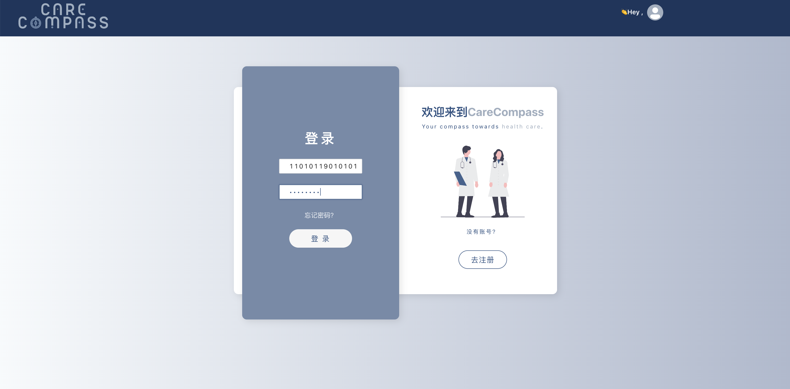

登录后，患者可正常查看个人信息，包括查看诊疗、缴费记录：

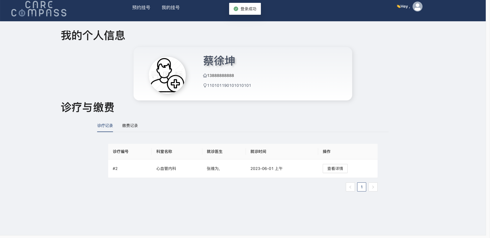


点击“预约挂号”，可选择挂号科室并查看对应医生排班：

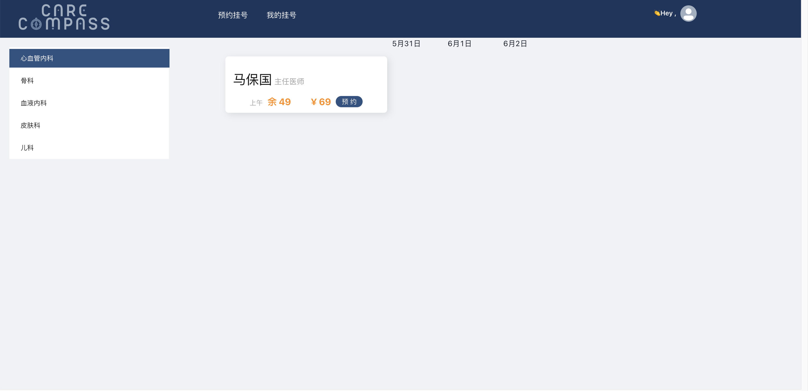

点击“预约”按钮，即可提交指定医生指定日期、时段的预约挂号。

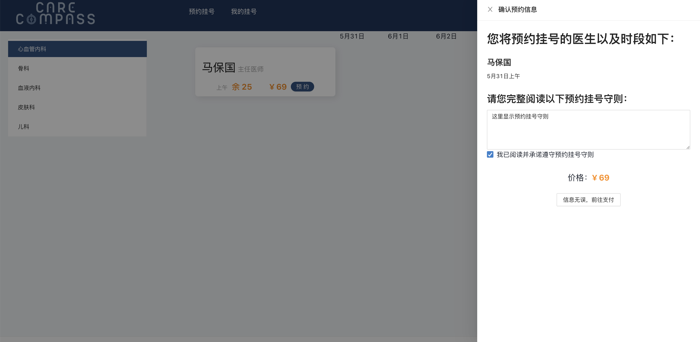

点击“信息无误，前往支付”后，平台将创建挂号记录和账单，并引导用户进行支付：

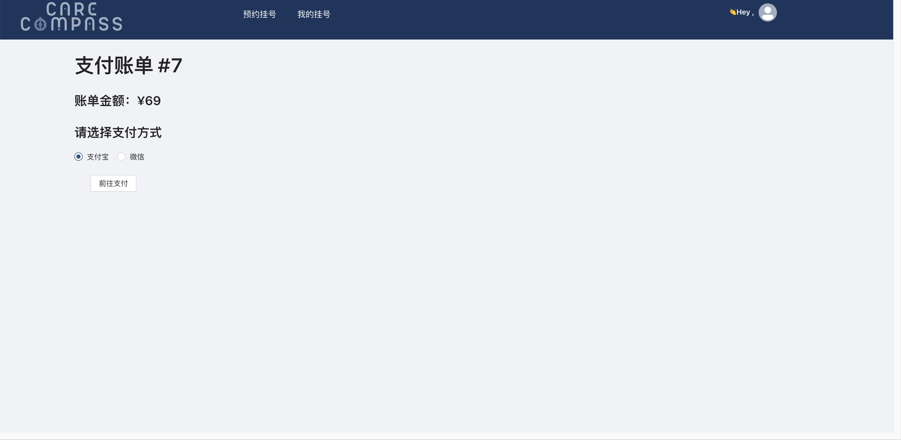

支付成功后，平台会显示“支付成功！”提示，并跳转回个人信息界面。

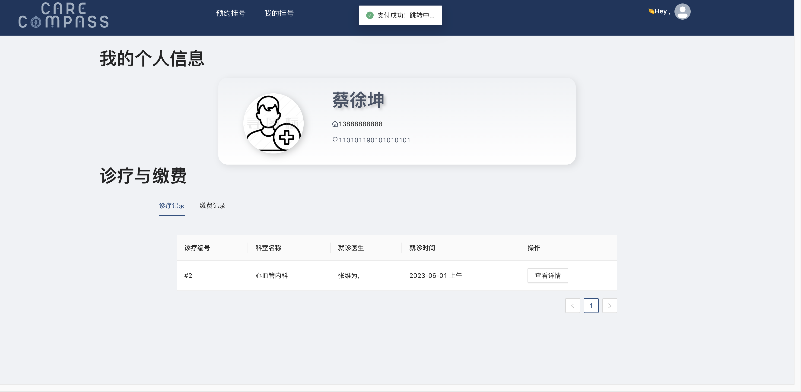

在“诊疗记录”表中，点击“查看详情”，可以查看该次诊疗的详细记录：

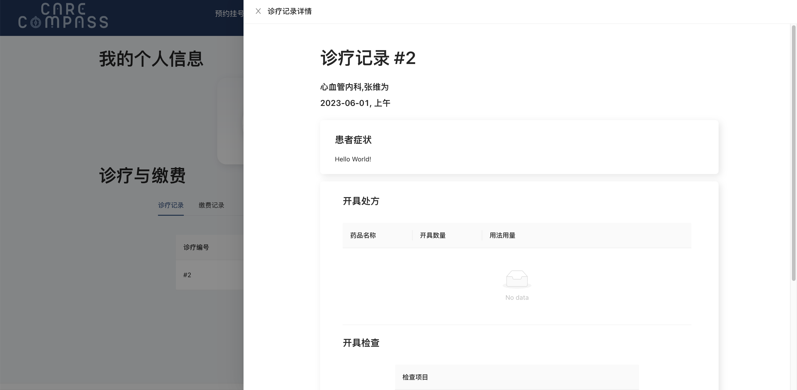

在“缴费记录”表中，可以查看历史缴费记录：

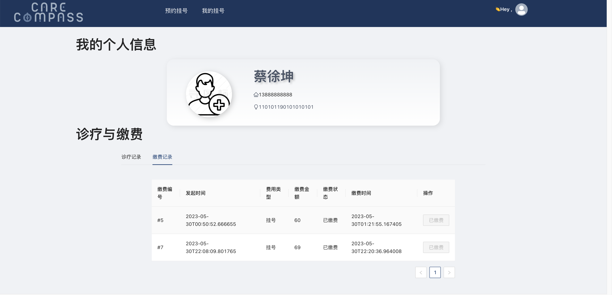

医生系统部分，医生进行账号登陆后，进入医生主页面

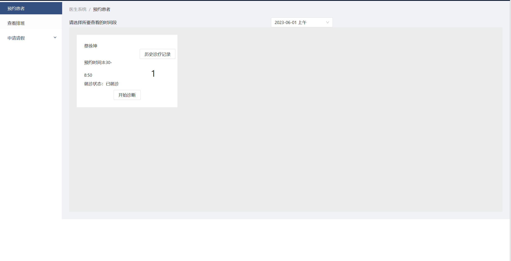

医生主页面主要负责医生查看近期排班信息、查看每个时间段待就诊患者以及医生的请假系统

首先是预约患者界面


这个页面可选择对应医生排班的时间段，并查看这个时间段内的预约患者信息，点击历史诊疗记录，可以查看该患者之前的病历信息：

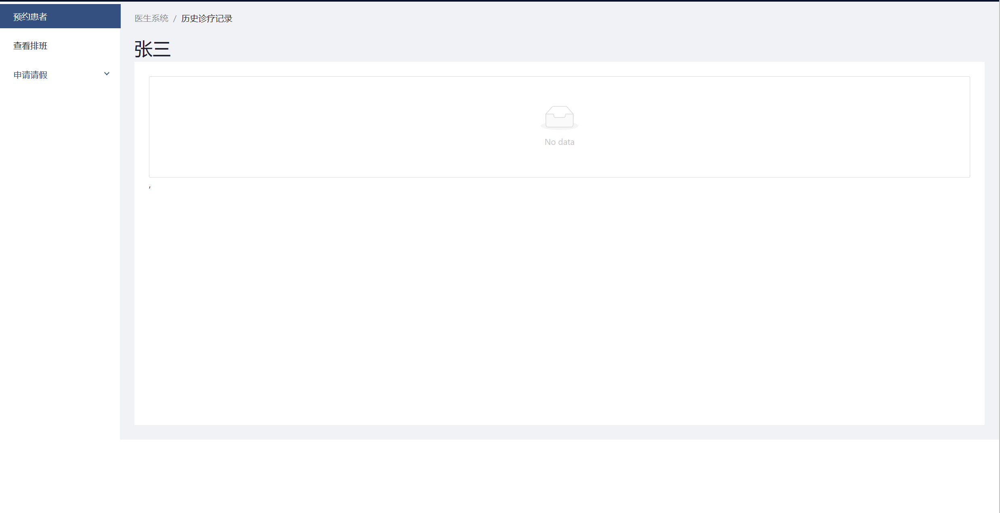

再或者，要开始就诊，点击开始诊断，进入患者就诊页面，可以描述症状、开具处方、开具检查以及记录医嘱，最终提交：

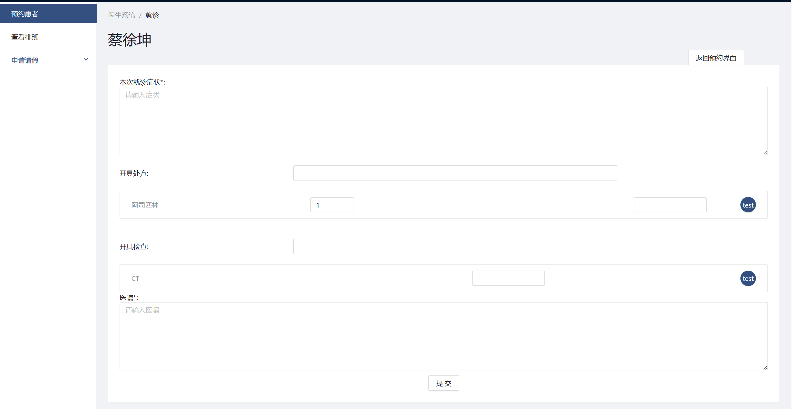

左侧栏的查看排班，医生可以查看到自己近期时间段的排班信息，包括对应时间段的患者人数：

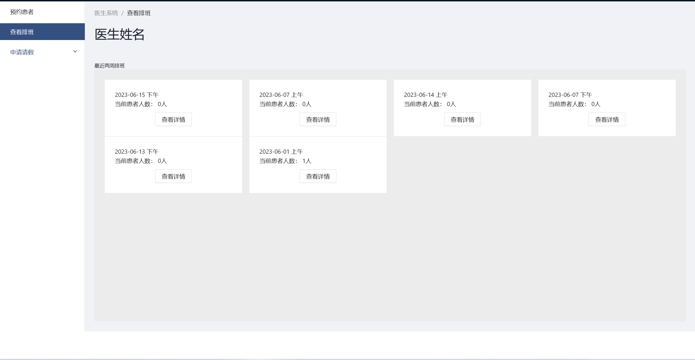

点击查看详情，会跳转到对应的预约患者界面：


请假栏中有申请请假和查看请假进度选项，申请请假，则医生可以选择请假类型、选择时间、申请请假：

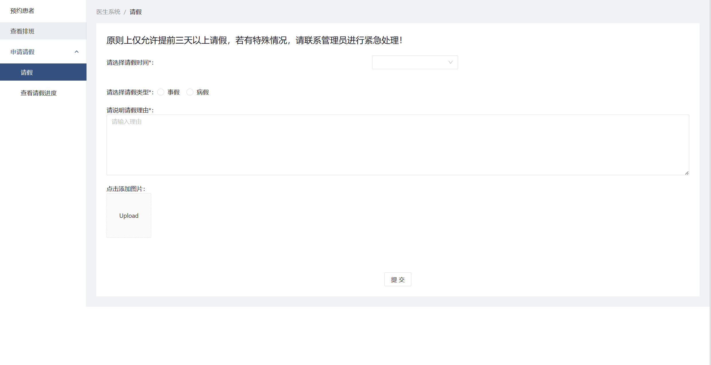

点击提交后，信息会发送到管理员处，等待管理员审核

之后查看请假进度部分，可以查看医生本人的请假记录信息：

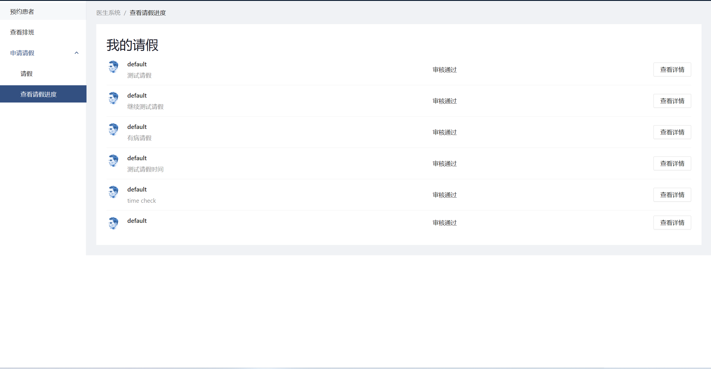

查看详情，会进入到对应的请假信息详情页：

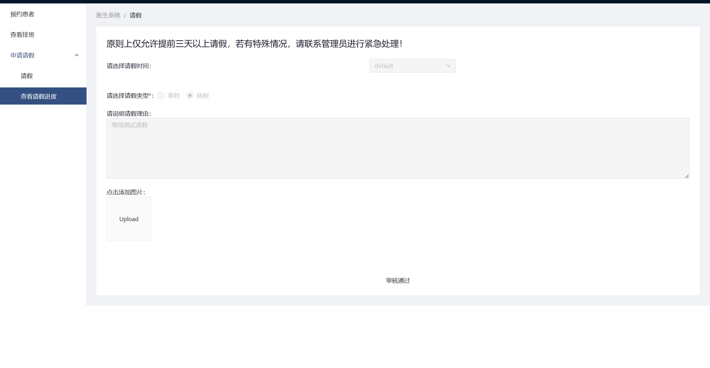

进入管理员系统排班管理界面，首先选择要进行排班的科室：


选好后默认展示下个月排班情况，黄色为上午出诊医生，绿色为下午出诊医生：


点击想要排班的日期可查看当日详细排班情况并进行当日排班的添加或删除：


确认提交后：


进入请假审批界面，可以看到请假申请列表，分为待审批和已审批两部分，可查看待审批申请详情，并评估是否通过并予以说明。


已审批申请可查看申请详情：


进入医生账号管理界面，首先进行要管理的医生科室：


然后选择医生，进行医生信息管理：


点击“+”，添加医生账号：


进入科室信息管理界面，可以看到科室列表，点开“+”号展示科室详细信息，点击医生姓名可进入医生门户，并进行医生信息的管理：


进入药品/检查管理界面，可以看见药品列表和检查列表，可进行药品和检查的添加：


进入公告管理界面，可以看到就医须知和健康科普列表，可添加相关内容，展示在医院首页：


## 六、CI流水线

### 6.1 CI流水线简介

CI（持续集成）是一种开发实践，通过频繁地集成和测试代码变更，以确保团队的代码始终保持可靠和可部署。CI流水线配置是实现CI的关键组成部分。

CI流水线是一系列自动化的步骤和操作，用于构建、测试和部署软件。它们通常由一个或多个工作流程组成，其中每个工作流程包含一组有序的任务和操作。每当有代码变更或特定事件触发时，CI流水线将自动执行这些任务和操作。

总结来说，选择使用CI流水线来自动化构建、测试和部署的原因包括：

-   提高开发效率：自动化任务和操作可以节省开发人员的时间和精力，使其能够专注于更有价值的工作，如功能开发和问题解决。
-   提高代码质量：通过自动化的测试和质量控制过程，可以提高代码的质量和稳定性。

在本测试文档中，主要介绍使用GitHub提供的CI流水线服务来实现后端自动测试的功能。

### 6.2 CI流水线配置

#### 6.2.1 平台选择

在本次开发中，我们选择使用GitHub提供的CI流水线服务，主要原因如下：

1.  集成性：GitHub提供了内置的CI/CD工具，称为GitHub Actions。它直接集成在GitHub平台上，使得配置和管理CI流水线变得非常方便。您需使用第三方工具或服务，可直接在GitHub上进行设置和管理CI流水线。
2.  免费额度：GitHub Actions为公共仓库提供免费使用，每个月具有一定的免费额度。我们可以在本次项目中免费使用CI流水线，无需支付额外费用。
3.  灵活性和可扩展性：GitHub Actions提供了丰富的功能和灵活的配置选项。我们可以根据项目的需求和要求，自定义和配置CI流水线。GitHub Actions还支持插件和自定义操作，使得能够扩展和定制流水线的功能。
4.  与代码存储的无缝集成：使用GitHub的CI流水线，我们可以直接与存储在GitHub上的代码进行集成。配置CI流水线在每次代码推送时触发，自动构建、测试我们的后端程序。

#### 6.2.2 使用GitHub配置CI流水线

1.  首先在我们的GitHub仓后端库中创建`.github/workflows`目录。
2.  在`.github/workflows`目录中创建需要用到的工作流程。例如创建一个文件名为`main.yml`的工作流程文件。
3.  编写流程文件以实现我们的目的。例如：

```yaml
name: CI Pipeline

on:
  push:
    branches:
      - main

jobs:
  build-and-test:
    runs-on: ubuntu-latest

    steps:
      - name: Checkout code
        uses: actions/checkout@v2

      - name: Set up Python
        uses: actions/setup-python@v2
        with:
          python-version: 3.9

      - name: Install dependencies
        run: pip install -r requirements.txt

      - name: Run tests
        run: python manage.py test

```

1.  如果按照上述配置，则会在每次有代码推送到main分支时自动构建项目并安装依赖，最后执行django项目的自动化测试。

#### 6.2.3使用CI流水线

按上述配置我们首先在我们的后端GitHub仓库配置好CI流水线。

注：本次测试我使用了我自己的独立分支，测试后会pull request到主分支内。

配置如下图：

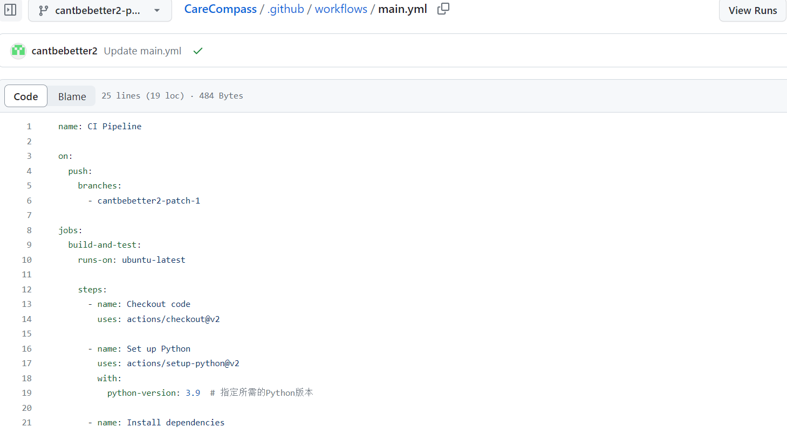

接着我在本地修改代码并push到GitHub上，就会自动触发CI流水线进行自动化测试。

测试结果如下图：

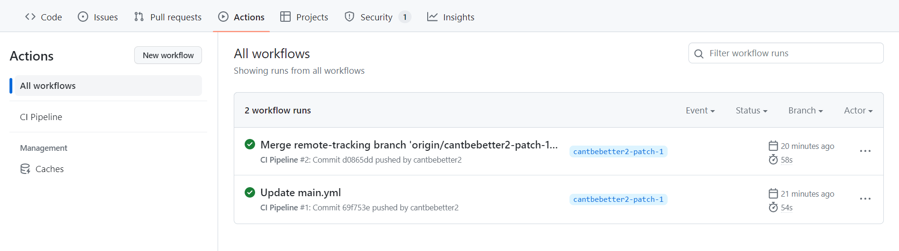

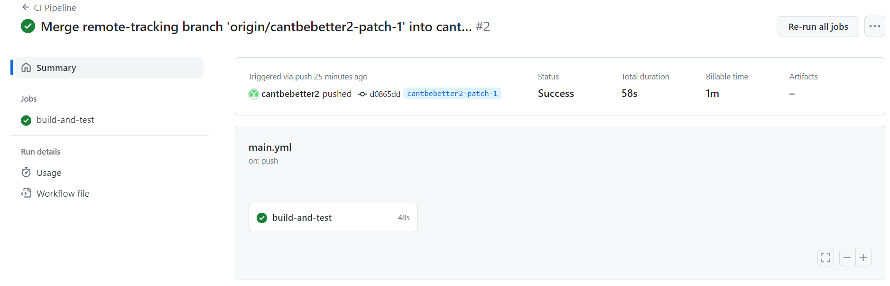

可以看到GitHub上配置好的CI流水线自动进行了构建与测试。

## 七、其他测试结果

### 7.1内容测试

在使用不同的方法打开页面以及刷新尝试之后，页面的内容展示均没有产生混乱，仍然在原定位置展示信息，页面布局设置及框架没有问题。
根据前文的功能测试可知，在调用方法后，页面的显示内容也实现了随方法的操作而改变，可以知道代码中对json对象操作后的内容展示也没有问题。

### 7.2用户界面测试

本网页的设计布局比较简洁。在没有涉及复杂的跳转的基础上，经内部人员测试，已经实现了甲方要求的所有功能。

### 7.3安全性测试

系统应该能够防止恶意或者意外访问、使用、修改等带来的不良影响。&#x20;
1.保留需要的日志文件。
2.对关键数据检查其完整性和合法性。
3.消除安全漏洞，防止包括 SQL 注入、WEB注入、XSS 攻击等在内的恶意行为。
4.为了增加安全性，限制程序不同模块之间的通信。&#x20;

## 八、不符合项列表

全部测试均达到了初期的目标，暂时没有不符合项的出现。

## 九、测试结论

最终测试结论如下表所述：

| 测试信息名     | 测试信息内容                                 |
| --------- | -------------------------------------- |
| 测试项目      | CareCompass患者预约系统                      |
| 测试完成日期    | 2023.06.06                             |
| 测试地点      | 各成员宿舍                                  |
| 测试环境      | 本地及服务器环境                               |
| 测试用具      | 笔记本电脑                                  |
| 参与测试的人员   | 所有前后端开发人员                              |
| 系统强项      | 页面风格统一，交互顺畅。前端安全可靠，UI精美；后端逻辑正确，响应较快。   |
| 系统弱项      | 功能可能还可以扩展，后端响应速度可能可以进一步提高，在之后可以迭代开发改进。 |
| 不符合项的统计结果 | 暂无                                     |
