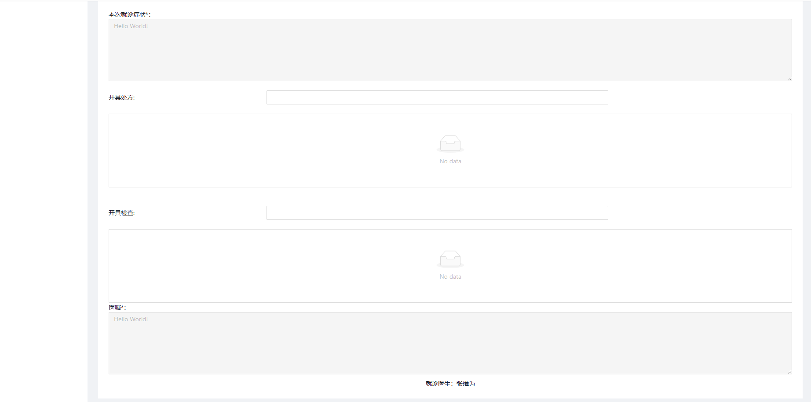

# 用户使用说明书

| 成员&#xA; | 刘芊琪&#xA; |
| --------- | ----------- |
| 成员&#xA; | 翁晨皓&#xA; |
| 成员&#xA; | 冯伟伦&#xA; |
| 成员&#xA; | 武钰川&#xA; |
| 成员&#xA; | 刘洪宇      |

[TOC]

## 一、引言

### 1.1 项目背景

随着人口的增加和医疗需求的提升，医院门诊的预约和就诊流程变得越来越复杂。传统的当场取号和电话预约方式存在许多问题，如患者需要长时间等待、预约信息容易出错、医生工作效率低下等。为了解决这些问题，提高医院门诊服务的效率和质量，我们决定开发一个线上的医院门诊预约系统。

传统的当场取号和电话预约方式存在一些痛点和局限性。首先，患者需要到医院现场排队取号，耗费时间和精力。其次，电话预约容易出现信息错误和沟通不畅的问题，可能导致预约失败或错过就诊时间。此外，医生和医院工作人员需要花费大量时间和精力处理预约事务，工作效率低下。

因此，开发一个在线的医院门诊预约系统具有重要的意义。通过该系统，患者可以方便地在家或办公室通过网络预约门诊号，避免长时间等待和信息错误的问题。医生可以实时查看患者的预约信息，提前做好准备，并在系统上确认患者是否按时来诊，提高就诊效率和服务质量。医院管理人员可以通过后台管理系统轻松管理科室信息、医生排班和放号数量，进一步提升医院的运营效率。

### 1.2 编写目的

该系统的主要目标是提供一个便捷的在线预约平台，使患者能够提前预约门诊号，同时方便医生查看当日的患者信息，并协助医院安排门诊排班。通过引入互联网技术，该系统能够提供更快捷、准确和可靠的预约服务，为患者和医院带来更好的体验。

### 1.3 使用者

1.  患者：患者是系统的主要使用者之一。他们可以通过系统进行注册、登录和个人信息的管理。患者可以查询各科室的门诊信息，包括医生出诊情况、介绍信息以及可预约的号源数量等。患者可以根据自己的需求和时间选择进行预约，并在预约时填写必要的信息。患者还可以查询或取消自己的预约。在就诊当日，患者需要按时到达医院进行诊疗。
2.  医生：医生也是系统的关键使用者之一。他们可以通过系统登录并查看当日候诊的患者信息。医生可以在系统上确认患者是否按时来诊，标记完成诊断或标记失约情况。这些操作有助于医生了解患者的就诊情况和提高工作效率。
3.  后台管理人员：后台管理人员负责系统的运营和管理。他们可以管理科室信息和各科室的医生信息，包括医生的介绍和排班情况。后台管理人员还可以设置医生的出诊排班表和放号数量，以便合理安排门诊资源和管理医生的工作时间

### 1.4 参考资料

\[1] 吕云翔.软件工程实用教程\[M].北京：清华大学出版社，2015.

### 1.5 相关文档

\[1] 《软件开发计划书》

\[2] 《需求规格说明书》

\[3] 《软件设计说明书》

\[4] 《部署文档》

\[5] 《测试分析报告》

## 二、软件概述

### 2.1 软件目标

提供便捷的预约流程：系统旨在替代传统的当场取号和电话预约方式，使患者能够方便地通过在线平台进行预约。系统应提供直观、简洁的界面，使患者能够快速查询和选择医生、科室以及可预约的时间段，从而实现便捷的预约流程。
提高医疗服务的效率和质量：系统应使医院门诊的就诊流程更加高效。医生可以在系统上查看患者的预约信息，提前准备和安排诊疗，从而提高就诊效率。系统还应提供确认患者到诊的功能，以减少失约情况的发生，优化门诊资源的利用。通过提高医疗服务的效率，系统有助于提升医疗服务的质量和患者满意度。
实现科室和医生的有效管理：系统的后台管理功能应能够方便地管理科室和医生的信息。后台管理人员可以管理科室介绍、医生介绍和排班情况，包括设置医生的出诊时间表和放号数量等。这样可以更好地协调和安排医生的工作时间，提高医院门诊资源的利用效率。
提供拓展功能的扩展性：系统具备可扩展的潜力，如电子病历、电子处方单、医生请假管理、患者失约系统等。这些拓展功能有助于进一步提升医院的服务水平和用户体验。

### 2.2 功能介绍

本项目的功能模块清单见下表：

| **编号** | **名称**       | **模块功能描述**             |
| ------ | ------------ | ---------------------- |
| 101    | 注册账号         | 用户从游客注册为患者             |
| 102    | 登录系统         | 已注册用户登录系统              |
| 103    | 找回密码         | 用户丢失密码后，通过审核重新获取       |
| 104    | 查看个人信息       | 用户查看个人信息               |
| 105    | 修改个人信息       | 用户登录后对资料进行管理           |
| 106    | 用户注销         | 用户离开系统时，进行注销           |
| 201    | 浏览科室信息       | 患者浏览可供挂号科室列表           |
| 202    | 查看排班信息       | 患者查看指定科室医生排班信息         |
| 203    | 提交预约信息       | 患者提交指定医生和时段的预约         |
| 204    | 查看预约记录       | 患者查看自己的预约挂号记录          |
| 205    | 查看历史诊疗记录     | 患者查看自己的历史诊疗记录          |
| 206    | 查看历史缴费记录     | 患者查看自己的历史缴费记录          |
| 207    | 支付账单         | 患者支付各类账单               |
| 301    | 账号登录         | 用户登录身份为医生              |
| 302    | 密码修改         | 医生修改自己密码               |
| 303    | 浏览当日候诊患者信息   | 医生点击当日患者信息菜单展示当日候诊患者信息 |
| 304    | 开具患者检查       | 医生为患者开具检查              |
| 305    | 查看患者历史诊疗信息   | 医生点击查看患者历史诊疗信息         |
| 306    | 开具患者病历       | 医生开具患者病历               |
| 307    | 开具患者处方单      | 医生开具患者处方单              |
| 308    | 确认患者就诊完成     | 医生确认患者就诊完成             |
| 401    | 浏览指定日期候诊患者信息 | 医生选择日期查看对应时间段的患者信息     |
| 402    | 查看患者历史诊疗信息   | 医生点击查看患者历史诊疗信息         |
| 403    | 开具患者病历       | 医生开具患者病历               |
| 404    | 开具患者处方单      | 医生开具患者处方单              |
| 405    | 开具患者检查单      | 医生开具患者检查               |
| 406    | 查看近期排班信息     | 医生查看自己最近一段时间的排班信息      |
| 501    | 申请请假         | 医生发起请假申请               |
| 502    | 查看请假记录       | 医生查看自己过去的请假信息          |
| 601    | 添加医生账号       | 管理员进行医生账号的添加           |
| 602    | 查看医生列表       | 管理员进行医生列表的查看           |
| 603    | 查看医院排班       | 管理员查看医院排班信息            |
| 604    | 新增医生排班       | 管理员进行排班信息的添加           |
| 605    | 删除医生排班       | 管理员进行排班信息的删除           |
| 606    | 管理科室信息       | 管理员进行医院科室信息的管理         |
| 607    | 查看可开具药品      | 管理员进行医院可开具药品的查看        |
| 608    | 新增药品         | 管理员进行医院可开具药品的添加        |
| 609    | 查看可开具检查      | 管理员进行医院可开具检查的查看        |
| 610    | 新增检查         | 管理员进行医院可开具检查的添加        |
| 611    | 审批医生请假       | 管理员进行医生请假申请的审批         |
| 612    | 查看医院公告       | 医院公告的查看                |
| 613    | 新增医院公告       | 管理员进行医院公告的添加           |
| 614    | 删除医院公告       | 管理员进行医院公告的删除           |

### 2.3 子系统介绍

本项目的子系统设置如下表所示：

|        |          |                                                                                                        |
| ------ | -------- | ------------------------------------------------------------------------------------------------------ |
| **编号** | **名称**   | **子系统功能描述**                                                                                            |
| 1      | 个人信息管理系统 | 1) 用户登录系统时，对其身份进行检验&#xA;2\) 未注册用户可以进行注册。&#xA;3\) 已注册用户可以修改个人信息、修改密码、注销等。                               |
| 2      | 患者门诊预约系统 | 1) 患者可选择预约挂号的科室，并查看各科室未来三天的医生排班与号源信息 2) 患者可提交仍有余号的挂号预约 3) 患者可查看自己的预约挂号信息 4) 患者可在个人信息页面查看历史诊疗记录         |
| 3      | 患者支付子系统  | 1) 患者支付挂号费。&#xA;2\) 患者支付检查、处方等项目费用。&#xA;3\) 患者查看历史付费项目记录。                                              |
| 4      | 医生门诊坐诊系统 | 1) 医生查看排班日期。&#xA;2\) 医生查看特定日期患者列表、患者历史病历、工作内容。&#xA;3\) 医生开具检查、处方，完善病例等。                                |
| 5      | 医生请假子系统  | 1) 医生申请请假。&#xA;2\) 医生查看自己的请假记录列表。                                                                      |
| 6      | 医院管理系统   | 1) 管理员审核医生请假信息。&#xA;2\) 管理员管理科室、检查项目、药品目录等信息。&#xA;3\) 管理员管理医生账号。&#xA;4\) 管理员进行医生排班。&#xA;5\) 管理员进行公告管理。 |

## 三、运行环境

### 3.1 硬件运行环境

处理器：Intel(R) Xeon(R) Platinum 8269CY CPU @ 2.50GHz

内存：1GB

硬盘容量：32GB

输入输出设备：鼠标、键盘、显示屏

网络设备：宽带

### 3.2 软件运行环境

操作系统：Ubuntu 20.04

连接的后端数据库：MySQL

项目运行环境：Python 3.9

## 四、系统访问方式

### 4.1 本地运行访问方式

本项目使用Vue和Django框架进行开发，所以需要分别在前端项目目录运行npm run dev指令，后端项目目录运行python manage.py runserver。运行成功后访问http\://localhost:3000 即可访问项目系统。

## 五、使用说明

### 5.1 登陆注册

主页面如下所示，右上角有登陆注册按钮，点击可以跳转到登陆/注册：

#### 5.1.1 登录

登录支持患者或医生登录，患者对应身份证号和密码登录，医生对应工号和密码登录，会判断账号类型进行相应登录，登陆错误则会报错，登陆成功则患者跳入患者主界面、医生跳入医生主界面、管理员跳入管理员主界面：

若忘记密码，可以进入忘记密码界面，借助手机号进行密码重置：

#### 5.1.2 注册

注册主要支持患者注册，患者需要提供姓名、身份证号、密码、确认密码、手机号以及手机验证码，完成患者注册：

### 5.2 患者系统

#### 5.2.1 预约挂号

患者挂号主要分为以下三步：

1.  **获取科室信息**：这一步骤涉及到用户界面和服务器之间的交互。设计模型中可以包含一个用户界面模型，描述用户如何获取科室信息，以及一个服务器模型，描述服务器如何处理这个请求。
2.  **选择科室并获取号源信息**：这一步骤同样涉及到用户界面和服务器的交互。设计模型需要描述用户如何在界面上选择科室，并向服务器请求号源信息，以及服务器如何处理这个请求。
3.  **选择号源并提交预约申请**：这一步骤涉及到用户界面、服务器、以及数据库的交互。设计模型需要描述用户如何在界面上选择号源并提交预约申请，服务器如何处理这个请求并向数据库添加新的预约记录和账单。

#### 5.2.2 支付指定账单

支付指定账单主要分为以下三步：

1.  **显示待支付金额**：在这一步骤中，系统会在页面上显示待支付的金额。
2.  **选择支付方式并前往付款**：患者选择他们偏好的支付方式，然后点击“前往付款”按钮。系统会弹出含有付款二维码的抽屉供患者扫码支付。
3.  **确认支付完成**：患者支付完成后，点击“已完成支付”按钮。系统会进行核实，如果支付成功，系统会更改账单支付状态。

#### 5.2.3 查看历史诊疗记录

1.  **选择查看所有诊疗记录**：在这一步骤中，患者在个人信息一览界面的下方Tab栏中，选中“诊疗记录”。
2.  **获取并展示诊疗记录详情**：点击“操作”一栏的“查看详情”按钮后，会跳出一个右侧抽屉，内含该次诊疗记录的所有信息。

#### 5.3.4 查看历史缴费记录

直接点击Tab中的“缴费记录”即可查看。若有费用未缴，则可点击“操作”中的“缴费”按钮前往缴费。

### 5.3 医生系统

#### 5.3.1 查看预约患者

预约患者界面可以查看近期医生排班时间所对应的患者信息：

点击某患者的历史诊疗记录，可以查看患者历史的诊疗列表：

点击可以查看某次诊疗记录的详情：

回到查看预约患者界面：

点击开始诊断，进入对该患者的本次就诊环节，可以输入患者的本次症状，通过模糊搜索开具处方、检查，并最后写下遗嘱进行提交：

#### 5.3.2 查看排班

查看排班，医生可以查看自己最近的排班时间和对应时间的患者数量：

点击查看详情，会跳转到对应日期的查看预约患者界面;

#### 5.3.3 申请请假

医生想请假，需要提前至少三天申请，且要填写请假时间、请假类型和请假理由，必要的话要上传请假证明等，最终点击提交请假成功：

#### 5.3.4 查看请假进度

在查看请假进度中，可以看到医生本人所有的历史请假信息，点击查看详情，则可以跳转到对应的请假信息中:

### 5.4 管理员系统

#### 5.4.1 管理医生排班

进入界面，首先选择要进行排班的科室：

选好后默认展示下个月排班情况，黄色为上午出诊医生，绿色为下午出诊医生：

点击想要排班的日期可查看当日详细排班情况并进行当日排班的添加或删除：

确认提交后：

#### 5.4.2 医生请假审批

进入界面，可以看到请假申请列表，分为待审批和已审批两部分，可查看待审批申请详情，并评估是否通过并予以说明。

已审批申请可查看申请详情：

#### 5.4.3 医生账号管理

进入界面，首先进行要管理的医生科室：

然后选择医生，进行医生信息管理：

点击“+”，添加医生账号：

#### 5.4.4 科室信息管理

进入界面，可以看到科室列表，点开“+”号展示科室详细信息，点击医生姓名可进入医生门户，并进行医生信息的管理：

#### 5.4.5 药品/检查管理

进入界面，可以看见药品列表和检查列表，可进行药品和检查的添加：

#### 5.4.6 公告管理

进入界面，可以看到就医须知和健康科普列表，可添加相关内容，展示在医院首页：

